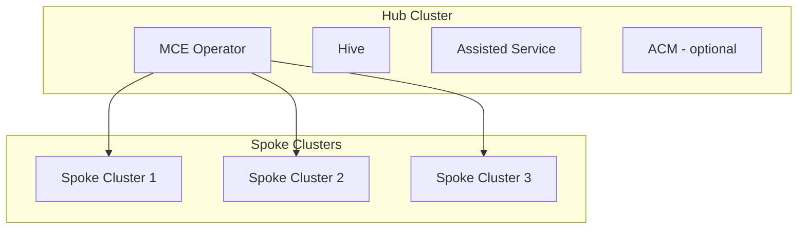
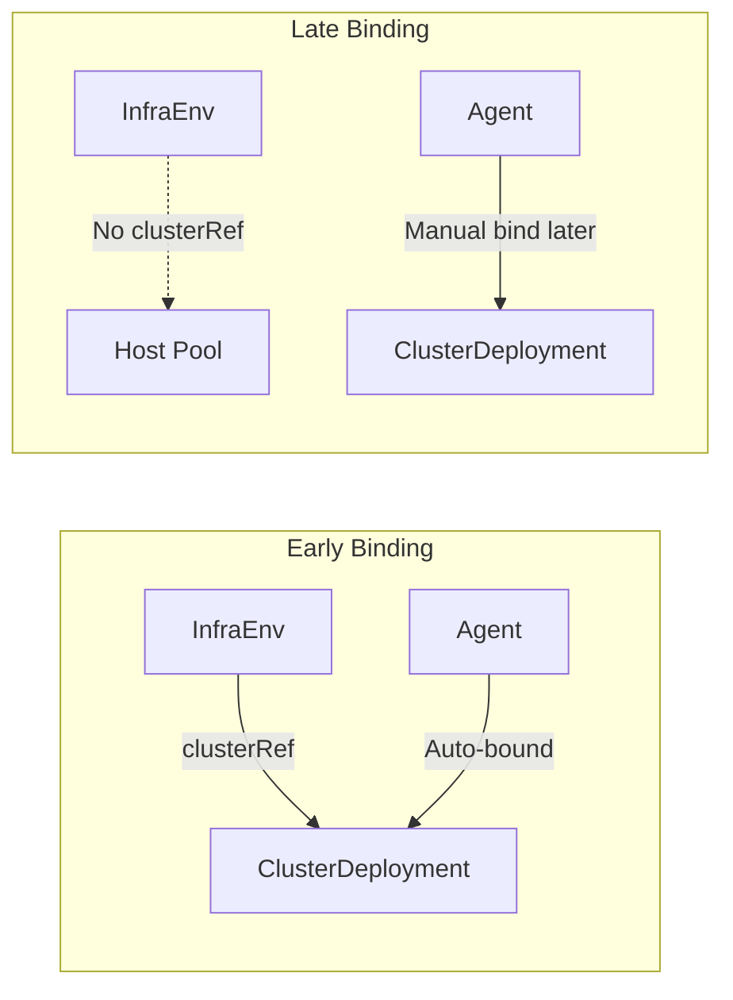
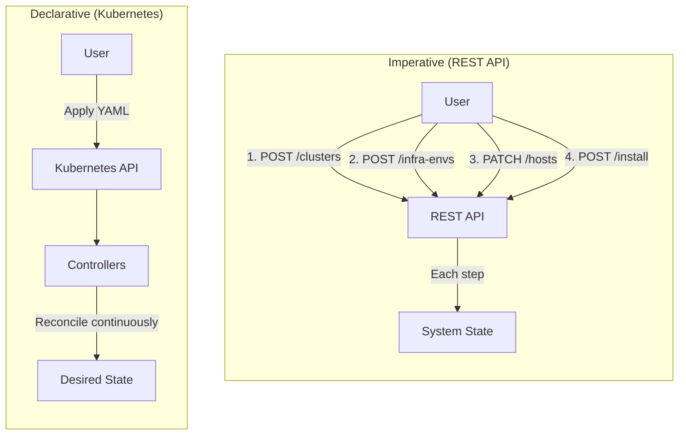
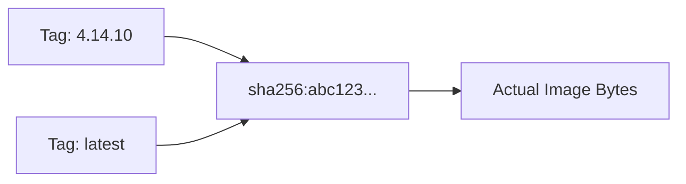
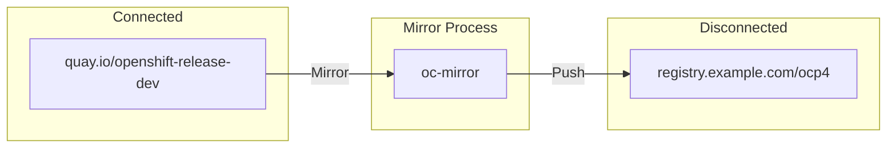

# Key Concepts and Glossary

This document explains fundamental concepts and terminology used throughout the OpenShift installation documentation.

## Core Concepts

### Hub and Spoke Architecture

In multi-cluster management, OpenShift uses a **hub-and-spoke** model:



| Term | Definition |
|------|------------|
| **Hub Cluster** | The central management cluster running MCE/ACM. It hosts operators that provision and manage other clusters. Also called "management cluster." |
| **Spoke Cluster** | A cluster that is provisioned and/or managed by the hub. Also called "managed cluster" or "workload cluster." |
| **Management Cluster** | Synonym for hub cluster; in HCP context, specifically the cluster hosting control planes. |

The hub cluster runs lifecycle operators (MCE, Hive, Assisted) that provision spoke clusters. Once installed, spoke clusters can operate independently but may remain connected for policy management, observability, and upgrades.

---

### Early Binding vs Late Binding

These terms describe **when hosts are assigned to clusters** during the discovery and installation process.



| Binding Type | When Hosts Bind | Use Case | Configuration |
|--------------|-----------------|----------|---------------|
| **Early Binding** | At discovery time | Known cluster, known hosts | InfraEnv has `clusterRef` |
| **Late Binding** | After discovery | Shared host pool, dynamic assignment | InfraEnv without `clusterRef` |

**Early Binding Example:**
```yaml
# InfraEnv with clusterRef - agents auto-bind to this cluster
apiVersion: agent-install.openshift.io/v1beta1
kind: InfraEnv
metadata:
  name: my-cluster-infraenv
spec:
  clusterRef:           # <-- Early binding: hosts bind immediately
    name: my-cluster
    namespace: my-cluster
```

**Late Binding Example:**
```yaml
# InfraEnv without clusterRef - agents go to a shared pool
apiVersion: agent-install.openshift.io/v1beta1
kind: InfraEnv
metadata:
  name: shared-discovery
  namespace: open-cluster-management
spec:
  # No clusterRef - late binding
  pullSecretRef:
    name: pull-secret
---
# Later, bind an agent to a specific cluster
apiVersion: agent-install.openshift.io/v1beta1
kind: Agent
metadata:
  name: host-uuid
spec:
  clusterDeploymentName:  # <-- Late binding: manual assignment
    name: target-cluster
    namespace: target-cluster
```

**When to use each:**
- **Early binding**: You know exactly which hosts go to which cluster upfront. Simpler workflow.
- **Late binding**: You have a pool of hosts that may be assigned to different clusters based on availability, location, or capacity. Common in large-scale ZTP deployments.

---

### Declarative vs Imperative APIs

OpenShift supports two API paradigms for cluster installation:

| Paradigm | Description | Example |
|----------|-------------|---------|
| **Imperative** | Tell the system *what to do* step by step | REST API: `POST /clusters`, `PATCH /hosts/{id}` |
| **Declarative** | Tell the system *what you want*, let it figure out how | Kubernetes CRDs: Apply YAML, controller reconciles |



**Imperative (REST API):**
```bash
# Step-by-step commands
curl -X POST /api/v2/clusters -d '{"name": "my-cluster"}'
curl -X POST /api/v2/infra-envs -d '{"cluster_id": "..."}'
curl -X POST /api/v2/clusters/{id}/actions/install
```

**Declarative (Kubernetes CRDs):**
```yaml
# Define desired state, apply once
apiVersion: hive.openshift.io/v1
kind: ClusterDeployment
metadata:
  name: my-cluster
spec:
  # ... desired configuration
# Controller continuously reconciles actual → desired
```

**Key differences:**

| Aspect | Imperative | Declarative |
|--------|------------|-------------|
| **State management** | User tracks state | Controller tracks state |
| **Error recovery** | User must retry | Controller auto-retries |
| **Idempotency** | Must handle manually | Built-in (apply same YAML) |
| **GitOps friendly** | No | Yes |
| **Audit trail** | API logs | Git history + K8s events |

---

### Hyperscalers

**Hyperscalers** are large-scale cloud providers with global infrastructure:

| Provider | OpenShift Support | Notes |
|----------|-------------------|-------|
| **AWS** (Amazon Web Services) | IPI, HCP (ROSA) | Primary development platform |
| **Azure** (Microsoft) | IPI, HCP (ARO) | Includes Azure Stack Hub |
| **GCP** (Google Cloud Platform) | IPI | Full automation |
| **IBM Cloud** | IPI | VPC Gen2 |

These providers offer:
- Global data centers
- API-driven infrastructure provisioning
- Managed Kubernetes services (EKS, AKS, GKE)
- Native OpenShift managed services (ROSA, ARO)

IPI (Installer-Provisioned Infrastructure) works best with hyperscalers because it can automatically provision VMs, networking, load balancers, and DNS through their APIs.

---

### Images and Versioning

OpenShift uses several types of images with specific terminology:

#### Release Image

The **release image** is a container image containing the complete OpenShift version:

```
quay.io/openshift-release-dev/ocp-release:4.14.10-x86_64
```

It contains:
- Metadata about all operator images
- The `openshift-install` binary (embedded)
- Version and upgrade graph information

```bash
# Extract installer from release image
oc adm release extract --tools quay.io/openshift-release-dev/ocp-release:4.14.10-x86_64

# View release info
oc adm release info quay.io/openshift-release-dev/ocp-release:4.14.10-x86_64
```

#### OS Image (RHCOS)

The **OS image** is the Red Hat CoreOS (RHCOS) bootable image for nodes:

```
https://mirror.openshift.com/pub/openshift-v4/dependencies/rhcos/4.14/
├── rhcos-live.x86_64.iso          # Live ISO for discovery
├── rhcos-metal.x86_64.raw.gz      # Bare metal disk image  
└── rhcos-qemu.x86_64.qcow2        # QEMU/KVM disk image
```

Each OCP version has a matching RHCOS version. The installer automatically selects the correct one.

#### Image Digest vs Tag



| Identifier | Format | Mutable | Example |
|------------|--------|---------|---------|
| **Tag** | `image:tag` | Yes (can change) | `ocp-release:4.14.10-x86_64` |
| **Digest** | `image@sha256:...` | No (immutable) | `ocp-release@sha256:abc123...` |

OpenShift installations use **digests** internally for reproducibility:
```yaml
# ClusterImageSet references a digest
apiVersion: hive.openshift.io/v1
kind: ClusterImageSet
metadata:
  name: openshift-4.14.10
spec:
  releaseImage: quay.io/openshift-release-dev/ocp-release@sha256:abc123...
```

#### ImageStreams

**ImageStreams** are OpenShift-specific resources that provide:
- Abstraction over image locations
- Automatic tracking of image updates
- Internal registry integration

```yaml
# ImageStream tracks images
apiVersion: image.openshift.io/v1
kind: ImageStream
metadata:
  name: my-app
spec:
  tags:
    - name: latest
      from:
        kind: DockerImage
        name: quay.io/myorg/myapp:latest
```

> **Note:** ImageStreams are primarily used for application workloads, not cluster installation. Installation uses release images and ClusterImageSets directly.

#### Image Mirroring

For disconnected installations, images must be mirrored to a local registry:



```bash
# Mirror release to local registry
oc-mirror --config imageset-config.yaml docker://registry.example.com
```

---

## Additional Concepts

### Bootstrap vs Rendezvous

| Term | Context | Purpose |
|------|---------|---------|
| **Bootstrap Node** | IPI/UPI | Temporary VM running initial control plane; destroyed after installation |
| **Rendezvous Host** | ABI/Assisted | Host coordinating installation; becomes permanent cluster member |

### VIP (Virtual IP)

Floating IP addresses shared across nodes:
- **API VIP**: Load-balanced access to kube-apiserver
- **Ingress VIP**: Load-balanced access to application routes

### Pull Secret

JSON credentials for accessing container registries:
```json
{
  "auths": {
    "quay.io": {"auth": "base64..."},
    "registry.redhat.io": {"auth": "base64..."}
  }
}
```

### CSR (Certificate Signing Request)

Kubernetes mechanism for nodes to request TLS certificates:
```bash
# View pending CSRs (workers need approval)
oc get csr
oc adm certificate approve <csr-name>
```

### Ignition vs MachineConfig

| Resource | When Applied | Managed By |
|----------|--------------|------------|
| **Ignition** | First boot only | CoreOS ignition |
| **MachineConfig** | Ongoing | Machine Config Operator |

Ignition is the initial configuration; MachineConfig manages ongoing node configuration.

---

## Glossary Quick Reference

| Term | Definition |
|------|------------|
| **ACM** | Advanced Cluster Management - full multi-cluster platform |
| **ABI** | Agent-Based Installer - standalone disconnected installation |
| **BMO** | Baremetal Operator - manages physical hosts |
| **BMAC** | Baremetal Agent Controller - bridges BMO and Assisted |
| **CAPI** | Cluster API - Kubernetes-native cluster management |
| **CIM** | Central Infrastructure Management - host inventory in MCE |
| **CRD** | Custom Resource Definition - Kubernetes API extension |
| **CVO** | Cluster Version Operator - manages OpenShift version/upgrades |
| **HCP** | Hosted Control Planes - control plane as pods |
| **Hive** | Cluster provisioning operator |
| **IBI** | Image-Based Install - fast SNO from seed images |
| **IPI** | Installer-Provisioned Infrastructure |
| **LCA** | Lifecycle Agent - manages seed images and IBU |
| **MCE** | Multicluster Engine - core lifecycle operator |
| **MCO** | Machine Config Operator - node OS configuration |
| **NMState** | Network Manager State - declarative network config |
| **OLM** | Operator Lifecycle Manager - installs/updates operators |
| **RHCOS** | Red Hat CoreOS - immutable OS for OpenShift nodes |
| **SNO** | Single Node OpenShift |
| **TALM** | Topology Aware Lifecycle Manager - upgrade orchestration |
| **UPI** | User-Provisioned Infrastructure |
| **ZTP** | Zero Touch Provisioning - GitOps cluster deployment |

---

## Related Documentation

- [Installation Methods Overview](01-installation-methods-overview.md)
- [REST API vs Kubernetes API](03-assisted-installation/rest-api-vs-kube-api.md)
- [Operators & Controllers](07-operators-controllers/overview.md)

