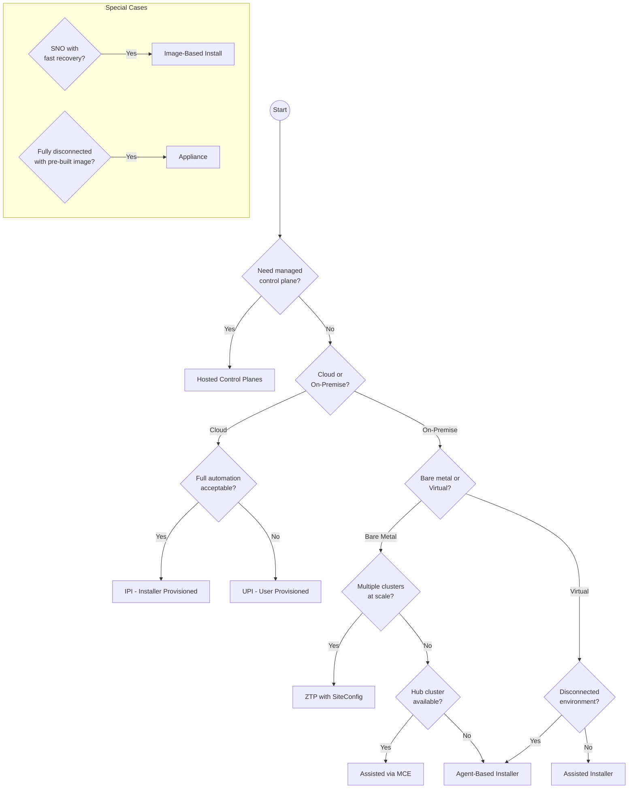
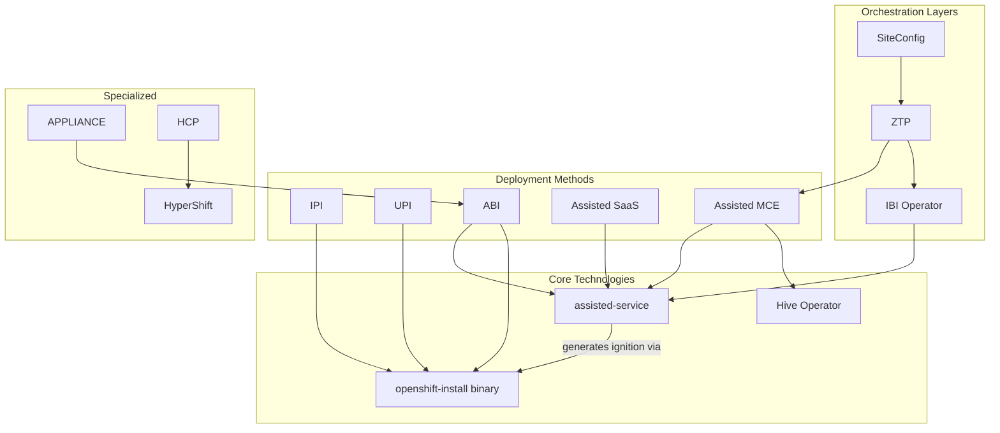

# Installation Methods Overview

This document provides a comprehensive comparison of OpenShift installation methods to help you choose the right approach for your use case.

## Decision Tree

Use this flowchart to determine which installation method fits your needs:

## Comparison Matrix

| Method | Infrastructure | Connectivity | Cluster Types | Hub Required | Primary Use Case |
|--------|---------------|--------------|---------------|--------------|------------------|
| **IPI** | Cloud-provisioned | Connected | Multi-node, SNO | No | Cloud deployments with full automation |
| **UPI** | User-provisioned | Connected/Disconnected | Multi-node, SNO | No | Custom infrastructure requirements |
| **Assisted (SaaS)** | User-provisioned | Connected | Multi-node, SNO | No (uses cloud.redhat.com) | Simplified on-premise with guided UI |
| **Assisted (MCE)** | User-provisioned | Connected/Disconnected | Multi-node, SNO | Yes | Enterprise on-premise with central management |
| **ABI** | User-provisioned | Disconnected | Multi-node, SNO | No | Standalone disconnected deployments |
| **IBI** | User-provisioned | Connected/Disconnected | SNO only | Optional | Fast SNO deployment from seed image |
| **Appliance** | User-provisioned | Fully Disconnected | Multi-node, SNO | No | Air-gapped environments |
| **HCP** | Mixed | Connected | Multi-node | Yes | Control plane as a service |
| **ZTP** | User-provisioned | Connected/Disconnected | Multi-node, SNO | Yes | GitOps-driven edge/telco deployments |

## Detailed Method Descriptions

### IPI - Installer-Provisioned Infrastructure

**What it is:** The `openshift-install` binary provisions all infrastructure (VMs, networking, storage) automatically on supported cloud platforms.

**Best for:**
- [Hyperscaler](00-concepts-glossary.md#hyperscalers) deployments (AWS, Azure, GCP, IBM Cloud)
- Teams that want minimal infrastructure management
- Development and testing environments

**Key characteristics:**
- Fully automated infrastructure provisioning
- Single binary (`openshift-install`) drives entire process
- Creates and manages cloud resources via Terraform (internally)
- Bootstrap node automatically created and destroyed

**Components involved:**
- `openshift-install` binary
- Cloud provider APIs
- Ignition configs

[Learn more →](02-traditional-installers/ipi.md)

---

### UPI - User-Provisioned Infrastructure

**What it is:** User prepares all infrastructure according to OpenShift requirements, then uses `openshift-install` to generate configs for the pre-existing infrastructure.

**Best for:**
- Environments with strict infrastructure policies
- Integration with existing provisioning systems
- Platforms not fully supported by IPI

**Key characteristics:**
- User responsible for VMs, networking, load balancers, DNS
- `openshift-install` generates Ignition configs only
- More flexibility but more manual steps
- Required for some platforms (IBM Power, z/VM)

**Components involved:**
- `openshift-install` binary (for config generation)
- User's infrastructure automation
- Ignition configs

[Learn more →](02-traditional-installers/upi.md)

---

### Assisted Installer (SaaS)

**What it is:** A hosted service at console.redhat.com that provides a web UI for creating OpenShift clusters on user-provided infrastructure.

**Best for:**
- Teams new to OpenShift
- On-premise deployments with internet connectivity
- Environments where a hub cluster isn't available

**Key characteristics:**
- Web-based wizard with validation
- Generates bootable discovery ISO
- Automatic hardware discovery and validation
- No hub cluster required (uses Red Hat's hosted service)

**Components involved:**
- console.redhat.com (hosted assisted-service)
- Discovery ISO with embedded agent
- User's bare metal or VMs

[Learn more →](03-assisted-installation/overview.md)

---

### Assisted Installer (On-Premise via MCE)

**What it is:** The same Assisted Installer technology, but deployed as an operator on your own hub cluster via Multicluster Engine (MCE).

**Best for:**
- Enterprise environments with central management
- Disconnected or air-gapped deployments
- Teams managing multiple clusters

**Key characteristics:**
- Runs on existing OpenShift hub cluster
- Uses Kubernetes CRDs instead of REST API
- Integrates with Hive for cluster lifecycle
- Can work in disconnected environments

**Components involved:**
- MCE Operator
- assisted-service (deployed by AgentServiceConfig)
- Hive (ClusterDeployment)
- Infrastructure Operator (InfraEnv, Agent CRDs)

[Learn more →](03-assisted-installation/saas-vs-onprem.md)

---

### Agent-Based Installer (ABI)

**What it is:** A standalone, self-contained installation method that embeds the assisted-service into the bootable ISO itself.

**Best for:**
- Fully disconnected environments
- Single cluster deployments without hub
- Automation pipelines requiring deterministic installs

**Key characteristics:**
- No external service required
- All components embedded in ISO
- Uses ZTP-style manifests for configuration
- Self-orchestrating installation

**Components involved:**
- `openshift-install agent create image` command
- Embedded assisted-service in ISO
- agent-config.yaml, install-config.yaml

[Learn more →](03-assisted-installation/abi.md)

---

### Image-Based Install (IBI)

**What it is:** Deploys Single Node OpenShift (SNO) clusters from pre-configured seed images, enabling rapid deployment and recovery.

**Best for:**
- Edge/Telco SNO deployments
- Fast cluster recovery scenarios
- Environments requiring consistent, repeatable deployments

**Key characteristics:**
- Uses seed images from existing SNO clusters
- Much faster than full installation
- SNO only (no multi-node support)
- Integrates with Lifecycle Agent (LCA)

**Components involved:**
- image-based-install-operator
- ImageClusterInstall CRD
- Lifecycle Agent (on seed cluster)
- Seed image with pre-installed OpenShift

[Learn more →](04-image-based-installation/ibi.md)

---

### Appliance

**What it is:** A pre-built disk image containing all OpenShift components and container images, enabling fully air-gapped installation.

**Best for:**
- Completely disconnected environments
- Environments where downloading images isn't possible
- Standardized deployments with fixed versions

**Key characteristics:**
- All container images embedded in disk
- Based on Agent-Based Installer technology
- Single disk image to deploy
- No network access required during install

**Components involved:**
- `openshift-appliance` tool
- ApplianceConfig
- Embedded registry with all images

[Learn more →](04-image-based-installation/appliance.md)

---

### Hosted Control Planes (HCP)

**What it is:** A deployment model where OpenShift control planes run as pods on a central management cluster, with only worker nodes on the target infrastructure.

**Best for:**
- Multi-tenancy scenarios
- Cost optimization (shared control planes)
- Rapid cluster provisioning
- Managed OpenShift offerings (ROSA, ARO)

**Key characteristics:**
- Control plane runs on management cluster
- Only workers deployed to target infrastructure
- Faster provisioning (no bootstrap required)
- Better resource utilization

**Components involved:**
- HyperShift Operator
- HostedCluster, NodePool CRDs
- Cluster API providers
- Control plane pods (kube-apiserver, etcd, etc.)

[Learn more →](05-hosted-control-planes/hcp-overview.md)

---

### Zero Touch Provisioning (ZTP)

**What it is:** GitOps-driven cluster provisioning using ArgoCD and the SiteConfig operator to deploy clusters at scale.

**Best for:**
- Telco/Edge deployments at scale
- Environments requiring GitOps workflows
- Standardized, repeatable deployments
- Large fleet management

**Key characteristics:**
- Declarative cluster definitions in Git
- ArgoCD synchronizes cluster state
- SiteConfig operator renders installation manifests
- ClusterInstance as unified API

**Components involved:**
- ArgoCD
- SiteConfig Operator
- ClusterInstance CRD
- Underlying installation method (Assisted or IBI)

[Learn more →](06-gitops-provisioning/ztp.md)

---

## Method Relationships

The installation methods are not always mutually exclusive. Here's how they relate:

> **Note:** The assisted-service internally uses the `openshift-install` binary to generate Ignition configs. This is an implementation detail—users interact only with the Assisted APIs or CRDs.

## Choosing Based on Requirements

### Connectivity Requirements

| Requirement | Recommended Methods |
|-------------|---------------------|
| Fully connected | IPI, Assisted SaaS, HCP |
| Partially disconnected | Assisted MCE, ABI |
| Fully air-gapped | Appliance, ABI with mirrored images |

### Scale Requirements

| Scale | Recommended Methods |
|-------|---------------------|
| 1-5 clusters | IPI, Assisted (any), ABI |
| 5-50 clusters | Assisted MCE, HCP |
| 50+ clusters | ZTP with SiteConfig |

### Cluster Type Requirements

| Type | Recommended Methods |
|------|---------------------|
| Multi-node HA | All methods except IBI |
| Single Node OpenShift (SNO) | Assisted, ABI, IBI |
| Compact (3-node) | Assisted, ABI, ZTP |

### Infrastructure Requirements

| Infrastructure | Recommended Methods |
|----------------|---------------------|
| [Hyperscalers](00-concepts-glossary.md#hyperscalers) (AWS, Azure, GCP) | IPI, HCP |
| VMware vSphere | IPI, Assisted, ABI |
| Bare metal | Assisted, ABI, ZTP |
| Edge/Telco | IBI, ZTP |

## Next Steps

- [Traditional Installers (IPI/UPI)](02-traditional-installers/ipi.md) - Deep dive into bootstrap process
- [Assisted Installation](03-assisted-installation/overview.md) - Detailed component architecture
- [Operators & Controllers Reference](07-operators-controllers/overview.md) - Understanding the operator ecosystem

