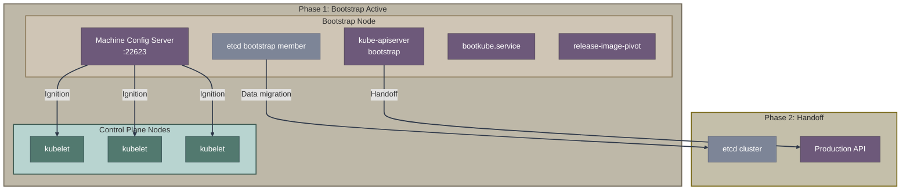
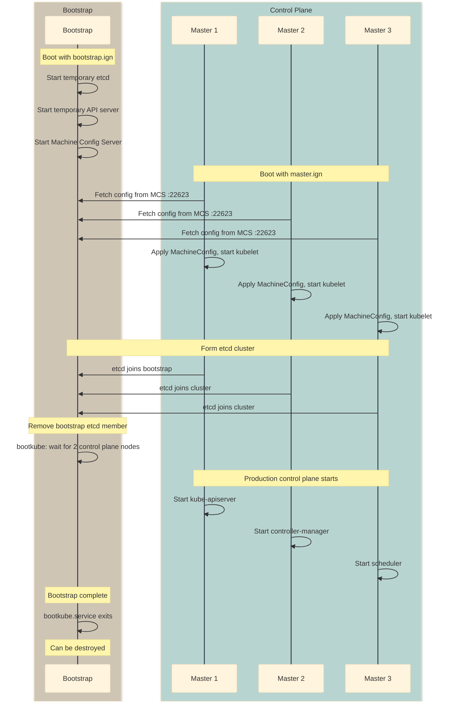
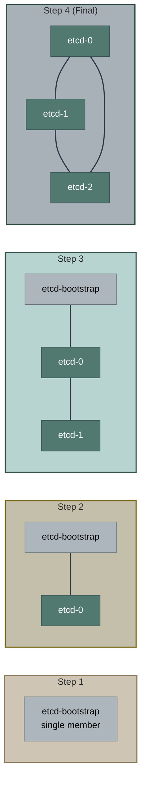
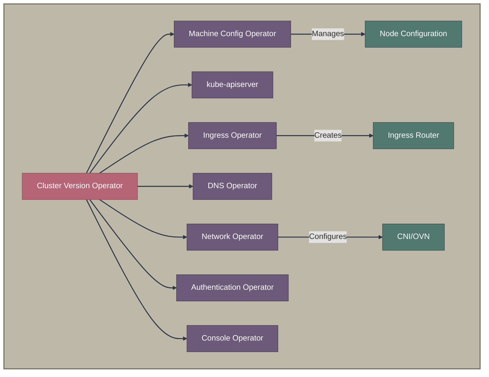
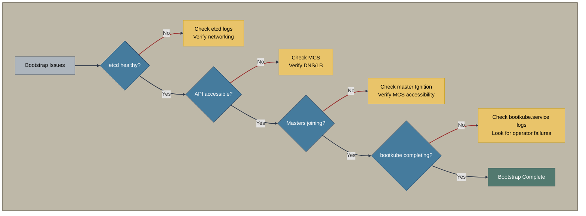

# The Bootstrap Process

The bootstrap process is fundamental to all OpenShift installations. This document explains how a cluster forms from nothing to a fully operational state.

**Key source code:**
- [openshift/installer/pkg/asset/ignition/bootstrap](https://github.com/openshift/installer/tree/master/pkg/asset/ignition/bootstrap) - Bootstrap Ignition generation
- [openshift/machine-config-operator](https://github.com/openshift/machine-config-operator) - Machine Config Server and node configuration
- [openshift/cluster-bootstrap](https://github.com/openshift/cluster-bootstrap) - Bootstrap rendering logic

## The Bootstrap Problem

OpenShift has a unique challenge: every node needs configuration from the cluster it's joining, but the cluster doesn't exist yet. This creates a chicken-and-egg problem.

**Solution:** A temporary bootstrap node acts as a stand-in cluster until the real control plane is ready.

## Bootstrap Architecture



## Detailed Timeline



## Bootstrap Node Components

### Core Services

| Service | Purpose | Port |
|---------|---------|------|
| `bootkube.service` | Orchestrates bootstrap | - |
| `machine-config-server` | Serves Ignition configs | 22623 |
| `etcd` (bootstrap) | Temporary etcd member | 2379, 2380 |
| `kube-apiserver` | Temporary API server | 6443 |
| `approve-csr.service` | Auto-approves initial CSRs | - |

### bootkube.service

The main orchestrator that:

1. Waits for etcd to be healthy
2. Starts the bootstrap control plane
3. Renders cluster manifests
4. Waits for the production control plane
5. Removes the bootstrap etcd member
6. Exits successfully (signaling bootstrap complete)

```bash
# View bootkube progress on bootstrap node
journalctl -b -f -u bootkube.service

# Key milestones to look for:
# - "Starting etcd-bootstrap..."
# - "Starting kube-apiserver-bootstrap..."
# - "Tearing down etcd-bootstrap..."
# - "bootkube.service complete"
```

## Machine Config Server (MCS)

The MCS runs on the bootstrap node and serves full Ignition configs to nodes.

### How It Works

1. `master.ign` contains only a pointer:
```json
{
  "ignition": {
    "config": {
      "merge": [{
        "source": "https://api-int.cluster.example.com:22623/config/master"
      }]
    }
  }
}
```

2. Node boots and fetches from MCS
3. MCS serves rendered MachineConfig as Ignition
4. Node applies full configuration

### MCS Endpoints

| Endpoint | Purpose |
|----------|---------|
| `/config/master` | Full control plane Ignition |
| `/config/worker` | Full worker Ignition |
| `/healthz` | Health check |

## etcd Bootstrap

### Initial State



### etcd Member Management

```bash
# On bootstrap, check etcd members
etcdctl member list

# Expected progression:
# 1. Only bootstrap member
# 2. bootstrap + master-0
# 3. bootstrap + master-0 + master-1
# 4. bootstrap + master-0 + master-1 + master-2
# 5. master-0 + master-1 + master-2 (bootstrap removed)
```

## Control Plane Components

During bootstrap, these components transition from bootstrap to production:

| Component | Bootstrap Phase | Production Phase |
|-----------|----------------|------------------|
| etcd | Static pod on bootstrap | StatefulSet on masters |
| kube-apiserver | Static pod on bootstrap | Static pod on masters (via MCO) |
| kube-controller-manager | Not running | Static pod on masters |
| kube-scheduler | Not running | Static pod on masters |
| Machine Config Server | Bootstrap binary | DaemonSet on masters (via MCO) |

## Cluster Operators During Bootstrap

The Cluster Version Operator (CVO) starts on the bootstrap node and begins deploying operators:



## Bootstrap Completion Criteria

The bootstrap is complete when:

1. etcd cluster has 3 healthy members (bootstrap removed)
2. kube-apiserver is running on control plane nodes
3. CVO has deployed critical operators
4. `bootkube.service` exits successfully

```bash
# Check bootstrap completion
openshift-install wait-for bootstrap-complete --dir=cluster --log-level=debug

# When complete, you'll see:
# INFO It is now safe to remove the bootstrap resources
# INFO Time elapsed: 15m30s
```

## Troubleshooting Bootstrap

### Common Failure Points



### Gathering Bootstrap Logs

```bash
# SSH to bootstrap node
ssh core@<bootstrap_ip>

# View all journal logs
journalctl -b

# Specific services
journalctl -b -u bootkube.service
journalctl -b -u kubelet.service
journalctl -b -u crio.service

# Container logs (pods)
crictl logs <container_id>

# Or use installer command
openshift-install gather bootstrap --dir=cluster
```

### Key Log Locations

| Log | Location | Purpose |
|-----|----------|---------|
| bootkube | `journalctl -u bootkube.service` | Main orchestrator |
| kubelet | `journalctl -u kubelet.service` | Node agent |
| etcd | `crictl logs etcd-bootstrap` | etcd member |
| API server | `crictl logs kube-apiserver-bootstrap` | API |
| MCS | `crictl logs machine-config-server` | Config server |

### Network Connectivity Requirements

During bootstrap, these connections must work:

```
Bootstrap → Masters (all)
  - TCP 2379-2380 (etcd)
  - TCP 6443 (API)
  
Masters → Bootstrap
  - TCP 22623 (MCS)
  - TCP 2379-2380 (etcd)
  
Masters → Masters
  - TCP 2379-2380 (etcd)
  - TCP 6443 (API)
  
External → Load Balancer → Bootstrap/Masters
  - TCP 6443 (API)
  - TCP 22623 (MCS) - internal only
```

## Bootstrap in Different Installation Methods

### IPI
- Bootstrap VM is automatically provisioned
- Automatically destroyed after completion

### UPI
- User provisions bootstrap infrastructure
- User must destroy after `wait-for bootstrap-complete`

### Assisted Installer
- One node temporarily acts as bootstrap
- No separate bootstrap machine needed
- Uses "bootstrap-in-place" technique

### Agent-Based Installer
- Similar to Assisted Installer
- Bootstrap role determined automatically

## Related Documentation

- [Traditional Installers Overview](index.md) - Section overview
- [IPI Installation](ipi.md) - Automated infrastructure
- [UPI Installation](upi.md) - Manual infrastructure
- [Assisted Installation](../03-assisted-installation/overview.md) - Bootstrap-less approach

