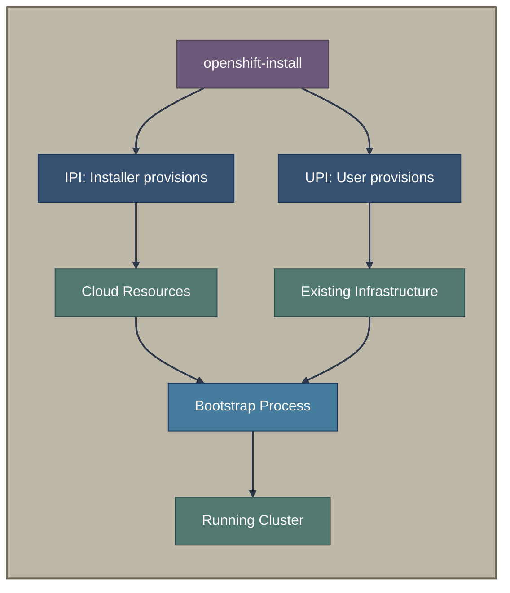

# Traditional Installers

This section covers the foundational OpenShift installation methods that use the `openshift-install` binary directly.

## Overview

Traditional installers represent the "classic" approach to OpenShift installation, where the `openshift-install` binary orchestrates the entire process. These methods differ primarily in *who* provisions the infrastructure.



## Documents in This Section

| Document | Description |
|----------|-------------|
| [**IPI - Installer-Provisioned Infrastructure**](ipi.md) | Fully automated installation where `openshift-install` provisions all cloud resources |
| [**UPI - User-Provisioned Infrastructure**](upi.md) | Installation on pre-existing infrastructure you provision yourself |
| [**The Bootstrap Process**](bootstrap-process.md) | Deep dive into how clusters form from bootstrap to production |

## Quick Comparison

| Aspect | IPI | UPI |
|--------|-----|-----|
| Infrastructure provisioning | Automatic | Manual |
| Supported platforms | Cloud providers with full API support | Any platform meeting requirements |
| Customization | Limited to install-config | Full control |
| Time to deploy | Faster | Longer |
| Cloud permissions | Extensive | Minimal |
| Disconnected support | Limited | Full |

## When to Use Traditional Installers

**Choose IPI when:**
- Deploying on supported cloud platforms (AWS, Azure, GCP, etc.)
- You want minimal infrastructure management
- Full cloud automation is acceptable
- Development/testing environments

**Choose UPI when:**
- Restricted cloud permissions
- Existing infrastructure automation (Terraform, Ansible, etc.)
- Custom networking requirements
- Air-gapped/disconnected environments
- Platforms not fully supported by IPI (IBM Power, z/VM)

## Key Concepts

### The Bootstrap Node

All traditional installations use a **bootstrap node** - a temporary machine that:
1. Hosts the initial control plane
2. Serves configurations to other nodes
3. Hands off control to permanent masters
4. Gets destroyed after successful bootstrap

See [The Bootstrap Process](bootstrap-process.md) for complete details.

### Ignition Configs

Both IPI and UPI generate [Ignition](https://coreos.github.io/ignition/) configs:
- `bootstrap.ign` - Full config for bootstrap node
- `master.ign` - Pointer to Machine Config Server
- `worker.ign` - Pointer to Machine Config Server

### The openshift-install Binary

**Repository:** [openshift/installer](https://github.com/openshift/installer)

The binary supports multiple "targets":
```bash
openshift-install create install-config   # Generate install-config.yaml
openshift-install create manifests        # Generate Kubernetes manifests
openshift-install create ignition-configs # Generate Ignition files
openshift-install create cluster          # Full installation
```

## Related Sections

- [Installation Methods Overview](../01-installation-methods-overview.md) - Decision tree for choosing methods
- [Assisted Installation](../03-assisted-installation/overview.md) - Alternative for bare metal
- [Agent-Based Installer](../03-assisted-installation/abi.md) - Disconnected alternative


