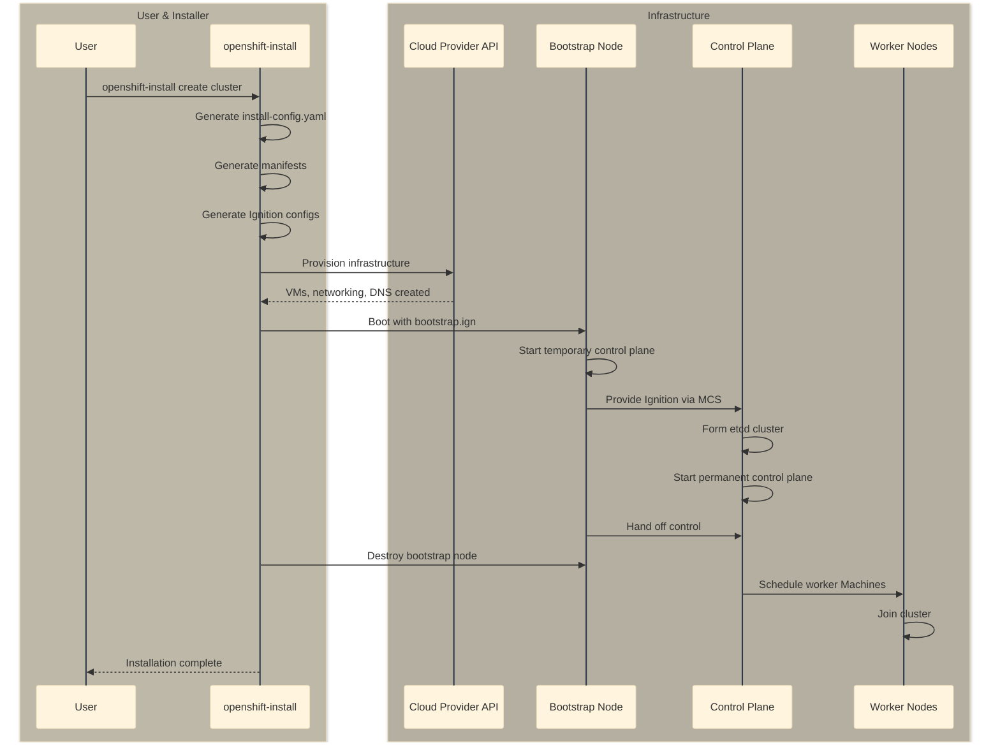
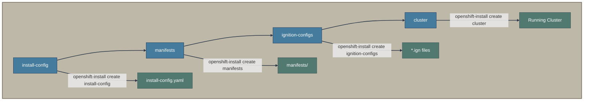
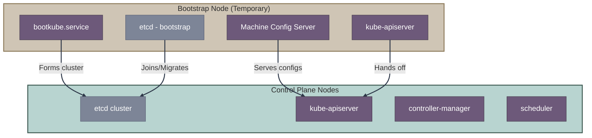

# IPI - Installer-Provisioned Infrastructure

IPI is the fully automated installation method where `openshift-install` provisions all infrastructure resources on supported cloud platforms.

## Overview



## Supported Platforms

| Platform | Full IPI Support | Notes |
|----------|-----------------|-------|
| AWS | ✅ | Primary development platform |
| Azure | ✅ | Includes Azure Stack Hub |
| GCP | ✅ | |
| IBM Cloud | ✅ | VPC Gen2 |
| Nutanix | ✅ | Requires Prism Central |
| OpenStack | ✅ | Requires Octavia for LB |
| vSphere | ✅ | Requires vCenter |
| Bare Metal | ✅ | Uses Bare Metal IPI (Metal3/Ironic), separate from Assisted |

## Key Components

### openshift-install Binary

The `openshift-install` binary is the main entry point. It's built from the [openshift/installer](https://github.com/openshift/installer) repository.

```bash
# Check embedded release info
openshift-install version

# Create cluster with default prompts
openshift-install create cluster --dir=<installation_directory>

# Generate only install-config (for customization)
openshift-install create install-config --dir=<installation_directory>

# Generate manifests (for advanced customization)
openshift-install create manifests --dir=<installation_directory>

# Generate ignition configs only
openshift-install create ignition-configs --dir=<installation_directory>
```

### Installation Targets

The installer operates on a dependency graph of "targets":



### install-config.yaml

The primary configuration file for IPI installations:

```yaml
apiVersion: v1
metadata:
  name: my-cluster
baseDomain: example.com
controlPlane:
  name: master
  replicas: 3
  platform:
    aws:
      type: m5.xlarge
      zones:
        - us-east-1a
        - us-east-1b
        - us-east-1c
compute:
  - name: worker
    replicas: 3
    platform:
      aws:
        type: m5.large
networking:
  networkType: OVNKubernetes
  clusterNetwork:
    - cidr: 10.128.0.0/14
      hostPrefix: 23
  serviceNetwork:
    - 172.30.0.0/16
platform:
  aws:
    region: us-east-1
pullSecret: '<pull_secret_json>'
sshKey: '<ssh_public_key>'
```

### Release and OS Images

The installer uses two key images (see [Images and Versioning](../00-concepts-glossary.md#images-and-versioning)):

| Image Type | Purpose | Example |
|------------|---------|---------|
| **Release Image** | Container with OpenShift version metadata | `quay.io/openshift-release-dev/ocp-release:4.14.10-x86_64` |
| **OS Image (RHCOS)** | Bootable CoreOS for nodes | `rhcos-4.14.10-x86_64-live.x86_64.iso` |

The release image is embedded in the `openshift-install` binary; the matching OS image is automatically selected during installation.

### Ignition Configs

Ignition is a first-boot provisioning system for CoreOS. The installer generates three Ignition configs:

| File | Purpose | Used By |
|------|---------|---------|
| `bootstrap.ign` | Configures the temporary bootstrap node | Bootstrap VM |
| `master.ign` | Pointer to Machine Config Server on bootstrap | Control plane nodes |
| `worker.ign` | Pointer to Machine Config Server on bootstrap/control plane | Worker nodes |

**Note:** `master.ign` and `worker.ign` are minimal configs that point to the Machine Config Server (MCS) to fetch the full configuration. This enables the cluster to manage its own configuration.

## The Bootstrap Process

The bootstrap node is a temporary machine that:

1. Hosts the initial control plane components
2. Serves Ignition configs via Machine Config Server
3. Runs the bootstrap process to form the cluster
4. Hands off control to the permanent control plane
5. Gets destroyed after successful handoff



For detailed bootstrap process documentation, see [Bootstrap Process](bootstrap-process.md).

## What IPI Provisions

On AWS (example), IPI creates:

| Resource | Purpose |
|----------|---------|
| VPC | Cluster networking |
| Subnets | Public and private subnets per AZ |
| Internet Gateway | Egress for public subnets |
| NAT Gateways | Egress for private subnets |
| Route Tables | Network routing |
| Security Groups | Firewall rules |
| ELB/NLB | API and Ingress load balancers |
| Route53 Records | DNS for API and apps |
| EC2 Instances | Bootstrap, masters, workers |
| EBS Volumes | Storage for nodes |
| IAM Roles | Permissions for operators |
| S3 Bucket | Ignition storage (bootstrap) |

## Customization Points

### 1. Install Config Level

Modify `install-config.yaml` before running `create cluster`:

```bash
openshift-install create install-config --dir=cluster
# Edit cluster/install-config.yaml
openshift-install create cluster --dir=cluster
```

### 2. Manifest Level

Add or modify Kubernetes manifests:

```bash
openshift-install create manifests --dir=cluster
# Add custom manifests to cluster/manifests/
# Add MachineConfig to cluster/openshift/
openshift-install create cluster --dir=cluster
```

### 3. Ignition Level

Modify Ignition configs (advanced, not recommended):

```bash
openshift-install create ignition-configs --dir=cluster
# Modify *.ign files (breaks signature!)
# Provision infrastructure manually with modified configs
```

## Day 2 Operations

After installation, cluster management shifts to:

| Component | Purpose |
|-----------|---------|
| Machine API | Manages cloud VMs via Machine CRDs |
| Cluster Autoscaler | Scales worker nodes |
| Machine Config Operator | Manages node OS configuration |
| Cluster Version Operator | Manages cluster upgrades |

## Troubleshooting

### Common Issues

1. **Bootstrap never completes**
   - Check bootstrap node logs: `ssh core@<bootstrap_ip> journalctl -b -f`
   - Verify network connectivity to control plane nodes

2. **Control plane nodes don't join**
   - Check Machine Config Server accessibility
   - Verify DNS resolution for API endpoint

3. **Installation times out**
   - Check `openshift-install wait-for bootstrap-complete --log-level=debug`
   - Review events in bootstrap machine-config-operator

### Gathering Logs

```bash
# Gather bootstrap logs (while bootstrap is running)
openshift-install gather bootstrap --dir=cluster

# Gather full cluster logs (after installation failure)
openshift-install gather --dir=cluster
```

## Related Documentation

- [UPI Installation](upi.md) - When you need to provision infrastructure yourself
- [Bootstrap Process](bootstrap-process.md) - Detailed bootstrap mechanics
- [Machine API](../08-crd-reference/day2-machine-management.md) - Post-install machine management

