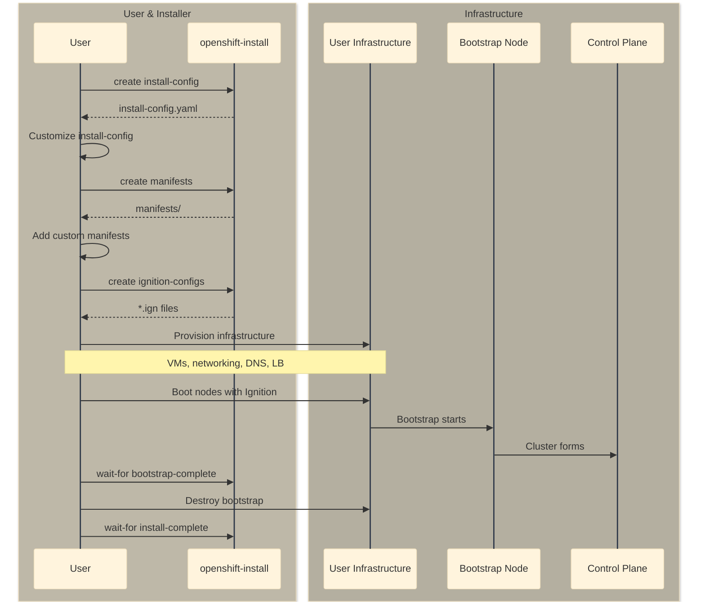
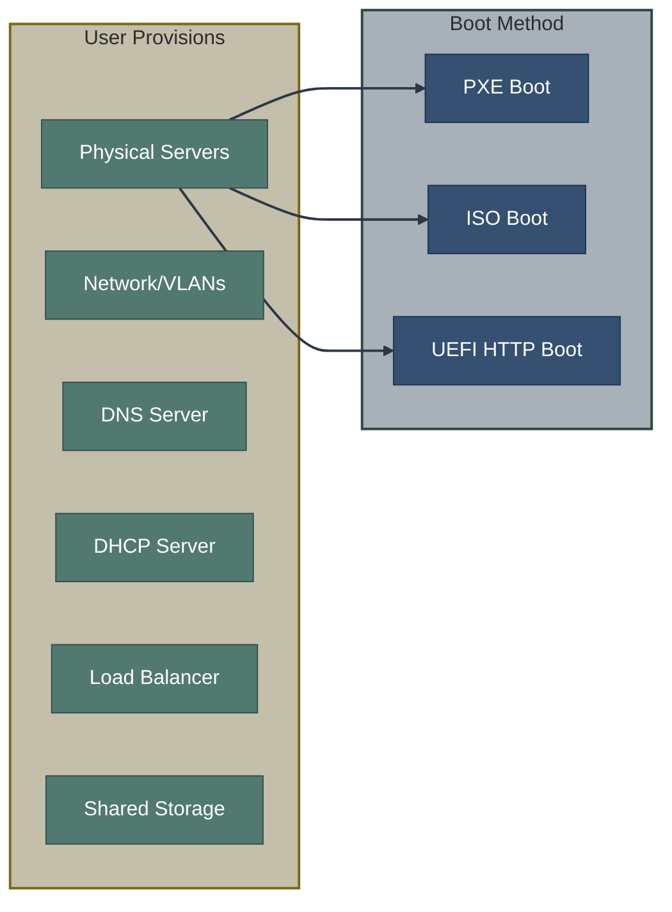

# UPI - User-Provisioned Infrastructure

UPI is the installation method where users provision all infrastructure according to OpenShift requirements, then use `openshift-install` to generate configuration for that infrastructure.

## Overview



## When to Use UPI

| Scenario | Use UPI |
|----------|---------|
| Restricted cloud permissions | ✅ |
| Existing infrastructure automation | ✅ |
| Custom networking requirements | ✅ |
| Platform not fully IPI-supported | ✅ |
| Air-gapped installation | ✅ |
| IBM Power, z/VM | ✅ (required) |

## Infrastructure Requirements

Before running the installer, you must provision:

### Network Infrastructure

| Component | Requirement |
|-----------|-------------|
| **DHCP or Static IPs** | All nodes need IP addresses |
| **DNS Records** | API, API-INT, apps wildcard, etcd |
| **Load Balancer (API)** | Ports 6443 (API), 22623 (MCS) |
| **Load Balancer (Ingress)** | Ports 80, 443 |
| **Firewall Rules** | Allow required ports between nodes |

### Required DNS Records

```
api.<cluster_name>.<base_domain>          → API load balancer
api-int.<cluster_name>.<base_domain>      → API load balancer (internal)
*.apps.<cluster_name>.<base_domain>       → Ingress load balancer
etcd-0.<cluster_name>.<base_domain>       → Control plane node 0
etcd-1.<cluster_name>.<base_domain>       → Control plane node 1
etcd-2.<cluster_name>.<base_domain>       → Control plane node 2
_etcd-server-ssl._tcp.<cluster_name>.<base_domain>  → SRV records for etcd
```

### Compute Requirements

| Node Type | Count | CPU | RAM | Storage |
|-----------|-------|-----|-----|---------|
| Bootstrap | 1 (temporary) | 4 | 16 GB | 100 GB |
| Control Plane | 3 | 4 | 16 GB | 100 GB |
| Worker | 2+ | 2 | 8 GB | 100 GB |

## UPI Installation Process

### Step 1: Generate Configuration

```bash
# Create installation directory
mkdir cluster && cd cluster

# Generate install-config.yaml
openshift-install create install-config

# Review and customize
cat install-config.yaml
```

### Step 2: Customize install-config.yaml

For UPI, you typically set `replicas: 0` for compute to prevent automatic Machine provisioning:

```yaml
apiVersion: v1
metadata:
  name: my-cluster
baseDomain: example.com
controlPlane:
  name: master
  replicas: 3
compute:
  - name: worker
    replicas: 0  # Workers will be manually provisioned
platform:
  none: {}  # Or specific platform with UPI settings
pullSecret: '<pull_secret>'
sshKey: '<ssh_key>'
```

### Step 3: Generate Manifests (Optional)

```bash
openshift-install create manifests

# Add custom manifests
# - cluster/manifests/ for cluster-scoped resources
# - cluster/openshift/ for MachineConfig and operators
```

### Step 4: Generate Ignition Configs

```bash
openshift-install create ignition-configs

# Output:
# - bootstrap.ign
# - master.ign
# - worker.ign
# - auth/kubeconfig
# - auth/kubeadmin-password
```

### Step 5: Host Ignition Configs

The Ignition configs must be accessible to the nodes during boot:

```bash
# Option 1: HTTP server
python3 -m http.server 8080

# Option 2: S3 bucket (AWS)
aws s3 cp bootstrap.ign s3://my-bucket/bootstrap.ign

# Option 3: Inject into VM provisioning system
```

### Step 6: Provision and Boot Nodes

Boot nodes in order:
1. **Bootstrap node** with `bootstrap.ign`
2. **Control plane nodes** with `master.ign`
3. Wait for bootstrap to complete
4. **Worker nodes** with `worker.ign`

### Step 7: Wait for Bootstrap

```bash
openshift-install wait-for bootstrap-complete --log-level=debug

# Output when complete:
# INFO It is now safe to remove the bootstrap resources
```

### Step 8: Destroy Bootstrap and Complete

```bash
# Remove bootstrap node and load balancer entries
# Then wait for installation to complete

openshift-install wait-for install-complete

# Approve pending CSRs for workers
oc get csr -o name | xargs oc adm certificate approve
```

## Platform-Specific Considerations

### Bare Metal



For bare metal, you need:
- PXE server or bootable media
- RHCOS images (download from `openshift-install coreos print-stream-json`)
- Network boot configuration

### vSphere UPI

```bash
# Get RHCOS OVA URL
openshift-install coreos print-stream-json | jq -r '.architectures.x86_64.artifacts.vmware.formats.ova.disk.location'

# Import OVA as template
govc import.ova -name rhcos-template <ova_url>

# Clone VMs from template with Ignition
govc vm.clone -vm rhcos-template -on=false master-0
govc vm.change -vm master-0 -e "guestinfo.ignition.config.data=$(cat master.ign | base64 -w0)"
govc vm.change -vm master-0 -e "guestinfo.ignition.config.data.encoding=base64"
govc vm.power -on master-0
```

### AWS UPI

AWS UPI uses CloudFormation templates:

```bash
# Infrastructure CloudFormation stacks
aws cloudformation create-stack --stack-name cluster-vpc --template-body file://vpc.yaml
aws cloudformation create-stack --stack-name cluster-infra --template-body file://infra.yaml

# Bootstrap
aws cloudformation create-stack --stack-name cluster-bootstrap --template-body file://bootstrap.yaml

# Control Plane
aws cloudformation create-stack --stack-name cluster-control-plane --template-body file://control-plane.yaml

# Workers (after bootstrap complete)
aws cloudformation create-stack --stack-name cluster-workers --template-body file://workers.yaml
```

## Ignition Config Handling

### Master and Worker Ignition

The `master.ign` and `worker.ign` files are small pointers:

```json
{
  "ignition": {
    "config": {
      "merge": [
        {
          "source": "https://api-int.cluster.example.com:22623/config/master"
        }
      ]
    },
    "version": "3.2.0"
  }
}
```

They fetch full configuration from the Machine Config Server (MCS) running on bootstrap (port 22623).

### Bootstrap Ignition

`bootstrap.ign` is large (megabytes) and contains:
- All control plane static pods
- Machine Config Server
- etcd bootstrap configuration
- Bootstrap services

## Certificate Signing Requests

Workers joining the cluster need their CSRs approved:

```bash
# View pending CSRs
oc get csr

# Approve all pending CSRs
oc get csr -o go-template='{{range .items}}{{if not .status}}{{.metadata.name}}{{"\n"}}{{end}}{{end}}' | xargs oc adm certificate approve

# Or approve individually
oc adm certificate approve csr-xxxxx
```

## Adding Workers Post-Install

After initial installation, add workers by:

1. Generate new worker Ignition pointing to cluster API:

```bash
# Get worker Ignition from running cluster
oc extract -n openshift-machine-api secret/worker-user-data --keys=userData --to=-
```

2. Boot new nodes with this Ignition
3. Approve CSRs

## Comparison: IPI vs UPI

| Aspect | IPI | UPI |
|--------|-----|-----|
| Infrastructure provisioning | Automatic | Manual |
| Customization flexibility | Limited | Full |
| Cloud permissions required | Extensive | Minimal |
| Time to install | Faster | Longer |
| Reproducibility | Built-in | Requires automation |
| Disconnected support | Limited | Full |
| Platform requirements | Strict | Flexible |

## Related Documentation

- [IPI Installation](ipi.md) - Automated installation
- [Bootstrap Process](bootstrap-process.md) - Understanding bootstrap
- [Agent-Based Installer](../03-assisted-installation/abi.md) - Alternative for disconnected

