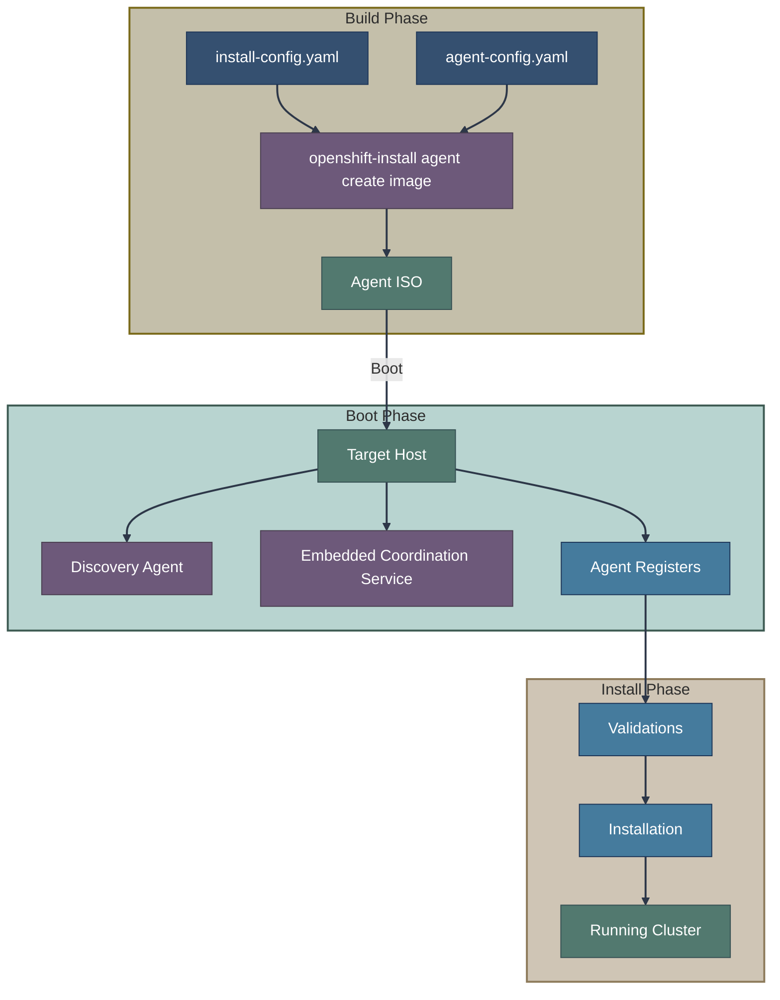
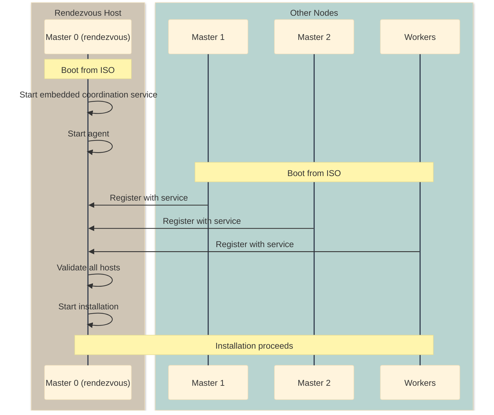
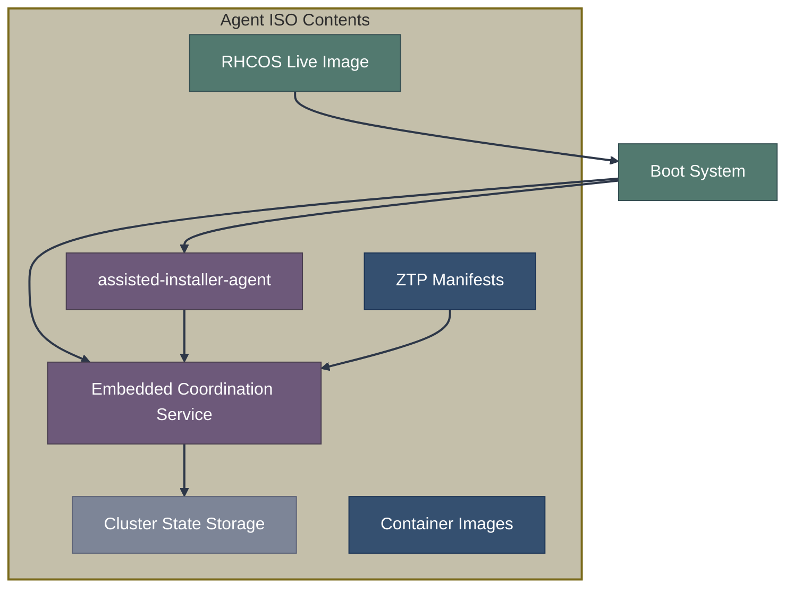
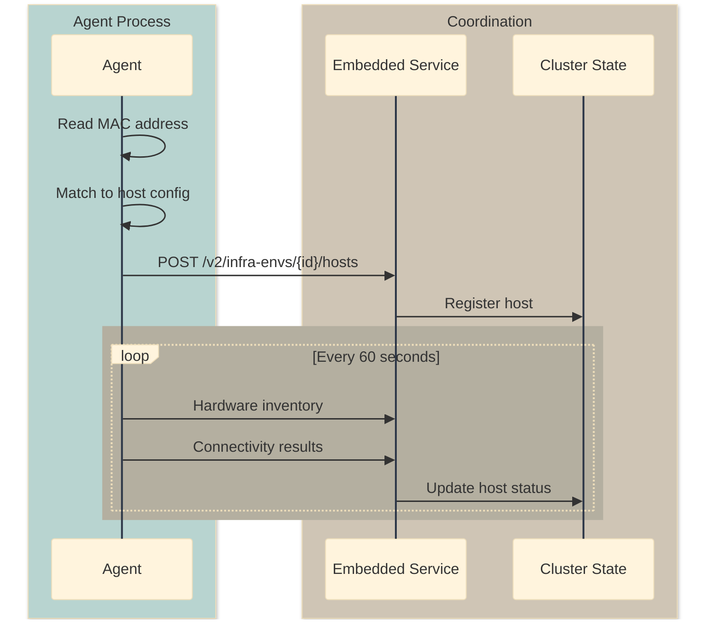

# Agent-Based Installer (ABI)

The Agent-Based Installer is a standalone installation method that embeds the Assisted Installer into a bootable ISO, enabling fully disconnected OpenShift deployments without requiring an external service.

**Repositories:**
- [openshift/installer](https://github.com/openshift/installer) - The `openshift-install agent` command
- [openshift/assisted-service](https://github.com/openshift/assisted-service) - Embedded coordination service
- [openshift/assisted-installer-agent](https://github.com/openshift/assisted-installer-agent) - Discovery agent

## Overview



## When to Use ABI

| Scenario | Use ABI |
|----------|---------|
| Fully disconnected/air-gapped environment | Yes |
| No hub cluster available | Yes |
| Single cluster deployment | Yes |
| Automation pipelines | Yes |
| Pre-defined static configuration | Yes |
| Interactive installation | No (use Assisted SaaS) |
| Multi-cluster management | No (use MCE) |
| GitOps-driven deployment | Partial (consider ZTP) |

## Key Differences from Other Methods

| Aspect | IPI/UPI | Assisted SaaS | Assisted MCE | ABI |
|--------|---------|---------------|--------------|-----|
| External service | No | Yes (Red Hat) | Yes (Hub) | No (Embedded) |
| Disconnected | Partial | No | Yes | Yes |
| Pre-validation | No | Yes | Yes | Yes |
| Bootstrap node | Separate | None | None | None |
| Configuration | install-config | Web UI/API | CRDs | YAML files |

## Configuration Files

### install-config.yaml

Standard OpenShift install configuration:

```yaml
apiVersion: v1
metadata:
  name: my-cluster
baseDomain: example.com
compute:
  - name: worker
    replicas: 2
controlPlane:
  name: master
  replicas: 3
networking:
  clusterNetwork:
    - cidr: 10.128.0.0/14
      hostPrefix: 23
  serviceNetwork:
    - 172.30.0.0/16
  networkType: OVNKubernetes
platform:
  baremetal:
    apiVIPs:
      - 192.168.1.100
    ingressVIPs:
      - 192.168.1.101
pullSecret: '<pull_secret>'
sshKey: '<ssh_public_key>'
```

### agent-config.yaml

Agent-specific configuration:

```yaml
apiVersion: v1alpha1
kind: AgentConfig
metadata:
  name: my-cluster
rendezvousIP: 192.168.1.10
additionalNTPSources:
  - ntp.example.com
hosts:
  - hostname: master-0
    role: master
    interfaces:
      - name: eno1
        macAddress: 00:11:22:33:44:01
    rootDeviceHints:
      deviceName: /dev/sda
    networkConfig:
      interfaces:
        - name: eno1
          type: ethernet
          state: up
          ipv4:
            address:
              - ip: 192.168.1.10
                prefix-length: 24
            enabled: true
            dhcp: false
      routes:
        config:
          - destination: 0.0.0.0/0
            next-hop-address: 192.168.1.1
            next-hop-interface: eno1
      dns-resolver:
        config:
          server:
            - 192.168.1.1
  - hostname: master-1
    role: master
    interfaces:
      - name: eno1
        macAddress: 00:11:22:33:44:02
    networkConfig:
      # Similar static config...
  - hostname: master-2
    role: master
    interfaces:
      - name: eno1
        macAddress: 00:11:22:33:44:03
    networkConfig:
      # Similar static config...
```

## Installation Process

### Step 1: Create Configuration

```bash
mkdir cluster-config
cd cluster-config

# Create install-config.yaml and agent-config.yaml
# (as shown above)
```

### Step 2: Generate ISO

```bash
openshift-install agent create image --dir=.

# Output:
# agent.x86_64.iso    - Bootable ISO
# auth/               - kubeconfig and kubeadmin password
```

### Step 3: Boot Nodes

Boot all nodes from the generated ISO. The rendezvousIP host becomes the coordination point:



### Step 4: Monitor Progress

```bash
# Watch installation progress
openshift-install agent wait-for bootstrap-complete --dir=.

# Wait for full installation
openshift-install agent wait-for install-complete --dir=.
```

## Architecture

### Embedded Components

The agent ISO contains embedded minimal services for coordination (internally using the same assisted-service codebase):



> **Implementation Note:** The embedded service is based on assisted-service running in a lightweight mode with local state storage. This is an implementation detail; the user experience is through the generated ISO and `openshift-install agent` commands.

### Rendezvous Host

One host (specified by `rendezvousIP`) acts as the coordination point:

| Responsibility | Description |
|----------------|-------------|
| Run coordination service | Embedded REST API for inter-node communication |
| Store cluster state | Local state storage |
| Coordinate installation | Track all hosts and progress |
| Serve Ignition | Machine Config Server role |

### Agent Registration



## ZTP Manifests

ABI uses the same manifest format as ZTP for cluster configuration:

```bash
# Directory structure after image creation
cluster-config/
├── agent.x86_64.iso
├── auth/
│   ├── kubeconfig
│   └── kubeadmin-password
└── cluster-manifests/          # Auto-generated
    ├── agent-cluster-install.yaml
    ├── cluster-deployment.yaml
    ├── cluster-image-set.yaml
    ├── infraenv.yaml
    ├── nmstate-config.yaml
    └── pull-secret.yaml
```

These manifests are embedded in the ISO and loaded by the embedded assisted-service.

## Static Network Configuration

### Using agent-config.yaml

```yaml
hosts:
  - hostname: master-0
    networkConfig:
      interfaces:
        - name: bond0
          type: bond
          state: up
          link-aggregation:
            mode: active-backup
            port:
              - eno1
              - eno2
          ipv4:
            address:
              - ip: 192.168.1.10
                prefix-length: 24
            enabled: true
        - name: eno1
          type: ethernet
          state: up
        - name: eno2
          type: ethernet
          state: up
```

### VLAN Configuration

```yaml
hosts:
  - hostname: master-0
    networkConfig:
      interfaces:
        - name: eno1.100
          type: vlan
          state: up
          vlan:
            base-iface: eno1
            id: 100
          ipv4:
            address:
              - ip: 192.168.100.10
                prefix-length: 24
            enabled: true
```

## Disconnected Installation

### Prerequisites

1. Mirror registry with OpenShift images
2. RHCOS ISO accessible locally
3. Network connectivity between nodes

### Configuration

```yaml
# install-config.yaml additions for disconnected
imageDigestSources:
  - source: quay.io/openshift-release-dev/ocp-release
    mirrors:
      - registry.example.com/ocp4/openshift4
  - source: quay.io/openshift-release-dev/ocp-v4.0-art-dev
    mirrors:
      - registry.example.com/ocp4/openshift4
additionalTrustBundle: |
  -----BEGIN CERTIFICATE-----
  <mirror registry CA cert>
  -----END CERTIFICATE-----
```

```bash
# Use local RHCOS image
export OPENSHIFT_INSTALL_OS_IMAGE_OVERRIDE="file:///path/to/rhcos-live.iso"
openshift-install agent create image --dir=.
```

## Single Node OpenShift (SNO)

ABI fully supports SNO deployments:

```yaml
# install-config.yaml for SNO
compute:
  - name: worker
    replicas: 0
controlPlane:
  name: master
  replicas: 1
platform:
  none: {}  # No VIPs needed for SNO
```

```yaml
# agent-config.yaml for SNO
apiVersion: v1alpha1
kind: AgentConfig
metadata:
  name: sno-cluster
rendezvousIP: 192.168.1.10
hosts:
  - hostname: sno-node
    role: master
    interfaces:
      - name: eno1
        macAddress: 00:11:22:33:44:55
```

## Troubleshooting

### Accessing the Rendezvous Host

```bash
# SSH to rendezvous host
ssh core@<rendezvous_ip>

# View assisted-service logs
journalctl -u agent.service -f

# Check installation progress
curl -s http://localhost:8090/api/assisted-install/v2/clusters | jq
```

### Common Issues

| Issue | Diagnosis | Solution |
|-------|-----------|----------|
| Hosts not registering | Check network connectivity | Verify `rendezvousIP` is reachable |
| Validation failures | Check agent logs | Review hardware requirements |
| Installation stuck | Check bootkube logs | Review network/DNS configuration |
| Wrong host roles | MAC address mismatch | Verify MAC addresses in agent-config |

### Gathering Logs

```bash
# Before installation completes
openshift-install agent gather --dir=.

# Creates support bundle with:
# - Agent logs from all hosts
# - assisted-service logs
# - Cluster state
```

## Comparison with Appliance

| Aspect | ABI | Appliance |
|--------|-----|-----------|
| Image type | ISO (boot + discover) | Disk image (complete) |
| Container images | Downloaded during install | Pre-embedded |
| Registry needed | Yes (mirror for disconnected) | No (embedded) |
| Customization | At ISO generation | At appliance build |
| Image size | ~1 GB | ~20+ GB |
| Use case | Normal disconnected | Fully air-gapped |

## Related Documentation

### Detailed Documentation

- [Agent-Based Installer](https://github.com/openshift/assisted-service/blob/master/docs/agent-based-installer.md) - Technical details
- [Static Network Configuration](https://github.com/openshift/assisted-service/blob/master/docs/user-guide/network-configuration/static-configuration.md)
- [OpenShift Installer ABI Docs](https://github.com/openshift/installer/tree/master/docs/user/agent) - Official installer documentation

### This Guide

- [Assisted Installation Overview](overview.md)
- [Image-Based Installation](../04-image-based-installation/ibi.md)
- [Appliance](../04-image-based-installation/appliance.md)
- [ZTP with SiteConfig](../06-gitops-provisioning/ztp.md)

