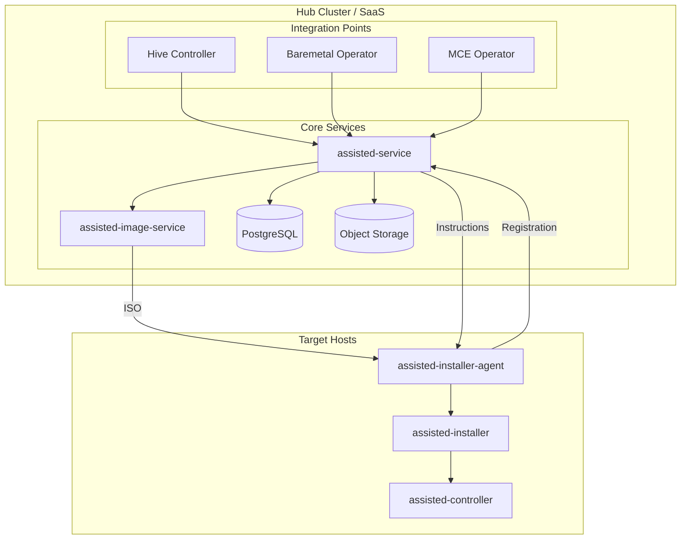
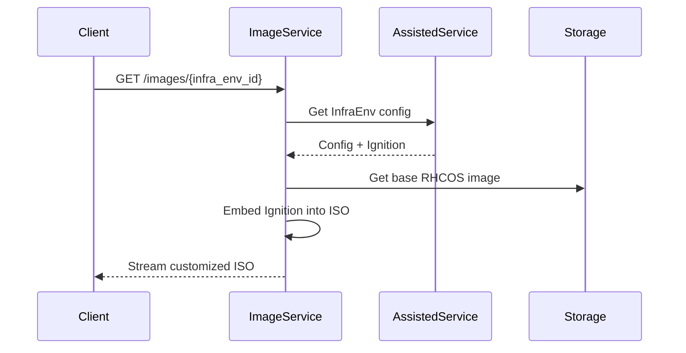
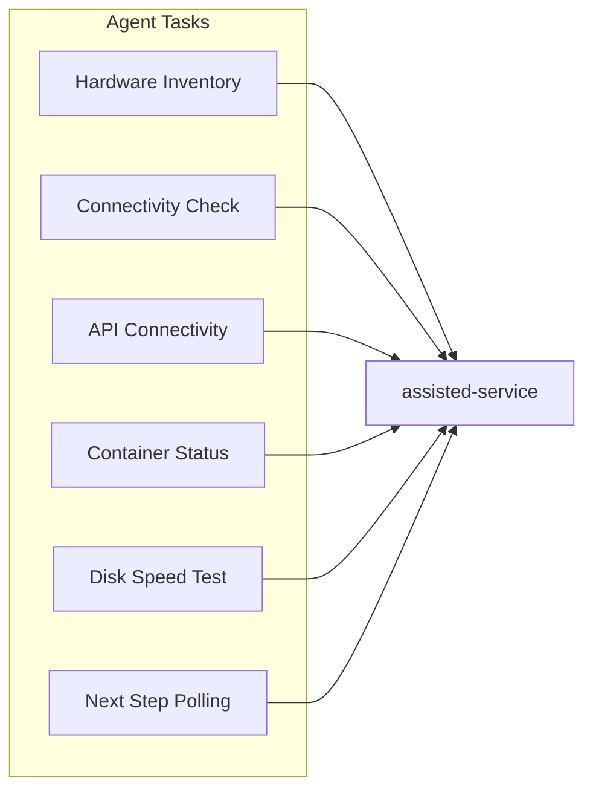
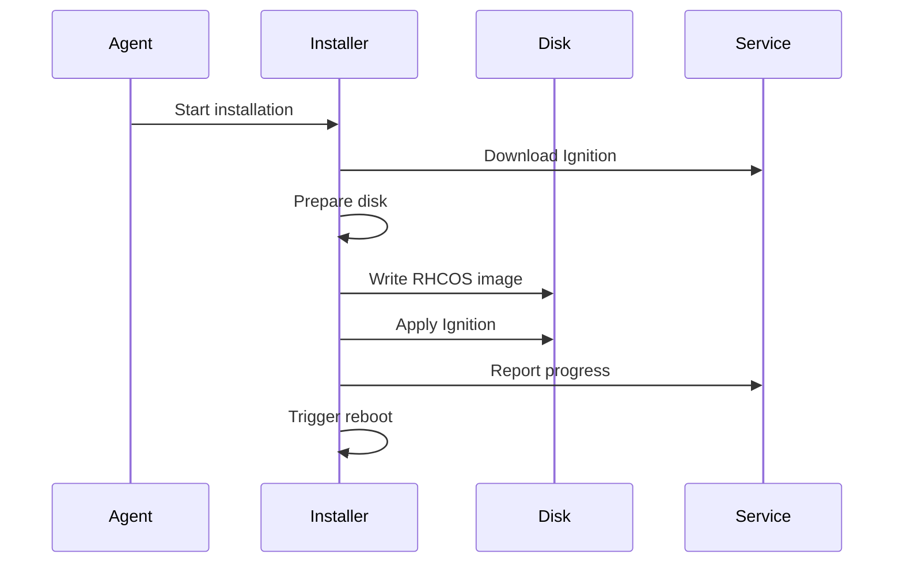
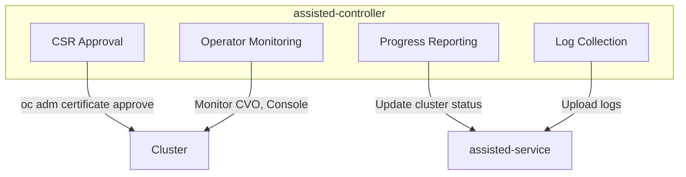
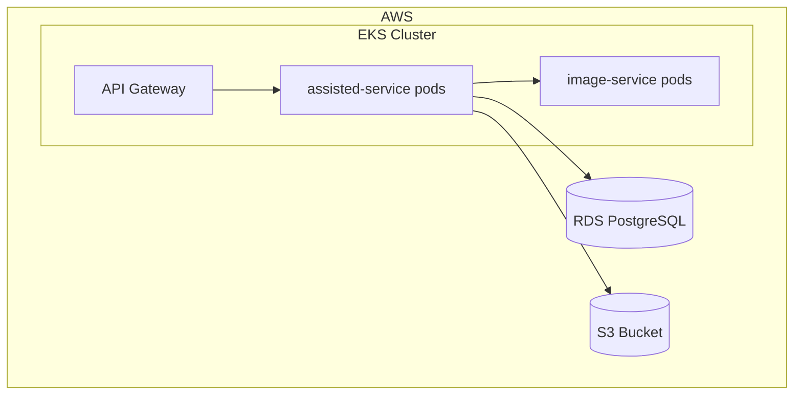
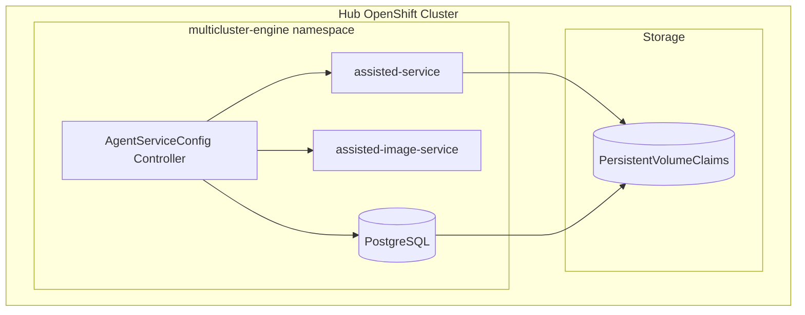

# Assisted Installer Components

This document provides a deep dive into the components that make up the Assisted Installer ecosystem.

## Component Architecture



## assisted-service

**Repository:** [openshift/assisted-service](https://github.com/openshift/assisted-service)

The core service providing API and business logic.

### Key Packages

| Package | Purpose |
|---------|---------|
| `internal/bminventory/` | Main REST API handlers |
| `internal/cluster/` | Cluster state machine and validations |
| `internal/host/` | Host state machine and validations |
| `internal/controller/` | Kubernetes controllers |
| `internal/operators/` | OLM operator support |
| `restapi/` | Generated REST server code |
| `models/` | Data models (from swagger) |

### REST API Handlers

```go
// internal/bminventory/inventory.go
type InstallerInternals interface {
    RegisterClusterInternal(ctx context.Context, params *models.ClusterCreateParams) (*common.Cluster, error)
    DeregisterClusterInternal(ctx context.Context, cluster *common.Cluster) error
    GetClusterByKubeKey(key types.NamespacedName) (*common.Cluster, error)
    InstallClusterInternal(ctx context.Context, cluster *common.Cluster) error
    // ... many more
}
```

### State Machines

**Cluster State Machine:**
```
                    ┌─────────────────┐
                    │ pending-for-input│
                    └────────┬────────┘
                             │
                    ┌────────▼────────┐
              ┌────►│  insufficient   │◄────┐
              │     └────────┬────────┘     │
              │              │              │
              │     ┌────────▼────────┐     │
              └─────│     ready       │─────┘
                    └────────┬────────┘
                             │
                    ┌────────▼────────┐
                    │  preparing...   │
                    └────────┬────────┘
                             │
                    ┌────────▼────────┐
                    │   installing    │
                    └────────┬────────┘
                             │
                    ┌────────▼────────┐
                    │   finalizing    │
                    └────────┬────────┘
                             │
              ┌──────────────┼──────────────┐
              │              │              │
     ┌────────▼────┐  ┌──────▼─────┐  ┌─────▼─────┐
     │  installed  │  │   error    │  │  cancelled │
     └─────────────┘  └────────────┘  └───────────┘
```

### Validation Engine

Validations are defined per resource type:

```go
// internal/cluster/validations.go
type validationID string

const (
    IsMachineCidrDefined        validationID = "machine-cidr-defined"
    IsMachineCidrEqualsToCalc   validationID = "machine-cidr-equals-to-calculated"
    AreApiVipsDefined           validationID = "api-vips-defined"
    AreApiVipsValid             validationID = "api-vips-valid"
    AreIngressVipsDefined       validationID = "ingress-vips-defined"
    AreIngressVipsValid         validationID = "ingress-vips-valid"
    AllHostsAreReadyToInstall   validationID = "all-hosts-are-ready-to-install"
    SufficientMastersCount      validationID = "sufficient-masters-count"
    // ...
)
```

### Kubernetes Controllers

In on-premise mode, these controllers reconcile CRDs:

```go
// internal/controller/controllers/

// ClusterDeploymentsReconciler
// - Watches: ClusterDeployment, AgentClusterInstall, Agent
// - Creates/updates cluster in assisted-service

// InfraEnvReconciler  
// - Watches: InfraEnv, NMStateConfig
// - Triggers ISO regeneration

// AgentReconciler
// - Watches: Agent
// - Syncs agent spec with internal host

// BMACReconciler (Baremetal Agent Controller)
// - Watches: BareMetalHost, Agent, InfraEnv
// - Bridges BMO and Assisted
```

## assisted-image-service

**Repository:** [openshift/assisted-image-service](https://github.com/openshift/assisted-image-service)

Generates customized discovery ISOs on-demand.

### How It Works



### ISO Types

| Type | Size | Contents |
|------|------|----------|
| **Full ISO** | ~1 GB | Complete rootfs + Ignition |
| **Minimal ISO** | ~100 MB | Kernel + initrd, rootfs downloaded at boot |

### Customizations Applied

1. **Ignition config** - Cluster ID, pull secret, endpoints
2. **Static networking** - NMState configuration
3. **Certificates** - Custom CA bundles
4. **Kernel parameters** - Custom boot arguments

## assisted-installer-agent

**Repository:** [openshift/assisted-installer-agent](https://github.com/openshift/assisted-installer-agent)

The agent running on discovered hosts.

### Responsibilities



### Hardware Inventory Collection

```go
// src/inventory/inventory.go
type Inventory struct {
    Hostname      string
    CPU           *CPU
    Memory        *Memory
    Disks         []*Disk
    Interfaces    []*Interface
    SystemVendor  *SystemVendor
    Gpus          []*GPU
    Routes        []*Route
    // ...
}
```

### Connectivity Checks

The agent performs L2 and L3 connectivity tests:

```go
// L3 connectivity (ping)
func (c *connectivityCheck) checkL3(host *models.Host) {
    for _, peer := range hosts {
        result := ping(peer.IP)
        // Report to service
    }
}

// L2 connectivity (ARP)
func (c *connectivityCheck) checkL2(host *models.Host) {
    for _, peer := range hosts {
        result := arp.Lookup(peer.MAC)
        // Report to service
    }
}
```

### Step Execution

The agent polls for instructions:

```go
// Main loop
for {
    steps := getNextSteps()
    for _, step := range steps {
        switch step.StepType {
        case models.StepTypeInventory:
            runInventory()
        case models.StepTypeConnectivityCheck:
            runConnectivityCheck()
        case models.StepTypeInstall:
            runInstallation()
        // ...
        }
    }
    time.Sleep(60 * time.Second)
}
```

## assisted-installer

The installer component that writes OpenShift to disk.

### Installation Steps



### coreos-installer

Uses `coreos-installer` under the hood:

```bash
coreos-installer install \
    --ignition-url=https://api-int.cluster.example.com:22623/config/master \
    --insecure-ignition \
    --copy-network \
    /dev/sda
```

## assisted-controller

A Kubernetes Job that runs after hosts boot from disk.

### Responsibilities



### CSR Approval

```go
func (c *controller) approvePendingCSRs() {
    csrs := c.clientset.CertificatesV1().CertificateSigningRequests().List()
    for _, csr := range csrs {
        if csr.Status.Conditions == nil { // Pending
            c.clientset.CertificatesV1().
                CertificateSigningRequests().
                UpdateApproval(csr.Name, approved)
        }
    }
}
```

### Progress Reporting

Reports cluster formation progress to assisted-service:

- Nodes joining
- Operator status
- Console availability
- Installation completion

## Database Schema

PostgreSQL stores the cluster state:

```
┌─────────────────┐     ┌─────────────────┐
│    clusters     │     │     hosts       │
├─────────────────┤     ├─────────────────┤
│ id (PK)         │────►│ id (PK)         │
│ name            │     │ cluster_id (FK) │
│ base_dns_domain │     │ infra_env_id    │
│ status          │     │ role            │
│ status_info     │     │ status          │
│ install_config  │     │ inventory       │
│ ...             │     │ ...             │
└─────────────────┘     └─────────────────┘
         │
         │              ┌─────────────────┐
         │              │   infra_envs    │
         └─────────────►├─────────────────┤
                        │ id (PK)         │
                        │ cluster_id (FK) │
                        │ name            │
                        │ iso_image_type  │
                        │ ...             │
                        └─────────────────┘
```

## Configuration

### Environment Variables

| Variable | Description | Default |
|----------|-------------|---------|
| `SERVICE_BASE_URL` | External service URL | - |
| `DB_HOST` | Database hostname | `localhost` |
| `ENABLE_KUBE_API` | Enable Kubernetes mode | `false` |
| `AUTH_TYPE` | Authentication type | `none` |
| `RELEASE_IMAGES` | Supported OCP versions | - |
| `OS_IMAGES` | RHCOS image locations | - |

### AgentServiceConfig

In Kubernetes mode, configuration via CRD:

```yaml
apiVersion: agent-install.openshift.io/v1beta1
kind: AgentServiceConfig
metadata:
  name: agent
spec:
  databaseStorage:
    resources:
      requests:
        storage: 10Gi
  filesystemStorage:
    resources:
      requests:
        storage: 100Gi
  osImages:
    - cpuArchitecture: x86_64
      openshiftVersion: "4.14"
      url: "https://..."
      version: "414.92..."
```

## Deployment Diagrams

### SaaS Deployment



### On-Premise Deployment



## Related Documentation

- [Assisted Installation Overview](overview.md)
- [Operators & Controllers Reference](../07-operators-controllers/reference.md)
- [CRD Reference](../08-crd-reference/index.md)

