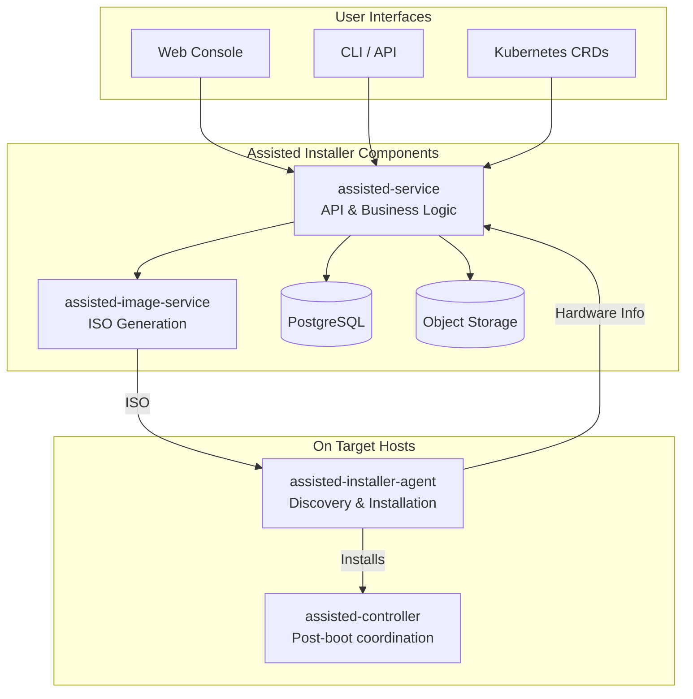
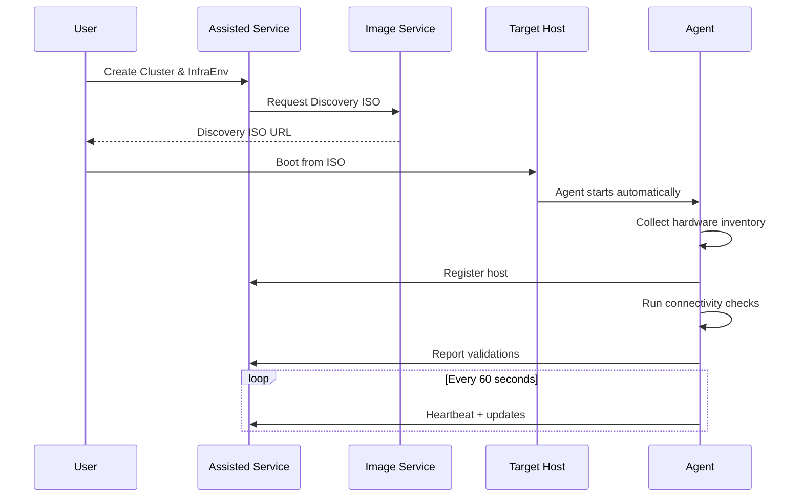
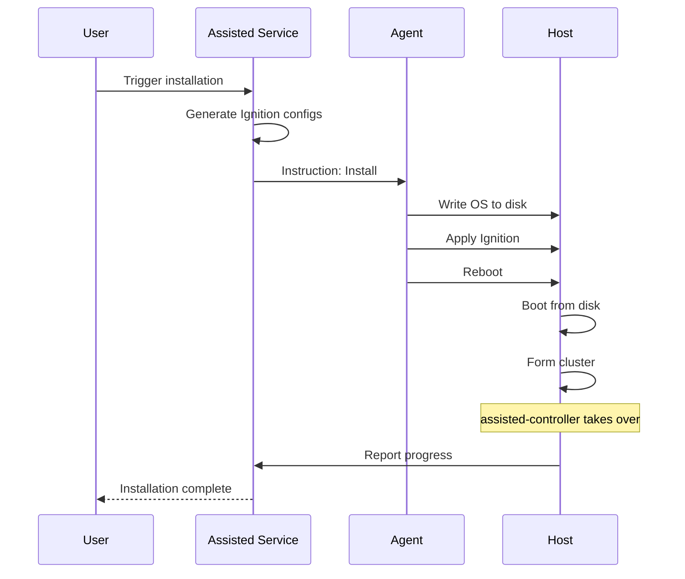
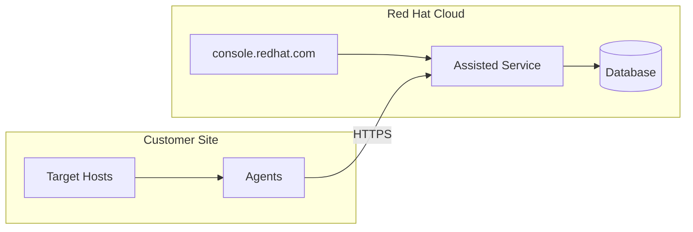
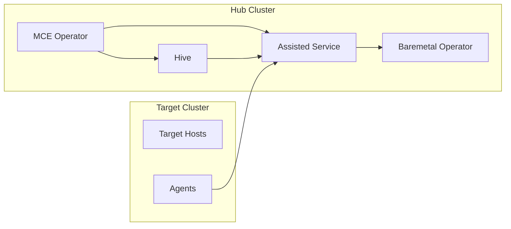
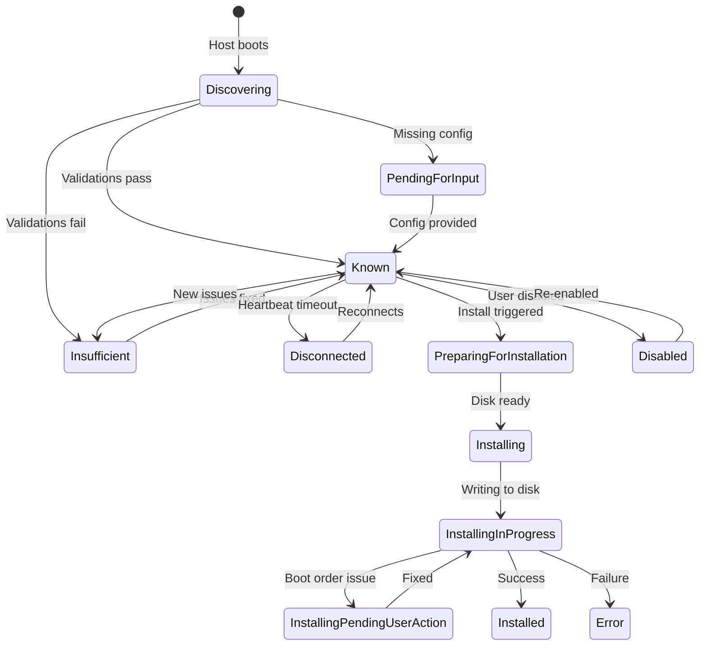
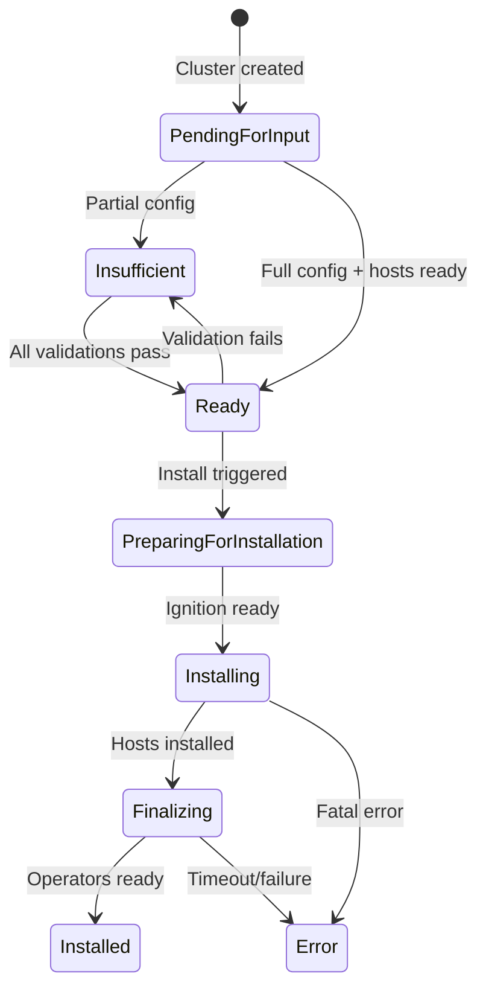
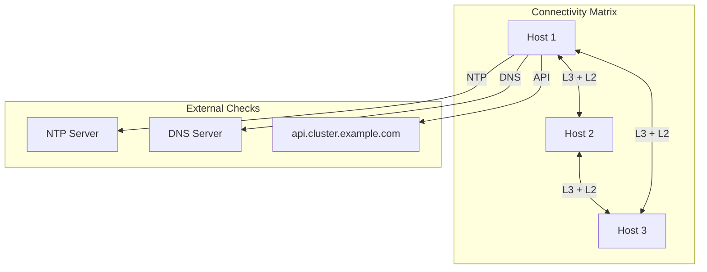

# Assisted Installation Overview

The Assisted Installer is an installation method that simplifies OpenShift deployment through hardware discovery, validation, and guided installation. Unlike traditional installers, it provides real-time feedback about hardware compatibility and installation progress.

## Core Concepts



## How It Works

### 1. Discovery Phase



### 2. Validation Phase

The service validates hosts against requirements:

| Validation Category | Checks |
|--------------------|--------|
| **Hardware** | CPU cores, RAM, disk size, disk speed |
| **Network** | Connectivity between hosts, DNS resolution, NTP sync |
| **Platform** | Virtualization support, required capabilities |
| **Cluster** | Sufficient control plane nodes, network CIDR validity |

### 3. Installation Phase



## Components Deep Dive

### assisted-service

The brain of the Assisted Installer. It provides:

- **REST API** for cluster and host management
- **State machines** for cluster and host lifecycle
- **Validation engine** for pre-flight checks
- **Ignition generation** using openshift-install
- **Kubernetes controllers** (in on-premise mode)

**Key packages:**
- `internal/bminventory/` - Main API handlers
- `internal/cluster/` - Cluster state machine
- `internal/host/` - Host state machine
- `internal/controller/` - Kubernetes controllers

### assisted-image-service

Generates customized discovery ISOs:

- Embeds cluster-specific configuration
- Injects pull secrets and certificates
- Supports minimal and full ISO types
- Streams images directly (no storage needed)

### assisted-installer-agent

Runs on discovered hosts:

- Collects hardware inventory (CPU, RAM, disks, NICs)
- Performs network connectivity tests
- Executes installation steps
- Reports status to service

**Discovery data collected:**
- CPU architecture and features
- Memory size and configuration
- Block devices and their properties
- Network interfaces and addresses
- System vendor and product info

### assisted-controller

A Kubernetes Job that runs post-installation:

- Monitors cluster formation
- Approves Certificate Signing Requests (CSRs)
- Reports installation progress
- Collects and uploads logs

## Deployment Modes

### SaaS (console.redhat.com)



**Characteristics:**
- No hub cluster required
- Red Hat manages the service
- Internet connectivity required
- REST API only

### On-Premise (via MCE)



**Characteristics:**
- Runs on your OpenShift hub
- Works in disconnected environments
- Uses Kubernetes CRDs
- Integrates with Hive for lifecycle

[Detailed comparison →](saas-vs-onprem.md)

## State Machines

### Host States



### Cluster States



## Key Features

### Hardware Discovery

The agent collects comprehensive hardware information:

```json
{
  "cpu": {
    "architecture": "x86_64",
    "model_name": "Intel Xeon E5-2680",
    "count": 32,
    "flags": ["vmx", "sse4_2", "avx2"]
  },
  "memory": {
    "physical_bytes": 137438953472,
    "usable_bytes": 134217728000
  },
  "disks": [{
    "name": "sda",
    "size_bytes": 480103981056,
    "drive_type": "SSD",
    "bootable": true
  }],
  "interfaces": [{
    "name": "eno1",
    "mac_address": "00:11:22:33:44:55",
    "ipv4_addresses": ["192.168.1.10/24"]
  }]
}
```

### Network Validations

Agents test connectivity to each other:



### Static Network Configuration

For environments requiring static IPs, use NMState:

```yaml
apiVersion: agent-install.openshift.io/v1beta1
kind: NMStateConfig
metadata:
  name: host-static-config
  labels:
    infraenvs.agent-install.openshift.io: my-infraenv
spec:
  config:
    interfaces:
      - name: eno1
        type: ethernet
        state: up
        ipv4:
          address:
            - ip: 192.168.1.10
              prefix-length: 24
          dhcp: false
          enabled: true
    routes:
      config:
        - destination: 0.0.0.0/0
          next-hop-address: 192.168.1.1
          next-hop-interface: eno1
    dns-resolver:
      config:
        server:
          - 192.168.1.1
  interfaces:
    - name: eno1
      macAddress: "00:11:22:33:44:55"
```

## Cluster Types Supported

| Type | Control Plane | Workers | Notes |
|------|--------------|---------|-------|
| **Standard HA** | 3 | 2+ | Production recommended |
| **Compact** | 3 | 0 | Control plane runs workloads |
| **SNO** | 1 | 0 | Single Node OpenShift |
| **Day 2 Workers** | N/A | 1+ | Add to existing cluster |

## Integration Points

### With Hive (On-Premise)

The Assisted Service integrates with Hive for:
- ClusterDeployment as cluster definition
- Automatic cluster import after installation
- ClusterPool support

### With Baremetal Operator

When BMO is present, the Baremetal Agent Controller (BMAC):
- Syncs BareMetalHost with Agent CRs
- Automates ISO attachment
- Manages host power state

### With SiteConfig/ZTP

SiteConfig renders Assisted CRDs for GitOps workflows:
- ClusterInstance → ClusterDeployment + AgentClusterInstall + InfraEnv
- Enables fleet-scale deployments

## Next Steps

- [SaaS vs On-Premise comparison](saas-vs-onprem.md)
- [REST API vs Kubernetes API](rest-api-vs-kube-api.md)
- [Agent-Based Installer](abi.md)
- [Component architecture](components.md)

