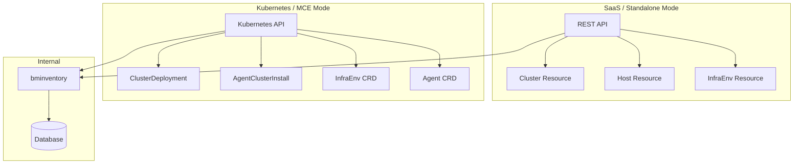
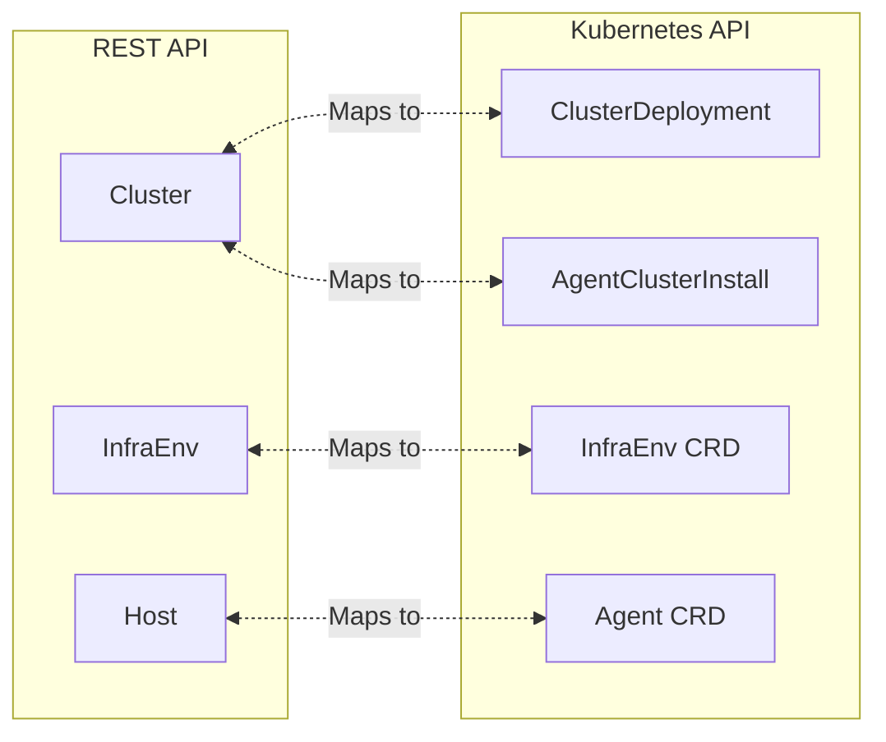
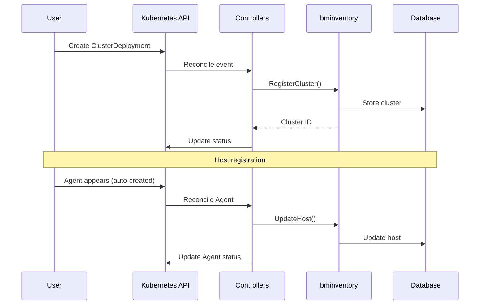
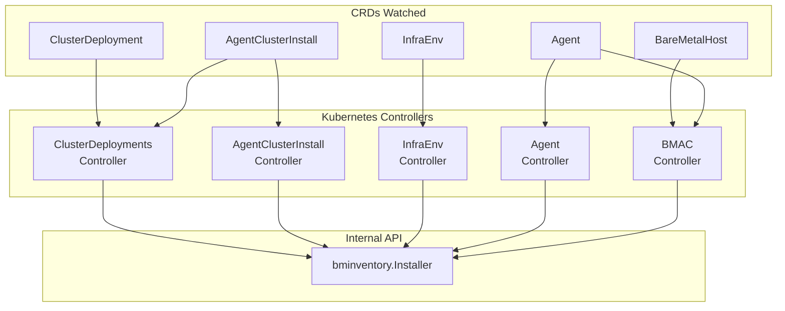

# REST API vs Kubernetes API

The Assisted Installer supports two API paradigms: a REST API and a Kubernetes-native API. This document explains the differences, use cases, and how they map to each other.

## Declarative vs Imperative

Before diving into the specifics, it's important to understand the fundamental difference between these API styles:

| Paradigm | Description | Style |
|----------|-------------|-------|
| **Imperative** (REST API) | Tell the system *what to do* step by step | Procedural |
| **Declarative** (Kubernetes CRDs) | Tell the system *what you want*, let controllers figure out how | GitOps-friendly |

**Imperative** requires you to issue commands in sequence and handle state transitions yourself. **Declarative** lets you define desired state, and controllers continuously reconcile actual state toward it.

See [Key Concepts & Glossary](../00-concepts-glossary.md#declarative-vs-imperative-apis) for detailed comparison.

## Overview



## API Comparison

### REST API Resources

| Resource | Description | Endpoint |
|----------|-------------|----------|
| **Cluster** | Cluster configuration and state | `/v2/clusters` |
| **Host** | Individual host in cluster | `/v2/clusters/{id}/hosts` |
| **InfraEnv** | Discovery environment config | `/v2/infra-envs` |
| **Event** | Installation events | `/v2/clusters/{id}/events` |

### Kubernetes CRDs

| CRD | API Group | Description |
|-----|-----------|-------------|
| **ClusterDeployment** | hive.openshift.io | Cluster definition (Hive) |
| **AgentClusterInstall** | extensions.hive.openshift.io | Assisted-specific cluster config |
| **InfraEnv** | agent-install.openshift.io | Discovery environment |
| **Agent** | agent-install.openshift.io | Discovered host |
| **NMStateConfig** | agent-install.openshift.io | Static network config |
| **AgentClassification** | agent-install.openshift.io | Auto-labeling rules |

## Resource Mapping



### Cluster ↔ ClusterDeployment + AgentClusterInstall

The REST API `Cluster` resource splits into two CRDs:

**REST API Cluster:**
```json
{
  "id": "uuid",
  "name": "my-cluster",
  "base_dns_domain": "example.com",
  "openshift_version": "4.14",
  "cluster_network_cidr": "10.128.0.0/14",
  "service_network_cidr": "172.30.0.0/16",
  "api_vips": [{"ip": "192.168.1.100"}],
  "ingress_vips": [{"ip": "192.168.1.101"}],
  "high_availability_mode": "Full",
  "status": "ready"
}
```

**Kubernetes ClusterDeployment:**
```yaml
apiVersion: hive.openshift.io/v1
kind: ClusterDeployment
metadata:
  name: my-cluster
  namespace: my-cluster
spec:
  baseDomain: example.com
  clusterName: my-cluster
  platform:
    agentBareMetal:
      agentSelector:
        matchLabels:
          infraenv: my-cluster
  pullSecretRef:
    name: pull-secret
  clusterInstallRef:
    group: extensions.hive.openshift.io
    kind: AgentClusterInstall
    name: my-cluster
    version: v1beta1
```

**Kubernetes AgentClusterInstall:**
```yaml
apiVersion: extensions.hive.openshift.io/v1beta1
kind: AgentClusterInstall
metadata:
  name: my-cluster
  namespace: my-cluster
spec:
  clusterDeploymentRef:
    name: my-cluster
  imageSetRef:
    name: openshift-4.14
  networking:
    clusterNetwork:
      - cidr: 10.128.0.0/14
        hostPrefix: 23
    serviceNetwork:
      - 172.30.0.0/16
  apiVIPs:
    - 192.168.1.100
  ingressVIPs:
    - 192.168.1.101
  provisionRequirements:
    controlPlaneAgents: 3
    workerAgents: 2
status:
  conditions:
    - type: Completed
      status: "False"
      reason: InstallationNotStarted
```

### Host ↔ Agent

**REST API Host:**
```json
{
  "id": "uuid",
  "cluster_id": "cluster-uuid",
  "infra_env_id": "infra-uuid",
  "requested_hostname": "master-0",
  "role": "master",
  "status": "known",
  "inventory": {
    "cpu": {"count": 8},
    "memory": {"physical_bytes": 34359738368},
    "disks": [{"name": "sda", "size_bytes": 480103981056}]
  }
}
```

**Kubernetes Agent:**
```yaml
apiVersion: agent-install.openshift.io/v1beta1
kind: Agent
metadata:
  name: aaaaaaaa-bbbb-cccc-dddd-eeeeeeeeeeee
  namespace: my-cluster
  labels:
    infraenv: my-cluster
spec:
  approved: true
  hostname: master-0
  role: master
  clusterDeploymentName:
    name: my-cluster
    namespace: my-cluster
status:
  inventory:
    cpu:
      count: 8
    memory:
      physicalBytes: 34359738368
    disks:
      - name: sda
        sizeBytes: 480103981056
  conditions:
    - type: Connected
      status: "True"
    - type: RequirementsMet
      status: "True"
```

### InfraEnv Mapping

**REST API InfraEnv:**
```json
{
  "id": "uuid",
  "name": "my-infraenv",
  "cluster_id": "cluster-uuid",
  "openshift_version": "4.14",
  "cpu_architecture": "x86_64",
  "pull_secret": "...",
  "ssh_authorized_key": "ssh-rsa ...",
  "download_url": "https://..."
}
```

**Kubernetes InfraEnv:**
```yaml
apiVersion: agent-install.openshift.io/v1beta1
kind: InfraEnv
metadata:
  name: my-infraenv
  namespace: my-cluster
spec:
  clusterRef:
    name: my-cluster
    namespace: my-cluster
  pullSecretRef:
    name: pull-secret
  sshAuthorizedKey: "ssh-rsa ..."
  cpuArchitecture: x86_64
status:
  isoDownloadURL: "https://..."
  conditions:
    - type: ImageCreated
      status: "True"
```

## Controller Reconciliation

In Kubernetes mode, controllers sync CRDs with internal state:



## When to Use Each

### Use REST API When:

| Scenario | Reason |
|----------|--------|
| SaaS (console.redhat.com) | Only option available |
| Custom tooling integration | Direct HTTP calls |
| CI/CD pipelines | Simple curl commands |
| Non-Kubernetes environments | No cluster needed |

### Use Kubernetes API When:

| Scenario | Reason |
|----------|--------|
| GitOps workflows | Declarative YAML in Git |
| Hub cluster management | Native kubectl experience |
| Integration with Hive | ClusterDeployment required |
| ArgoCD/Flux | Kubernetes-native reconciliation |
| ZTP at scale | SiteConfig generates CRDs |

## Controller Architecture

The assisted-service contains controllers that bridge CRDs to the internal API:



## Status and Conditions

Kubernetes CRDs use conditions to report state:

### AgentClusterInstall Conditions

| Condition | Meaning |
|-----------|---------|
| `SpecSynced` | Spec applied to internal state |
| `Validated` | Cluster validations passing |
| `RequirementsMet` | Enough hosts ready |
| `Completed` | Installation finished |
| `Failed` | Installation failed |
| `Stopped` | Installation stopped |

### Agent Conditions

| Condition | Meaning |
|-----------|---------|
| `SpecSynced` | Agent spec synced |
| `Connected` | Agent communicating |
| `RequirementsMet` | Host meets requirements |
| `Validated` | Host validations passing |
| `Installed` | Installation status |
| `Bound` | Bound to cluster |

## Early Binding vs Late Binding

Host binding determines **when agents are assigned to clusters** during discovery and installation.

### Early Binding

With **early binding**, the InfraEnv references a specific cluster. All discovered hosts automatically bind to that cluster:

```yaml
# InfraEnv WITH clusterRef - early binding
apiVersion: agent-install.openshift.io/v1beta1
kind: InfraEnv
metadata:
  name: my-cluster-infraenv
  namespace: my-cluster
spec:
  clusterRef:                    # <-- Early binding
    name: my-cluster
    namespace: my-cluster
  pullSecretRef:
    name: pull-secret
```

**Characteristics:**
- Simpler workflow - hosts auto-bind on discovery
- One InfraEnv per cluster
- Best when you know which hosts go where upfront

### Late Binding

With **late binding**, the InfraEnv has no cluster reference. Hosts enter a shared pool and are manually assigned later:

```yaml
# InfraEnv WITHOUT clusterRef - late binding
apiVersion: agent-install.openshift.io/v1beta1
kind: InfraEnv
metadata:
  name: shared-discovery-pool
  namespace: open-cluster-management
spec:
  # No clusterRef - hosts can bind later
  pullSecretRef:
    name: pull-secret
  sshAuthorizedKey: "ssh-rsa ..."
```

Agents from this pool can later bind to any cluster:

```yaml
apiVersion: agent-install.openshift.io/v1beta1
kind: Agent
metadata:
  name: agent-uuid
  namespace: open-cluster-management
spec:
  approved: true
  clusterDeploymentName:         # <-- Late binding assignment
    name: target-cluster
    namespace: target-cluster
```

**Characteristics:**
- Shared host pool across clusters
- Flexible assignment based on capacity, location, hardware
- Common in large-scale ZTP deployments
- Requires additional step to bind hosts

### Comparison

| Aspect | Early Binding | Late Binding |
|--------|---------------|--------------|
| **clusterRef** | Required | Omitted |
| **When hosts bind** | At discovery | After discovery |
| **InfraEnv scope** | One per cluster | Shared pool |
| **Use case** | Known clusters, known hosts | Dynamic assignment, large fleets |
| **ZTP pattern** | Per-site InfraEnv | Central pool + AgentClassification |

See [Key Concepts & Glossary](../00-concepts-glossary.md#early-binding-vs-late-binding) for more details.

## API Parity

Not all REST API features have CRD equivalents and vice versa:

| Feature | REST API | Kubernetes API |
|---------|----------|----------------|
| Cluster management | ✅ | ✅ (via CRDs) |
| Host management | ✅ | ✅ (Agent CRD) |
| InfraEnv management | ✅ | ✅ (InfraEnv CRD) |
| Events | ✅ | ⚠️ (via conditions/events) |
| Logs download | ✅ | ⚠️ (via cluster access) |
| Manifest management | ✅ | ✅ (ConfigMaps) |
| Late binding | ✅ | ✅ |
| Static networking | ✅ | ✅ (NMStateConfig) |
| Agent classification | ❌ | ✅ |
| Hive integration | ❌ | ✅ |
| BMO integration | ❌ | ✅ |

## Related Documentation

- [Assisted Installation Overview](overview.md)
- [SaaS vs On-Premise](saas-vs-onprem.md)
- [Operators & Controllers Reference](../07-operators-controllers/reference.md)
- [CRD Reference](../08-crd-reference/index.md)

