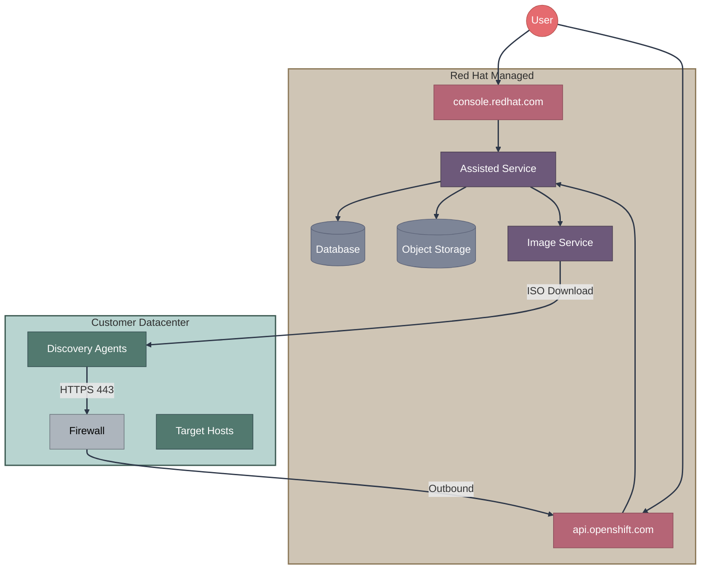
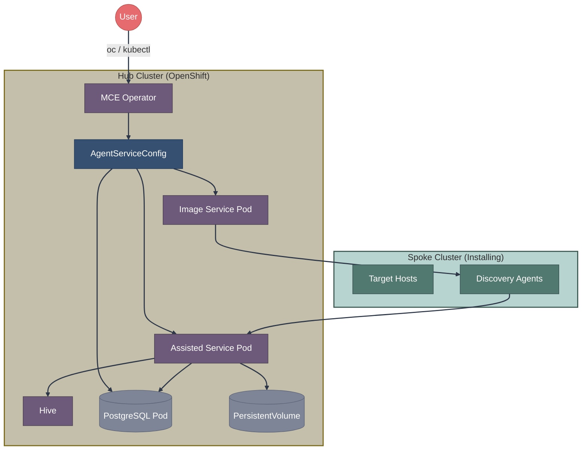
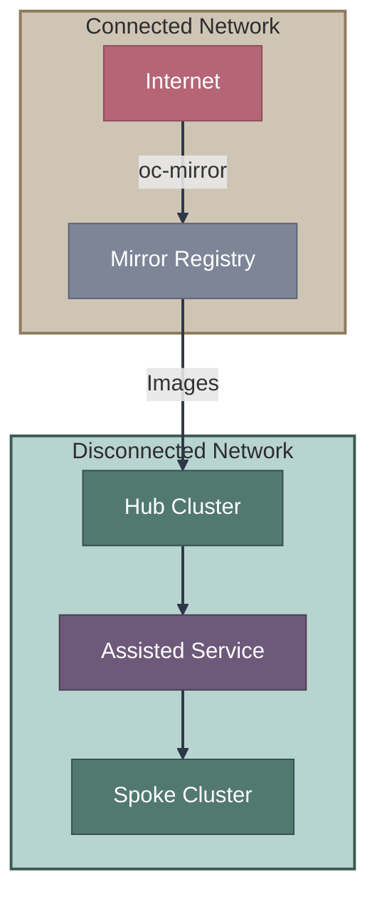
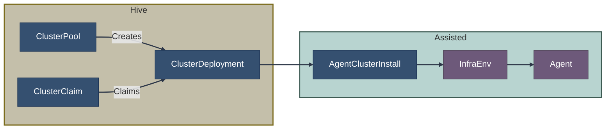

# SaaS vs On-Premise Assisted Installation

The Assisted Installer can run in two modes: as a hosted SaaS service or deployed on your own infrastructure (on a hub cluster). This document compares the two approaches.

**Key resources:**
- SaaS: [console.redhat.com/openshift](https://console.redhat.com/openshift/assisted-installer/clusters)
- On-Premise: [assisted-service operator](https://github.com/openshift/assisted-service) deployed via [MCE](https://github.com/stolostron/backplane-operator)

## Architecture Comparison

### SaaS Mode (console.redhat.com)



### On-Premise Mode (MCE Operator)



## Hub and Spoke Architecture

On-premise Assisted Installer uses a **hub-and-spoke** model:

| Term | Definition |
|------|------------|
| **Hub Cluster** | The central OpenShift cluster running MCE/ACM. Hosts the Assisted Service and manages spoke clusters. |
| **Spoke Cluster** | A cluster provisioned by the hub. Also called "managed cluster." |

The hub runs lifecycle operators (MCE, Hive, Assisted Service) that provision spoke clusters. Once installed, spokes can operate independently but remain connected for management, policies, and upgrades.

## Early vs Late Binding

When using on-premise Assisted Installer, you can choose **when hosts are assigned to clusters**:

| Binding Type | When Hosts Bind | Use Case |
|--------------|-----------------|----------|
| **Early Binding** | At discovery time | Known cluster with known hosts |
| **Late Binding** | After discovery | Shared host pool, dynamic assignment |

**Early Binding** - InfraEnv references a specific cluster:
```yaml
apiVersion: agent-install.openshift.io/v1beta1
kind: InfraEnv
metadata:
  name: my-cluster-infraenv
spec:
  clusterRef:           # Hosts auto-bind to this cluster
    name: my-cluster
    namespace: my-cluster
```

**Late Binding** - InfraEnv creates a shared host pool:
```yaml
apiVersion: agent-install.openshift.io/v1beta1
kind: InfraEnv
metadata:
  name: shared-discovery
spec:
  # No clusterRef - hosts go to a pool
  pullSecretRef:
    name: pull-secret
---
# Later, manually bind an agent to a cluster
apiVersion: agent-install.openshift.io/v1beta1
kind: Agent
metadata:
  name: discovered-host-uuid
spec:
  clusterDeploymentName:    # Manual assignment
    name: target-cluster
    namespace: target-cluster
```

**When to use each:**
- **Early binding**: You know exactly which hosts go to which cluster. Simpler workflow.
- **Late binding**: Pool of hosts assigned dynamically based on availability. Common in large ZTP deployments.

## Feature Comparison

| Feature | SaaS | On-Premise (MCE) |
|---------|------|------------------|
| **Hub cluster required** | No | Yes (OpenShift) |
| **Internet connectivity** | Required | Optional (can be disconnected) |
| **API type** | REST API only | REST API available, but CRDs are the recommended integration surface |
| **User interface** | console.redhat.com | OpenShift Console + CLI |
| **Multi-cluster management** | Limited | Full (via ACM) |
| **Mirror registry support** | No* | Yes |
| **Day 2 cluster management** | Limited | Full (via Hive) |
| **Red Hat subscription** | Required for hosts | Required for hub + hosts |
| **Maintenance** | Red Hat managed | Customer managed |

> \* **Mirror registry note:** SaaS requires Internet connectivity for the service itself. For target clusters that can reach the SaaS but have limited registry access, image mirroring may still be configured per standard disconnected guidance.

## When to Use Each

### Use SaaS When:

- Quick proof-of-concept or testing
- Single cluster deployment
- Internet connectivity is available
- No existing hub cluster
- Minimal infrastructure overhead desired
- Red Hat managed service preferred

### Use On-Premise When:

- Disconnected or air-gapped environment
- Managing multiple clusters
- GitOps/automation workflows required
- Integration with existing OpenShift hub
- Custom certificates or proxy required
- Data sovereignty requirements

## On-Premise Deployment

### Prerequisites

1. OpenShift 4.10+ hub cluster
2. MCE (Multicluster Engine) operator installed
3. Persistent storage for assisted-service
4. (Optional) Mirror registry for disconnected

### Installation Steps

```yaml
# 1. Install MCE Operator (via OperatorHub or CLI)
# Note: Update channel to match your ACM/MCE version (e.g., stable-2.5, stable-2.6)
# See: https://access.redhat.com/articles/7055998 for version compatibility
apiVersion: operators.coreos.com/v1alpha1
kind: Subscription
metadata:
  name: multicluster-engine
  namespace: multicluster-engine
spec:
  channel: stable-2.x  # Replace with current supported version
  name: multicluster-engine
  source: redhat-operators
  sourceNamespace: openshift-marketplace
```

```yaml
# 2. Create MultiClusterEngine instance
apiVersion: multicluster.openshift.io/v1
kind: MultiClusterEngine
metadata:
  name: multiclusterengine
spec: {}
```

```yaml
# 3. Create AgentServiceConfig to deploy assisted-service
apiVersion: agent-install.openshift.io/v1beta1
kind: AgentServiceConfig
metadata:
  name: agent
spec:
  databaseStorage:
    accessModes:
      - ReadWriteOnce
    resources:
      requests:
        storage: 10Gi
  filesystemStorage:
    accessModes:
      - ReadWriteOnce
    resources:
      requests:
        storage: 100Gi
  imageStorage:
    accessModes:
      - ReadWriteOnce
    resources:
      requests:
        storage: 50Gi
  # OS images - update versions to match your target OCP release
  # See: https://mirror.openshift.com/pub/openshift-v4/dependencies/rhcos/
  osImages:
    - cpuArchitecture: x86_64
      openshiftVersion: "4.x"  # Replace with target version
      url: "https://mirror.example.com/rhcos-live.x86_64.iso"
      version: "4xx.xx.xxxxxxxxxx-0"  # Match RHCOS version
```

### Verifying Deployment

```bash
# Check assisted-service pods
oc get pods -n multicluster-engine | grep assisted

# Verify AgentServiceConfig status
oc get agentserviceconfig agent -o yaml

# Check service endpoints
oc get routes -n multicluster-engine | grep assisted
```

## API Comparison

### SaaS REST API

```bash
# Authenticate
TOKEN=$(ocm token)

# Create cluster
curl -X POST https://api.openshift.com/api/assisted-install/v2/clusters \
  -H "Authorization: Bearer $TOKEN" \
  -H "Content-Type: application/json" \
  -d '{
    "name": "my-cluster",
    "openshift_version": "4.14",
    "base_dns_domain": "example.com",
    "pull_secret": "..."
  }'

# Get cluster info
curl https://api.openshift.com/api/assisted-install/v2/clusters/$CLUSTER_ID \
  -H "Authorization: Bearer $TOKEN"
```

### On-Premise Kubernetes API

```yaml
# ClusterDeployment (Hive)
apiVersion: hive.openshift.io/v1
kind: ClusterDeployment
metadata:
  name: my-cluster
  namespace: my-cluster
spec:
  baseDomain: example.com
  clusterName: my-cluster
  platform:
    agentBareMetal:
      agentSelector:
        matchLabels:
          cluster-name: my-cluster
  pullSecretRef:
    name: pull-secret
  clusterInstallRef:
    group: extensions.hive.openshift.io
    kind: AgentClusterInstall
    name: my-cluster
    version: v1beta1
---
# AgentClusterInstall
apiVersion: extensions.hive.openshift.io/v1beta1
kind: AgentClusterInstall
metadata:
  name: my-cluster
  namespace: my-cluster
spec:
  clusterDeploymentRef:
    name: my-cluster
  imageSetRef:
    name: openshift-4.14
  networking:
    clusterNetwork:
      - cidr: 10.128.0.0/14
        hostPrefix: 23
    serviceNetwork:
      - 172.30.0.0/16
  provisionRequirements:
    controlPlaneAgents: 3
    workerAgents: 2
---
# InfraEnv
apiVersion: agent-install.openshift.io/v1beta1
kind: InfraEnv
metadata:
  name: my-cluster
  namespace: my-cluster
spec:
  clusterRef:
    name: my-cluster
    namespace: my-cluster
  pullSecretRef:
    name: pull-secret
  sshAuthorizedKey: "ssh-rsa AAAA..."
```

## Disconnected Installation

On-premise mode supports fully disconnected environments:



### Required Configuration

```yaml
# AgentServiceConfig for disconnected
apiVersion: agent-install.openshift.io/v1beta1
kind: AgentServiceConfig
metadata:
  name: agent
spec:
  mirrorRegistryRef:
    name: mirror-registry-config
  unauthenticatedRegistries:
    - registry.example.com
  osImages:
    - cpuArchitecture: x86_64
      openshiftVersion: "4.14"
      url: "https://mirror.example.com/rhcos-live.x86_64.iso"
      version: "414.92.202310210434-0"
```

```yaml
# Mirror registry config
apiVersion: v1
kind: ConfigMap
metadata:
  name: mirror-registry-config
  namespace: multicluster-engine
data:
  registries.conf: |
    [[registry]]
      location = "quay.io"
      mirror-by-digest-only = true
      [[registry.mirror]]
        location = "registry.example.com/ocp4"
    [[registry]]
      location = "registry.redhat.io"
      mirror-by-digest-only = true
      [[registry.mirror]]
        location = "registry.example.com/rh"
  ca-bundle.crt: |
    -----BEGIN CERTIFICATE-----
    ...
    -----END CERTIFICATE-----
```

## Hive Integration

On-premise mode integrates with Hive for cluster lifecycle:



### Benefits of Hive Integration

- **ClusterPools**: Pre-provision clusters for on-demand claiming
- **Hibernation**: Suspend idle clusters to save resources  
- **SyncSets**: Push configurations to managed clusters
- **ClusterClaims**: Self-service cluster provisioning

## Migration Path

### SaaS to On-Premise

1. Deploy MCE on hub cluster
2. Configure AgentServiceConfig
3. Create new clusters using CRDs
4. (Cannot migrate existing SaaS clusters)

### On-Premise to SaaS

1. Export cluster configurations
2. Recreate using console.redhat.com
3. (Cannot migrate installed clusters)

## Related Documentation

### Detailed Documentation

- [Hive Integration Guide](https://github.com/openshift/assisted-service/blob/master/docs/hive-integration/README.md) - Complete CRD reference and examples
- [Kube-API Getting Started](https://github.com/openshift/assisted-service/blob/master/docs/hive-integration/kube-api-getting-started.md) - Step-by-step on-premise setup
- [Late Binding](https://github.com/openshift/assisted-service/blob/master/docs/hive-integration/late-binding.md) - Detailed late binding guide
- [Mirror Registry Guide](https://github.com/openshift/assisted-service/blob/master/docs/user-guide/mirror_registry_guide.md) - Disconnected setup
- [Operator Deployment](https://github.com/openshift/assisted-service/blob/master/docs/operator.md) - MCE operator details

### This Guide

- [Assisted Installation Overview](overview.md)
- [REST API vs Kubernetes API](rest-api-vs-kube-api.md)
- [Operators & Controllers Reference](../07-operators-controllers/reference.md)

