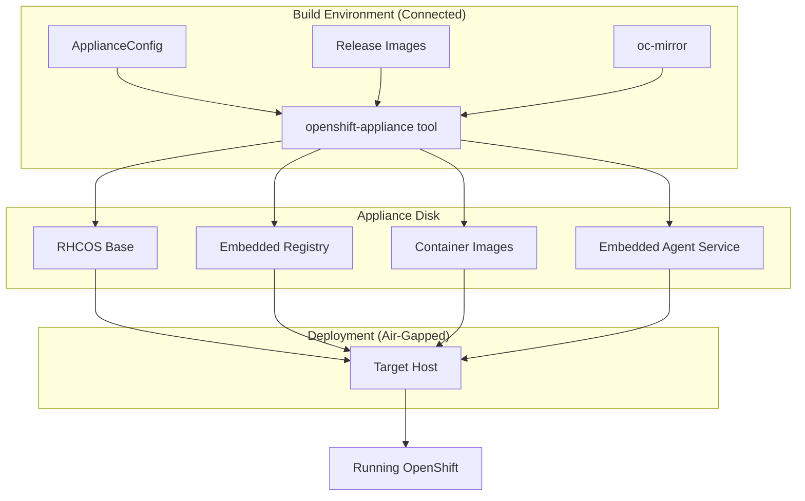
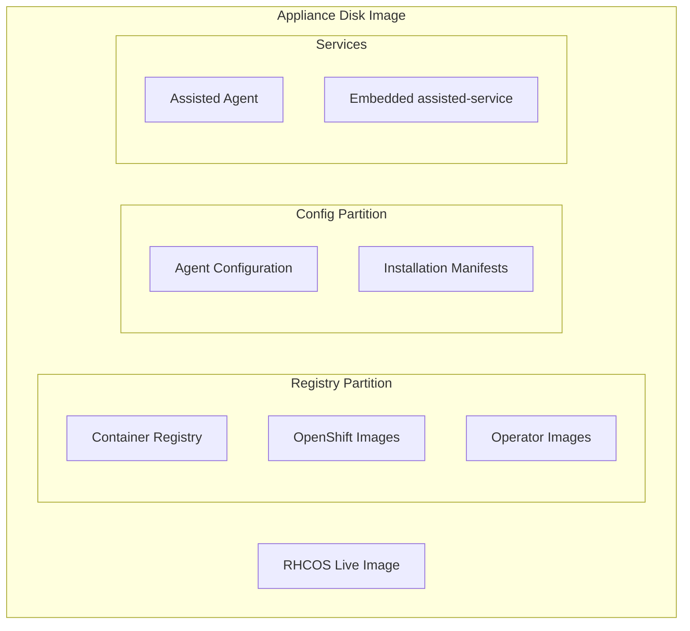
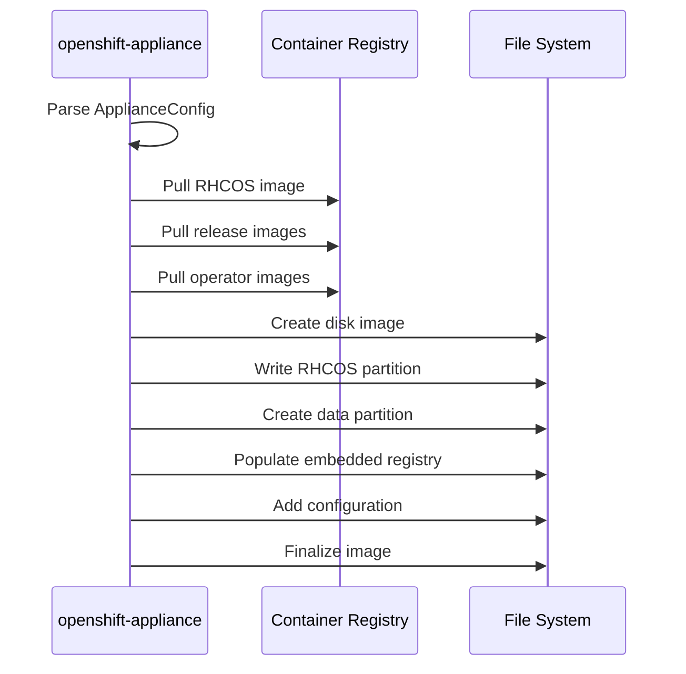
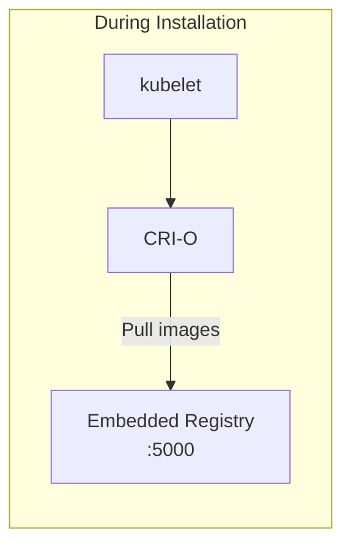

# OpenShift Appliance

The OpenShift Appliance is a pre-built disk image containing all OpenShift components and container images, enabling fully air-gapped installation without any network connectivity.

> **Maturity Note:** The OpenShift Appliance project has varying support levels across releases. Check the [openshift/appliance repository](https://github.com/openshift/appliance) and [official Red Hat documentation](https://docs.openshift.com/container-platform/latest/installing/installing_with_agent_based_installer/preparing-to-install-with-agent-based-installer.html) for current support status and any preview/tech preview designations for your target OCP version.

## Overview



## When to Use Appliance

| Scenario | Use Appliance |
|----------|---------------|
| Fully air-gapped (no network at all) | ✅ |
| Standardized deployments | ✅ |
| Edge locations with physical media | ✅ |
| Portable OpenShift (USB/DVD) | ✅ |
| Dynamic image updates needed | ❌ |
| Different cluster configurations | ⚠️ (need multiple appliances) |

## Key Differences

| Aspect | ABI | Appliance |
|--------|-----|-----------|
| **Image type** | ISO (discovery + install) | Disk image (ready to run) |
| **Container images** | Downloaded or mirrored | Embedded in image |
| **Registry needed** | Yes (mirror for disconnected) | No (embedded) |
| **Configuration** | At ISO creation | At appliance creation + runtime |
| **Image size** | ~1 GB | ~20+ GB |
| **Customization** | Per-cluster | Per-appliance |

## Components

### openshift-appliance Tool

**Repository:** [openshift/appliance](https://github.com/openshift/appliance)

Builds the appliance disk image:
- Downloads RHCOS base image
- Pulls all required container images
- Embeds local container registry
- Includes Agent-Based Installer components

### Embedded Components



## Building an Appliance

### Prerequisites

- Linux system with:
  - `libguestfs-tools`
  - `coreos-installer`
  - `oc` and `oc-mirror`
  - `skopeo`
  - `podman`
- Pull secret at `~/.docker/config.json`
- ~100 GB disk space

### ApplianceConfig

```yaml
apiVersion: v1beta1
kind: ApplianceConfig
ocpRelease:
  version: "4.14"
  channel: stable
  cpuArchitecture: x86_64
diskSizeGB: 200
pullSecret: '<pull_secret_json>'
imageRegistry:
  uri: docker.io/library/registry:2
enableDefaultSources: true
additionalImages:
  - quay.io/myorg/custom-operator:latest
operators:
  - catalog: registry.redhat.io/redhat/redhat-operator-index:v4.14
    packages:
      - name: local-storage-operator
      - name: openshift-gitops-operator
```

### Build Commands

```bash
# Generate config template
./openshift-appliance generate-config --dir assets

# Edit assets/appliance-config.yaml
vim assets/appliance-config.yaml

# Build the appliance
export LIBGUESTFS_BACKEND=direct
./openshift-appliance build --dir assets --log-level info

# Output: assets/appliance.raw
```

### Build Process



## Deployment

### Step 1: Transfer Appliance

The appliance disk image needs to reach the target:
- USB drive
- DVD/Blu-ray
- SAN/NAS
- Sneakernet

### Step 2: Write to Disk

```bash
# Option 1: Direct disk write
dd if=appliance.raw of=/dev/sda bs=4M status=progress

# Option 2: Using coreos-installer
coreos-installer install /dev/sda --insecure --image-file appliance.raw
```

### Step 3: Configure Cluster

Before first boot, inject cluster configuration:

```bash
# Mount config partition
mount /dev/sda4 /mnt/config

# Add install-config.yaml
cat > /mnt/config/install-config.yaml <<EOF
apiVersion: v1
metadata:
  name: my-cluster
baseDomain: example.com
controlPlane:
  replicas: 1
compute:
  - replicas: 0
platform:
  none: {}
pullSecret: '...'
sshKey: '...'
EOF

# Add agent-config.yaml
cat > /mnt/config/agent-config.yaml <<EOF
apiVersion: v1alpha1
kind: AgentConfig
rendezvousIP: 192.168.1.100
hosts:
  - hostname: sno-node
    role: master
    interfaces:
      - name: eno1
        macAddress: 00:11:22:33:44:55
    networkConfig:
      # NMState config
EOF

umount /mnt/config
```

### Step 4: Boot and Install

1. Boot from the appliance disk
2. Embedded Agent-Based Installer starts
3. Uses embedded registry for all images
4. Installation completes without network

## Configuration Options

### Cluster Types Supported

| Type | Control Plane | Workers |
|------|--------------|---------|
| SNO | 1 | 0 |
| Compact | 3 | 0 |
| Standard | 3 | 2+ |

### Static Network Configuration

Same NMState format as ABI:

```yaml
# agent-config.yaml
hosts:
  - hostname: master-0
    networkConfig:
      interfaces:
        - name: eno1
          type: ethernet
          state: up
          ipv4:
            address:
              - ip: 192.168.1.100
                prefix-length: 24
            enabled: true
            dhcp: false
```

## Embedded Registry

The appliance includes a local container registry:



### Mirror Configuration

Installation uses image digests pointing to embedded registry:

```yaml
# Automatically configured imageDigestSources
- source: quay.io/openshift-release-dev/ocp-release
  mirrors:
    - localhost:5000/openshift/release-images
- source: quay.io/openshift-release-dev/ocp-v4.0-art-dev
  mirrors:
    - localhost:5000/openshift/release
```

## Including Additional Content

### Custom Operators

```yaml
# ApplianceConfig
operators:
  - catalog: registry.redhat.io/redhat/redhat-operator-index:v4.14
    packages:
      - name: local-storage-operator
      - name: advanced-cluster-management
      - name: multicluster-engine
```

### Additional Images

```yaml
# ApplianceConfig
additionalImages:
  - quay.io/myorg/app:v1
  - registry.example.com/tools/debug:latest
```

### Custom Manifests

Place in `assets/openshift/` directory before build:

```
assets/
├── appliance-config.yaml
└── openshift/
    ├── 99-custom-mco.yaml
    └── 99-performance-profile.yaml
```

## Image Size Optimization

### Disk Size Calculation

```
Base RHCOS: ~2 GB
Registry data:
  - Release images: ~8-12 GB
  - Operator images: ~2-5 GB (depends on selection)
  - Additional images: varies
Configuration: ~100 MB
Buffer: ~5-10 GB

Minimum recommended: 40 GB
Typical with operators: 60-100 GB
```

### Reducing Size

```yaml
# ApplianceConfig
enableDefaultSources: false  # Don't include all operator catalogs
operators:
  - catalog: registry.redhat.io/redhat/redhat-operator-index:v4.14
    packages:
      - name: local-storage-operator  # Only specific operators
```

## Multi-Architecture Support

### Building for Different Architectures

```yaml
# ApplianceConfig for ARM64
ocpRelease:
  version: "4.14"
  cpuArchitecture: aarch64
```

### Multi-Arch Appliances

Currently, each appliance is single-architecture. Build separate appliances for:
- `x86_64`
- `aarch64`

## Updating Appliances

Appliances are immutable once built. To update:

1. Build new appliance with updated config
2. Replace old appliance at deployment sites
3. Reinstall clusters (or use IBU for upgrades)

## Troubleshooting

### Build Issues

```bash
# Enable debug logging
./openshift-appliance build --dir assets --log-level debug

# Common issues:
# - Missing pull secret
# - Insufficient disk space
# - Network issues during image pull
```

### Deployment Issues

```bash
# SSH to node after boot
ssh core@<node_ip>

# Check Agent service
systemctl status agent.service

# Check embedded registry
podman ps  # Should show registry container

# Verify images available
curl -s http://localhost:5000/v2/_catalog | jq
```

### Missing Images

If installation fails due to missing images:
1. Check `additionalImages` in ApplianceConfig
2. Rebuild appliance with missing images
3. Verify operator catalog includes required operators

## Comparison Table

| Feature | Standard Install | ABI | Appliance |
|---------|-----------------|-----|-----------|
| Network required | Yes | Mirror only | No |
| Image download | At install | At install | Pre-embedded |
| Install time | ~60-90 min | ~60-90 min | ~45-60 min |
| Portability | N/A | Via ISO | Via disk image |
| Customization | Full | Per-ISO | Per-appliance |
| Image size | N/A | ~1 GB | 40+ GB |
| Day 2 updates | Online | Mirror | Rebuild appliance |

## Related Documentation

- [Agent-Based Installer](../03-assisted-installation/abi.md)
- [Image-Based Install](ibi.md)
- [Installation Methods Overview](../01-installation-methods-overview.md)

