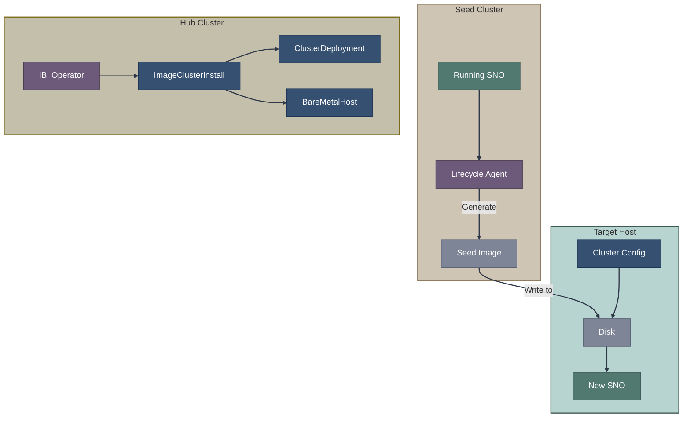
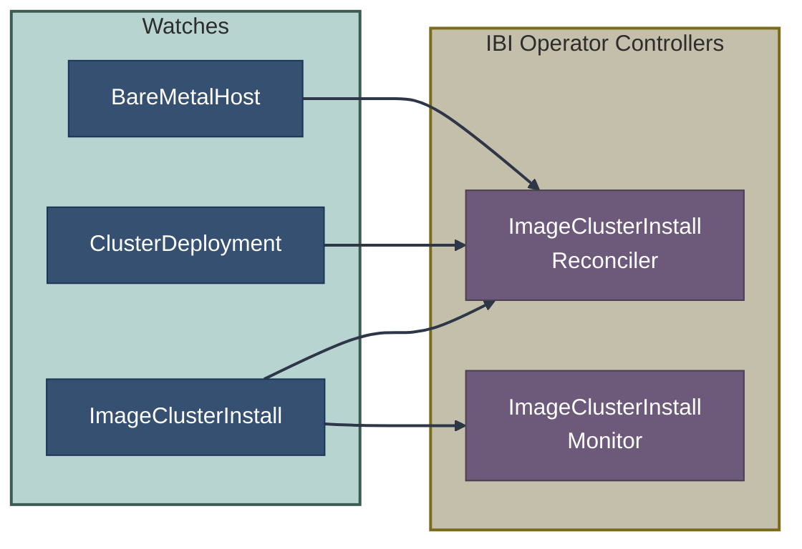
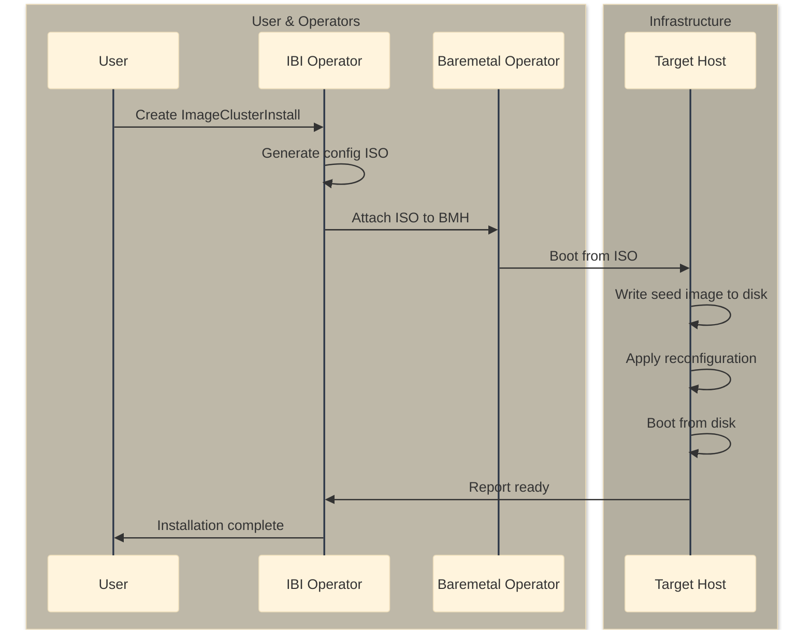

# Image-Based Install (IBI)

Image-Based Install (IBI) is an installation method that deploys Single Node OpenShift (SNO) clusters from pre-configured seed images, enabling rapid deployment and recovery scenarios.

## Overview



## Key Concepts

### Seed Image

A seed image is a pre-captured state of a running SNO cluster:
- Complete OS and OpenShift installation
- All container images
- Cluster configuration (reconfigurable)

### Why IBI?

| Traditional Install | Image-Based Install |
|--------------------|---------------------|
| Download images at install time | Images pre-baked in seed |
| ~45-90 minutes for SNO | ~15-20 minutes |
| Requires registry access | Works fully air-gapped |
| Fresh installation each time | Consistent, repeatable |

### Use Cases

- **Edge/Telco deployments**: Fast SNO rollout
- **Disaster recovery**: Quick cluster restoration
- **Standardized fleets**: Consistent base image across sites

## Components

### Lifecycle Agent (LCA)

**Repository:** Part of [openshift/lifecycle-agent](https://github.com/openshift/lifecycle-agent)

Runs on seed clusters to:
- Generate seed images
- Manage image-based upgrades (IBU)
- Capture cluster state

### Image-Based Install Operator

**Repository:** [openshift/image-based-install-operator](https://github.com/openshift/image-based-install-operator)

Runs on hub clusters to:
- Orchestrate IBI deployments
- Create configuration ISOs
- Manage BareMetalHost lifecycle



## Seed Image Creation

### Prerequisites

- Running SNO cluster (the seed)
- Lifecycle Agent installed
- Storage for seed image (~15-20 GB)

### Creating a Seed Image

```yaml
# SeedGenerator CR
apiVersion: lca.openshift.io/v1
kind: SeedGenerator
metadata:
  name: seedimage
spec:
  seedImage: registry.example.com/seedimages/sno-seed:4.14.0
```

```bash
# Trigger seed generation
oc apply -f seedgenerator.yaml

# Monitor progress
oc get seedgenerator seedimage -o yaml
```

### What Gets Captured

| Captured | Not Captured |
|----------|--------------|
| OS (RHCOS) | Node-specific certs |
| OpenShift components | Machine-specific config |
| Container images | Network configuration |
| Operator deployments | Storage class bindings |
| Cluster CRDs | Persistent data |

## Deployment Process

### Step 1: Create Configuration

```yaml
# ClusterDeployment
apiVersion: hive.openshift.io/v1
kind: ClusterDeployment
metadata:
  name: edge-sno-1
  namespace: edge-sno-1
spec:
  baseDomain: example.com
  clusterName: edge-sno-1
  platform:
    agentBareMetal:
      agentSelector: {}
  pullSecretRef:
    name: pull-secret
  clusterInstallRef:
    group: extensions.hive.openshift.io
    kind: ImageClusterInstall
    name: edge-sno-1
    version: v1alpha1
```

```yaml
# ImageClusterInstall
apiVersion: extensions.hive.openshift.io/v1alpha1
kind: ImageClusterInstall
metadata:
  name: edge-sno-1
  namespace: edge-sno-1
spec:
  clusterDeploymentRef:
    name: edge-sno-1
  imageSetRef:
    name: openshift-4.14-seed
  hostname: edge-sno-1.example.com
  # Reference to BareMetalHost
  bareMetalHostRef:
    name: edge-sno-1
    namespace: edge-sno-1
  # Network configuration
  machineNetwork: 192.168.1.0/24
  # Extra manifests
  extraManifestsRefs:
    - name: edge-config
```

```yaml
# BareMetalHost
apiVersion: metal3.io/v1alpha1
kind: BareMetalHost
metadata:
  name: edge-sno-1
  namespace: edge-sno-1
spec:
  online: true
  bootMACAddress: "00:11:22:33:44:55"
  bmc:
    address: idrac-virtualmedia://192.168.1.10/redfish/v1/Systems/System.Embedded.1
    credentialsName: bmc-credentials
  automatedCleaningMode: disabled
```

### Step 2: IBI Operator Actions



### Step 3: Reconfiguration

After booting from the seed image, the cluster reconfigures:

1. **Network reconfiguration** - New IP/hostname
2. **Certificate regeneration** - Fresh cluster certs (via recert)
3. **Identity reset** - New cluster ID/name
4. **Crypto regeneration** - New keys and tokens

## Configuration ISO

The IBI operator creates a configuration ISO containing:

```
config-iso/
├── config.json            # Cluster configuration
├── extra-manifests/       # Additional manifests to apply
├── network-config/        # NMState configuration
└── image-based-config.yaml # IBI-specific config
```

### image-based-config.yaml

```yaml
apiVersion: v1alpha1
kind: ImageBasedInstallationConfig
metadata:
  name: edge-sno-1
seedImage: registry.example.com/seeds/sno-seed:4.14.0
seedVersion: 4.14.0
hostname: edge-sno-1.example.com
installationDisk: /dev/sda
networkConfig:
  interfaces:
    - name: eno1
      type: ethernet
      state: up
      ipv4:
        address:
          - ip: 192.168.1.100
            prefix-length: 24
        enabled: true
        dhcp: false
```

## ClusterImageSet for IBI

```yaml
apiVersion: hive.openshift.io/v1
kind: ClusterImageSet
metadata:
  name: openshift-4.14-seed
spec:
  releaseImage: registry.example.com/seeds/sno-seed:4.14.0
```

## Static Network Configuration

### Simple Static IP

```yaml
spec:
  machineNetwork: 192.168.1.0/24
  networkConfig:
    interfaces:
      - name: eno1
        type: ethernet
        state: up
        ipv4:
          address:
            - ip: 192.168.1.100
              prefix-length: 24
          enabled: true
          dhcp: false
    routes:
      config:
        - destination: 0.0.0.0/0
          next-hop-address: 192.168.1.1
    dns-resolver:
      config:
        server:
          - 192.168.1.1
```

### Bond Configuration

```yaml
spec:
  networkConfig:
    interfaces:
      - name: bond0
        type: bond
        state: up
        link-aggregation:
          mode: 802.3ad
          options:
            miimon: "100"
          port:
            - eno1
            - eno2
        ipv4:
          address:
            - ip: 192.168.1.100
              prefix-length: 24
          enabled: true
```

## Extra Manifests

Apply additional configuration via ConfigMaps:

```yaml
apiVersion: v1
kind: ConfigMap
metadata:
  name: edge-config
  namespace: edge-sno-1
data:
  01-performance-profile.yaml: |
    apiVersion: performance.openshift.io/v2
    kind: PerformanceProfile
    metadata:
      name: edge-profile
    spec:
      cpu:
        isolated: "2-31"
        reserved: "0-1"
      realTimeKernel:
        enabled: true
```

## Status and Conditions

### ImageClusterInstall Status

```yaml
status:
  conditions:
    - type: ImageCreated
      status: "True"
      reason: ImageCreated
    - type: HostConfigured
      status: "True"
      reason: HostConfigured
    - type: Completed
      status: "True"
      reason: InstallationSucceeded
  bootTime: "2024-01-15T10:30:00Z"
  installedTimestamp: "2024-01-15T10:45:00Z"
```

## Comparison with Other Methods

| Aspect | Assisted | ABI | IBI |
|--------|----------|-----|-----|
| Cluster types | Any | Any | SNO only |
| Installation time | 45-90 min | 45-90 min | 15-20 min |
| Pre-validation | Yes | Yes | No |
| Air-gapped | With mirror | With mirror | Yes (Native) |
| Day 2 changes | N/A | N/A | N/A |
| Image size | ~1 GB ISO | ~1 GB ISO | ~15-20 GB |

## Troubleshooting

### Checking IBI Operator Logs

```bash
oc logs -n multicluster-engine -l app=image-based-install-operator
```

### Common Issues

| Issue | Diagnosis | Solution |
|-------|-----------|----------|
| Image creation fails | Check operator logs | Verify seed image accessible |
| Boot fails | Check BMH status | Verify BMC credentials |
| Reconfiguration fails | Check recert logs | Verify network config |
| Cluster not joining | Check kubeconfig | Verify hub connectivity |

### Accessing the Target

During installation:
```bash
# SSH to node (if configured)
ssh core@<node_ip>

# View installation progress
journalctl -f

# Check reconfiguration
journalctl -u recert -f
```

## Integration with ZTP

IBI can be used with ZTP via SiteConfig:

```yaml
apiVersion: ran.openshift.io/v2
kind: ClusterInstance
metadata:
  name: edge-sno-1
spec:
  clusterType: ImageBasedInstall
  clusterImageSetRef:
    name: openshift-4.14-seed
  # ... additional config
```

## Related Documentation

- [Image-Based Installation Overview](index.md) - Section overview
- [Appliance](appliance.md) - For fully pre-built disk images
- [ZTP with SiteConfig](../06-gitops-provisioning/ztp.md) - GitOps integration
- [CRD Reference](../08-crd-reference/installation-crds.md) - ImageClusterInstall CRD

