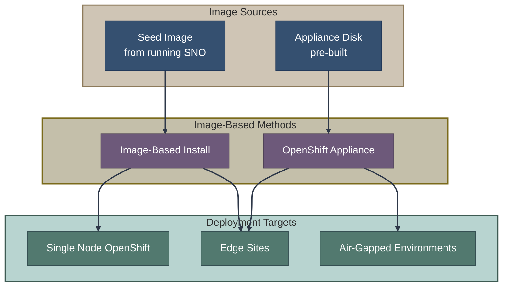

# Image-Based Installation

This section covers installation methods that use pre-built disk images containing OpenShift, enabling rapid deployment and fully air-gapped scenarios.

## Overview

Image-Based Installation represents a fundamentally different approach: instead of downloading and installing components at runtime, these methods use **pre-built images** that contain everything needed for a working cluster.

## Documents in This Section

| Document | Description |
|----------|-------------|
| [**Image-Based Install (IBI)**](ibi.md) | Deploy SNO from seed images captured from running clusters |
| [**OpenShift Appliance**](appliance.md) | Pre-built disk images with embedded registry for fully air-gapped installation |

## Quick Comparison

| Aspect | IBI | Appliance |
|--------|-----|-----------|
| Cluster types | SNO only | SNO and multi-node |
| Image source | Seed from running SNO | Built with `openshift-appliance` |
| Hub required | Optional (for orchestration) | No |
| Installation time | ~15-20 minutes | ~30-45 minutes |
| Air-gapped support | With mirror registry | Fully embedded |
| Use case | Fleet standardization, fast recovery | True air-gap, portable media |

## When to Use Image-Based Installation

**Choose IBI when:**
- Deploying many similar SNO clusters (edge/telco)
- Fast cluster recovery is critical
- You have a "golden" SNO configuration to replicate
- Hub cluster is available for orchestration

**Choose Appliance when:**
- Completely disconnected (no network at all)
- Deploying via physical media (USB, DVD)
- Standardized, repeatable deployments
- No external dependencies during install

## Key Concepts

### Seed Images (IBI)

A **seed image** is a point-in-time capture of a running SNO cluster:
- Complete OS and OpenShift installation
- All container images
- Cluster configuration (reconfigured at deployment)

Created using the [Lifecycle Agent](https://github.com/openshift/lifecycle-agent) on a "seed cluster."

### Appliance Disk Images

An **appliance** is a bootable disk image containing:
- RHCOS base OS
- Embedded container registry with all images
- Agent-based installer components
- Pre-configured cluster manifests

Built using the [`openshift-appliance`](https://github.com/openshift/appliance) tool.

### Reconfiguration

Both methods reconfigure identity at deployment time:
- Cluster name and domain
- Network configuration
- Certificates and secrets
- Node-specific settings

This allows a single image to deploy many unique clusters.

## Key Repositories

| Component | Repository |
|-----------|------------|
| IBI Operator | [openshift/image-based-install-operator](https://github.com/openshift/image-based-install-operator) |
| Lifecycle Agent | [openshift/lifecycle-agent](https://github.com/openshift/lifecycle-agent) |
| Appliance Builder | [openshift/appliance](https://github.com/openshift/appliance) |

## Related Sections

- [Installation Methods Overview](../01-installation-methods-overview.md) - Decision tree
- [Agent-Based Installer](../03-assisted-installation/abi.md) - Underlying technology for Appliance
- [ZTP with SiteConfig](../06-gitops-provisioning/ztp.md) - GitOps orchestration for IBI

