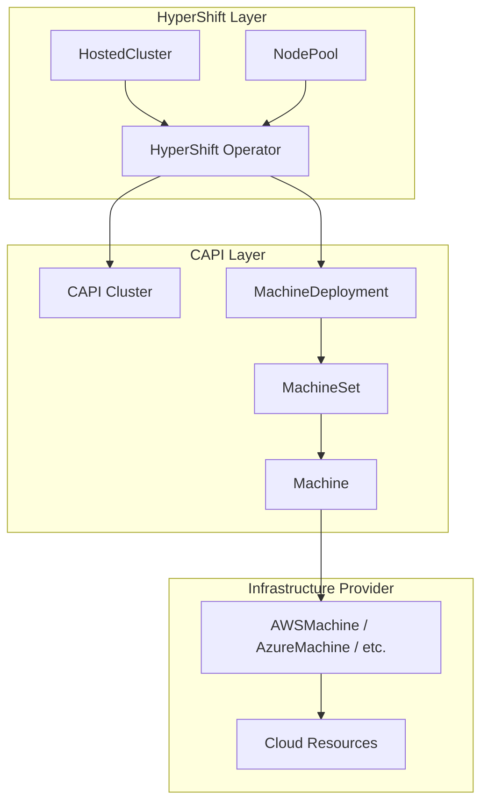
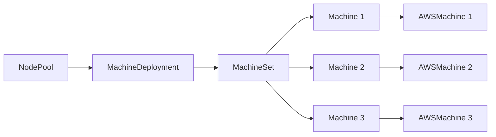
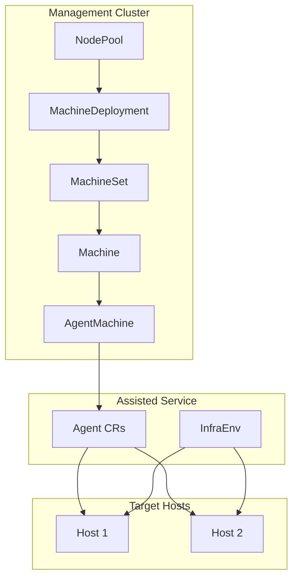
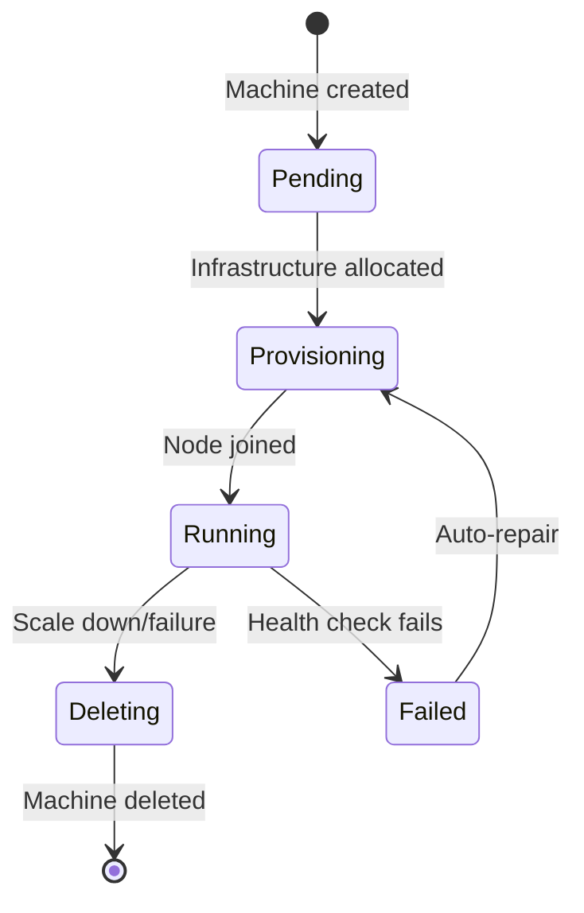
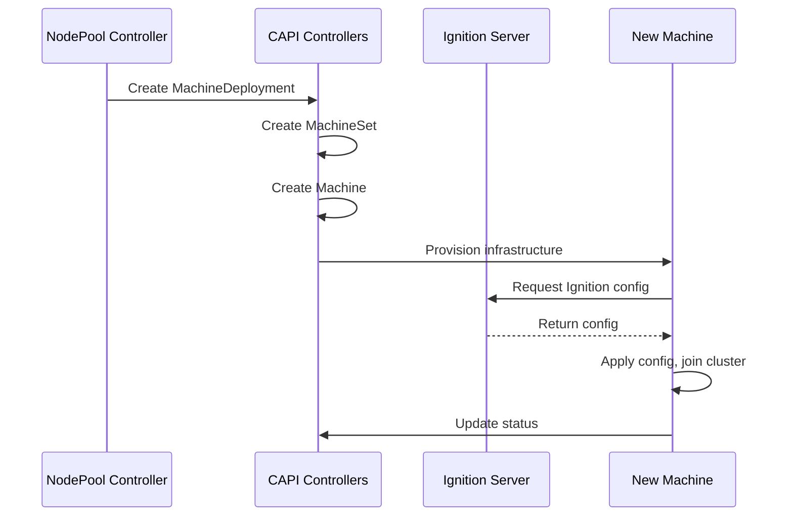

# Cluster API (CAPI) Integration

Hosted Control Planes leverages Cluster API for worker node management. This document explains the CAPI integration and how it works with HyperShift.

## Overview



## Cluster API Concepts

### Core Resources

| Resource | Purpose |
|----------|---------|
| `Cluster` | Represents a Kubernetes cluster |
| `Machine` | Represents a single node |
| `MachineSet` | Manages a group of identical Machines |
| `MachineDeployment` | Manages MachineSets with rolling updates |
| `MachineHealthCheck` | Monitors and repairs unhealthy Machines |

### Infrastructure Providers

Platform-specific controllers that provision actual infrastructure:

| Provider | CRD Prefix | Description |
|----------|------------|-------------|
| AWS | `AWS*` | EC2 instances |
| Azure | `Azure*` | Azure VMs |
| Agent | `Agent*` | Bare metal via Assisted |
| KubeVirt | `KubeVirt*` | VMs on OpenShift Virtualization |

## NodePool to CAPI Mapping



### Translation Example

**NodePool:**
```yaml
apiVersion: hypershift.openshift.io/v1beta1
kind: NodePool
metadata:
  name: workers
  namespace: clusters
spec:
  clusterName: my-cluster
  replicas: 3
  platform:
    type: AWS
    aws:
      instanceType: m5.large
      rootVolume:
        size: 120
        type: gp3
```

**Generated MachineDeployment:**
```yaml
apiVersion: cluster.x-k8s.io/v1beta1
kind: MachineDeployment
metadata:
  name: my-cluster-workers
  namespace: clusters-my-cluster
spec:
  replicas: 3
  selector:
    matchLabels:
      hypershift.openshift.io/nodePool: workers
  template:
    spec:
      clusterName: my-cluster
      bootstrap:
        dataSecretName: workers-bootstrap
      infrastructureRef:
        apiVersion: infrastructure.cluster.x-k8s.io/v1beta2
        kind: AWSMachineTemplate
        name: workers
```

## Agent Provider for Bare Metal

For bare metal/virtual environments, HyperShift uses the Agent CAPI provider.

**Repository:** [openshift/cluster-api-provider-agent](https://github.com/openshift/cluster-api-provider-agent)



### Agent-Based NodePool

```yaml
apiVersion: hypershift.openshift.io/v1beta1
kind: NodePool
metadata:
  name: workers
  namespace: clusters
spec:
  clusterName: my-cluster
  replicas: 3
  platform:
    type: Agent
    agent:
      agentLabelSelector:
        matchLabels:
          location: datacenter-1
```

### AgentMachine

```yaml
apiVersion: capi-provider.agent-install.openshift.io/v1alpha1
kind: AgentMachine
metadata:
  name: my-cluster-workers-xxxxx
  namespace: clusters-my-cluster
spec:
  agentLabelSelector:
    matchLabels:
      location: datacenter-1
status:
  agentRef:
    name: agent-uuid
    namespace: clusters
  ready: true
```

## Machine Lifecycle



### Machine Phases

| Phase | Description |
|-------|-------------|
| `Pending` | Machine CR created, waiting for infrastructure |
| `Provisioning` | Infrastructure being provisioned |
| `Provisioned` | Infrastructure ready, waiting for node |
| `Running` | Node joined and healthy |
| `Deleting` | Being terminated |
| `Failed` | Provisioning or health check failed |

## Auto-Repair

MachineHealthCheck monitors nodes and triggers repairs:

```yaml
apiVersion: cluster.x-k8s.io/v1beta1
kind: MachineHealthCheck
metadata:
  name: workers-mhc
  namespace: clusters-my-cluster
spec:
  clusterName: my-cluster
  selector:
    matchLabels:
      hypershift.openshift.io/nodePool: workers
  unhealthyConditions:
    - type: Ready
      status: "False"
      timeout: 300s
    - type: Ready
      status: Unknown
      timeout: 300s
  maxUnhealthy: 40%
  nodeStartupTimeout: 10m
```

## Scaling

### Manual Scaling

```bash
# Scale NodePool
oc patch nodepool workers -n clusters --type merge \
  -p '{"spec":{"replicas":5}}'

# CAPI automatically scales MachineSet
```

### Autoscaling

```yaml
apiVersion: hypershift.openshift.io/v1beta1
kind: NodePool
metadata:
  name: workers
spec:
  clusterName: my-cluster
  autoScaling:
    min: 2
    max: 10
```

## CAPI Controllers

### In HyperShift

| Controller | Watches | Creates/Manages |
|------------|---------|-----------------|
| NodePool | NodePool | MachineDeployment, MachineSet |
| CAPI core | Cluster, Machine | Node coordination |
| Infrastructure provider | *Machine (platform) | Cloud resources |

### Agent Provider Controllers

| Controller | Watches | Purpose |
|------------|---------|---------|
| AgentMachine | AgentMachine, Agent | Binds Machines to Agents |
| Bootstrap | Machine | Provides bootstrap data |

## Viewing CAPI Resources

```bash
# Get all CAPI resources for a hosted cluster
oc get cluster,machinedeployment,machineset,machine \
  -n clusters-my-cluster

# Get infrastructure machines
oc get awsmachine -n clusters-my-cluster  # For AWS
oc get agentmachine -n clusters-my-cluster  # For Agent

# Describe a specific machine
oc describe machine my-cluster-workers-xxxxx -n clusters-my-cluster
```

## Bootstrap Process

### Bootstrap Data Flow



### Bootstrap Token

Each Machine gets a unique bootstrap token:

```yaml
# Generated in hosted control plane namespace
apiVersion: v1
kind: Secret
metadata:
  name: workers-bootstrap
  namespace: clusters-my-cluster
data:
  value: <base64-encoded-ignition-pointer>
```

## Troubleshooting

### Machine Not Provisioning

```bash
# Check Machine status
oc get machine -n clusters-my-cluster
oc describe machine <name> -n clusters-my-cluster

# Check infrastructure machine
oc get awsmachine -n clusters-my-cluster  # or agentmachine
oc describe awsmachine <name> -n clusters-my-cluster
```

### Machine Not Joining

```bash
# Check ignition server
oc logs -n clusters-my-cluster -l app=ignition-server

# Check bootstrap data
oc get secret workers-bootstrap -n clusters-my-cluster -o yaml

# SSH to machine and check
ssh core@<machine-ip>
journalctl -u kubelet
```

### Health Check Repairs

```bash
# View MachineHealthCheck status
oc get machinehealthcheck -n clusters-my-cluster
oc describe machinehealthcheck workers-mhc -n clusters-my-cluster

# View unhealthy machines
oc get machine -n clusters-my-cluster -l "cluster.x-k8s.io/unhealthy"
```

## Custom Machine Templates

### AWS Example

```yaml
apiVersion: infrastructure.cluster.x-k8s.io/v1beta2
kind: AWSMachineTemplate
metadata:
  name: custom-workers
  namespace: clusters-my-cluster
spec:
  template:
    spec:
      instanceType: m5.xlarge
      ami:
        id: ami-12345678
      rootVolume:
        size: 200
        type: gp3
        iops: 5000
      additionalSecurityGroups:
        - id: sg-custom
```

### AgentMachine Template

```yaml
apiVersion: capi-provider.agent-install.openshift.io/v1alpha1
kind: AgentMachineTemplate
metadata:
  name: workers-template
  namespace: clusters-my-cluster
spec:
  template:
    spec:
      agentLabelSelector:
        matchLabels:
          location: datacenter-1
          hardware-profile: compute
```

## Related Documentation

- [HCP Overview](hcp-overview.md)
- [Assisted Installation](../03-assisted-installation/overview.md) - Agent provider uses Assisted
- [Operators & Controllers Reference](../07-operators-controllers/reference.md)

