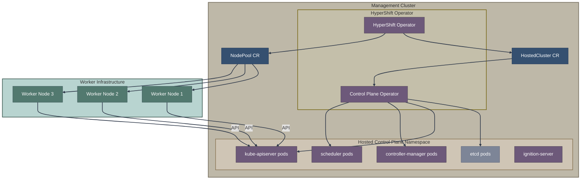
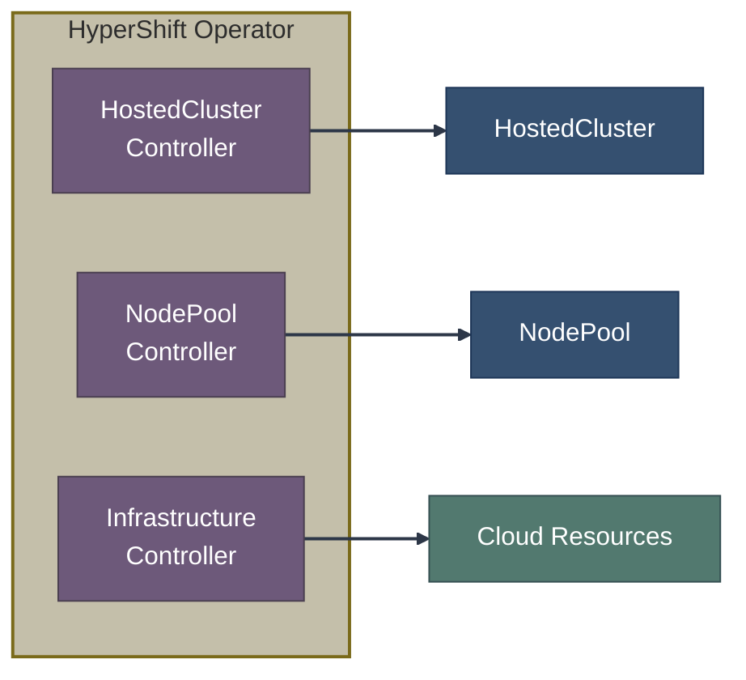
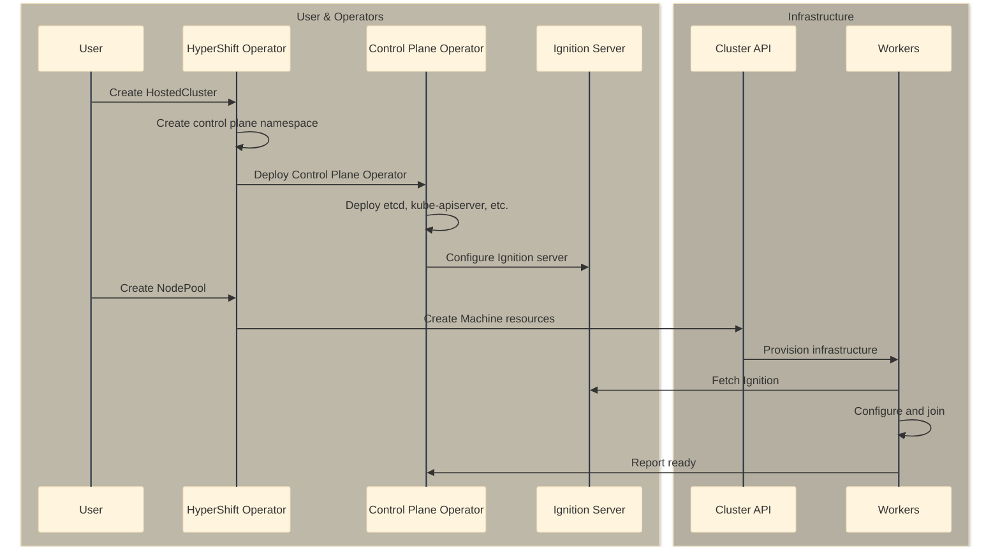
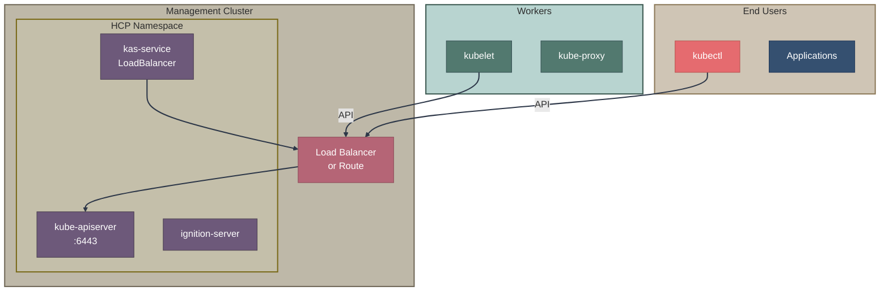

# Hosted Control Planes (HCP) Overview

Hosted Control Planes (HCP) is a deployment model where OpenShift control planes run as pods on a central management cluster, with only worker nodes deployed to the target infrastructure.

## Architecture



## Key Benefits

| Benefit | Description |
|---------|-------------|
| **Cost efficiency** | Control planes share management cluster resources |
| **Faster provisioning** | No bootstrap required; control plane starts as pods |
| **Simplified operations** | Centralized control plane management |
| **Multi-tenancy** | Strong isolation between hosted clusters |
| **Portability** | Control plane independent of worker infrastructure |

## Core Concepts

### Management Cluster

The OpenShift cluster running the HyperShift operator and hosting control planes:
- Runs HyperShift Operator
- Hosts control plane pods for multiple clusters
- Provides networking and storage for control planes

### Hosted Cluster

A Kubernetes cluster whose control plane runs on the management cluster:
- Control plane: Pods on management cluster
- Workers: VMs/bare metal on target infrastructure
- Fully compliant OpenShift cluster

### Hosted Control Plane

The set of pods comprising a cluster's control plane:
- etcd (3 pods for HA)
- kube-apiserver
- kube-controller-manager
- kube-scheduler
- OpenShift operators

## Components

### HyperShift Operator

**Repository:** [openshift/hypershift](https://github.com/openshift/hypershift)

The main operator managing the HCP lifecycle:



### Control Plane Operator (CPO)

Manages control plane components within each hosted control plane namespace:
- Deploys and configures control plane pods
- Handles upgrades and scaling
- Manages certificates and secrets

### Key CRDs

| CRD | Purpose |
|-----|---------|
| `HostedCluster` | Defines a hosted cluster |
| `NodePool` | Manages worker node groups |
| `HostedControlPlane` | Internal: control plane state |

## Supported Platforms

> **Note:** Platform support status changes between releases. The table below is approximate as of OCP 4.14/4.15. Always consult the [official HCP platform support matrix](https://docs.openshift.com/container-platform/latest/hosted_control_planes/index.html) for current status.

| Platform | Status | Worker Type |
|----------|--------|-------------|
| AWS | GA | EC2 instances |
| Azure | Tech Preview | Azure VMs |
| KubeVirt | GA | VMs on OpenShift Virtualization |
| Bare Metal (Agent) | GA | Physical/virtual via Assisted |
| IBM Power | Tech Preview | PowerVS instances |

## HostedCluster Configuration

```yaml
apiVersion: hypershift.openshift.io/v1beta1
kind: HostedCluster
metadata:
  name: my-hosted-cluster
  namespace: clusters
spec:
  # Release version
  release:
    image: quay.io/openshift-release-dev/ocp-release:4.14.0-x86_64
  
  # Pull secret for images
  pullSecret:
    name: pull-secret
  
  # SSH key for workers
  sshKey:
    name: ssh-key
  
  # Networking
  networking:
    clusterNetwork:
      - cidr: 10.132.0.0/14
    serviceNetwork:
      - cidr: 172.31.0.0/16
    networkType: OVNKubernetes
  
  # Platform-specific
  platform:
    type: AWS
    aws:
      region: us-east-1
      cloudProviderConfig:
        vpc: vpc-12345678
        zone: us-east-1a
      endpointAccess: Public
  
  # Control plane settings
  controllerAvailabilityPolicy: HighlyAvailable
  etcd:
    managementType: Managed
    managed:
      storage:
        persistentVolume:
          size: 8Gi
  
  # Service endpoints
  services:
    - service: APIServer
      servicePublishingStrategy:
        type: LoadBalancer
    - service: OAuthServer
      servicePublishingStrategy:
        type: Route
    - service: Konnectivity
      servicePublishingStrategy:
        type: Route
    - service: Ignition
      servicePublishingStrategy:
        type: Route
```

## NodePool Configuration

```yaml
apiVersion: hypershift.openshift.io/v1beta1
kind: NodePool
metadata:
  name: my-nodepool
  namespace: clusters
spec:
  # Reference to hosted cluster
  clusterName: my-hosted-cluster
  
  # Number of workers
  replicas: 3
  
  # Release version (inherits from HostedCluster if not set)
  release:
    image: quay.io/openshift-release-dev/ocp-release:4.14.0-x86_64
  
  # Platform-specific
  platform:
    type: AWS
    aws:
      instanceType: m5.large
      rootVolume:
        size: 120
        type: gp3
  
  # Node management
  management:
    autoRepair: true
    upgradeType: Replace
  
  # Node configuration
  config:
    - apiVersion: machineconfiguration.openshift.io/v1
      kind: MachineConfig
      # ...
```

## Deployment Process



## Control Plane Pods

In the hosted control plane namespace:

```bash
$ oc get pods -n clusters-my-hosted-cluster

NAME                                     READY   STATUS
etcd-0                                   1/1     Running
etcd-1                                   1/1     Running
etcd-2                                   1/1     Running
kube-apiserver-6d4f5b6c7-xxxxx           2/2     Running
kube-controller-manager-7f8b9c-xxxxx     1/1     Running
kube-scheduler-5f6g7h8-xxxxx             1/1     Running
openshift-apiserver-8j9k0l-xxxxx         1/1     Running
openshift-oauth-apiserver-1m2n3-xxxxx    1/1     Running
cluster-policy-controller-4o5p6-xxxxx    1/1     Running
...
```

## Network Architecture



## Accessing Hosted Clusters

### Get kubeconfig

```bash
# Extract kubeconfig
hypershift create kubeconfig --name my-hosted-cluster > kubeconfig

# Or from secret
oc get secret -n clusters my-hosted-cluster-admin-kubeconfig -o jsonpath='{.data.kubeconfig}' | base64 -d
```

### Using the kubeconfig

```bash
export KUBECONFIG=./kubeconfig
oc get nodes
oc get clusterversion
```

## Comparison with Standalone

| Aspect | Standalone | HCP |
|--------|------------|-----|
| Control plane location | Dedicated nodes | Management cluster |
| Control plane cost | 3+ machines | Shared pods |
| Provisioning time | 30-45 minutes | 10-15 minutes |
| Upgrade process | In-place | Pod replacement |
| Isolation | Physical | Namespace + network |
| Worker requirement | Yes | Yes |
| Control plane scaling | Add nodes | Add pods |

## High Availability

### Control Plane HA

```yaml
spec:
  controllerAvailabilityPolicy: HighlyAvailable
  etcd:
    managementType: Managed
    managed:
      storage:
        persistentVolume:
          size: 8Gi
          storageClassName: gp3-csi
```

- 3 etcd pods with persistent storage
- Multiple kube-apiserver replicas
- Spread across availability zones

### Worker HA

```yaml
# Multiple NodePools across zones
---
apiVersion: hypershift.openshift.io/v1beta1
kind: NodePool
metadata:
  name: workers-zone-a
spec:
  clusterName: my-cluster
  replicas: 2
  platform:
    aws:
      instanceType: m5.large
      subnet:
        id: subnet-zone-a
---
apiVersion: hypershift.openshift.io/v1beta1
kind: NodePool
metadata:
  name: workers-zone-b
spec:
  clusterName: my-cluster
  replicas: 2
  platform:
    aws:
      instanceType: m5.large
      subnet:
        id: subnet-zone-b
```

## Upgrades

### Control Plane Upgrade

```bash
# Update HostedCluster release image
oc patch hostedcluster my-cluster -n clusters --type merge \
  -p '{"spec":{"release":{"image":"quay.io/openshift-release-dev/ocp-release:4.15.0-x86_64"}}}'
```

### Worker Upgrade

```bash
# Update NodePool release image (optional, can auto-follow)
oc patch nodepool my-nodepool -n clusters --type merge \
  -p '{"spec":{"release":{"image":"quay.io/openshift-release-dev/ocp-release:4.15.0-x86_64"}}}'
```

Upgrade strategies:
- `Replace`: Rolling replacement of workers
- `InPlace`: In-place upgrade (where supported)

## CLI Commands

```bash
# Install HyperShift
hypershift install

# Create hosted cluster (AWS example)
hypershift create cluster aws \
  --name my-cluster \
  --node-pool-replicas 3 \
  --instance-type m5.large \
  --region us-east-1

# Get cluster status
hypershift dump cluster --name my-cluster

# Destroy cluster
hypershift destroy cluster aws --name my-cluster
```

## Related Documentation

- [CAPI Integration](capi-integration.md)
- [Operators & Controllers Reference](../07-operators-controllers/reference.md)
- [CRD Reference](../08-crd-reference/installation-crds.md)

