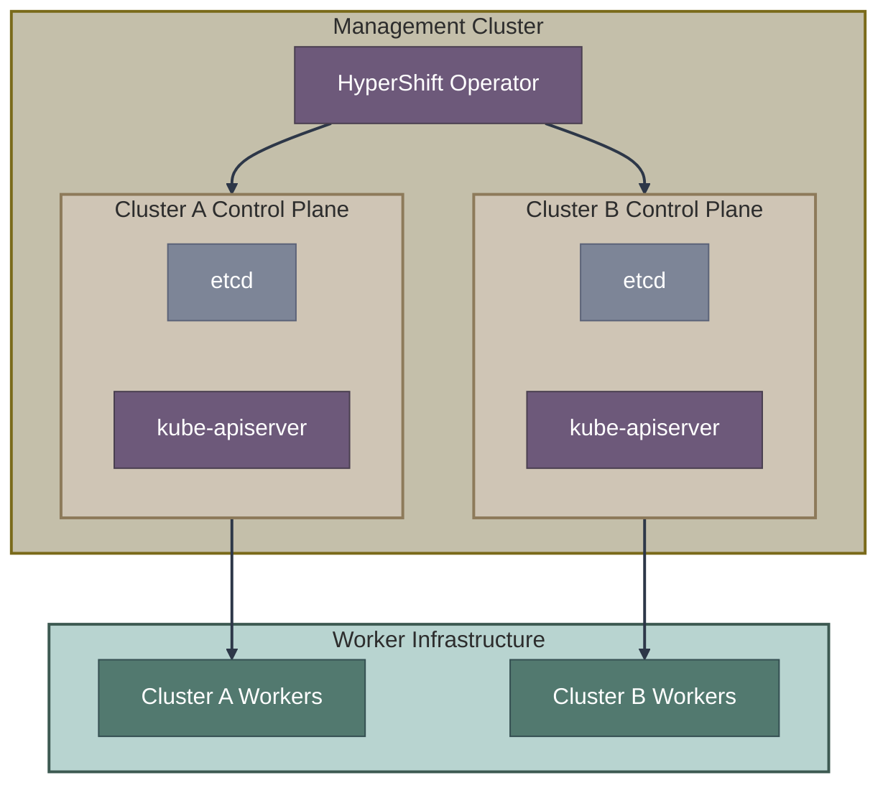

# Hosted Control Planes (HCP)

This section covers Hosted Control Planes, a deployment model where OpenShift control planes run as pods on a management cluster, with only worker nodes on target infrastructure.

## Overview

Hosted Control Planes (HCP), powered by [HyperShift](https://github.com/openshift/hypershift), fundamentally changes the OpenShift deployment model by decoupling the control plane from worker infrastructure.

## Documents in This Section

| Document | Description |
|----------|-------------|
| [**HCP Overview**](hcp-overview.md) | Architecture, concepts, and deployment process |
| [**CAPI Integration**](capi-integration.md) | How Cluster API manages worker nodes |

## Key Benefits

| Benefit | Description |
|---------|-------------|
| **Cost efficiency** | Control planes share management cluster resources |
| **Faster provisioning** | No bootstrap required; control plane starts as pods |
| **Simplified operations** | Centralized control plane management |
| **Multi-tenancy** | Strong isolation between hosted clusters |
| **Portability** | Control plane independent of worker infrastructure |

## When to Use HCP

**Choose Hosted Control Planes when:**
- Multi-tenancy is required
- Cost optimization through shared infrastructure
- Rapid cluster provisioning is critical
- Operating managed OpenShift offerings
- You need control plane/worker separation

**Consider alternatives when:**
- Single cluster deployment
- Fully disconnected environments
- Control plane must be on same infrastructure as workers
- Limited management cluster capacity

## Core Components

| Component | Repository | Purpose |
|-----------|------------|---------|
| HyperShift Operator | [openshift/hypershift](https://github.com/openshift/hypershift) | Manages HostedCluster lifecycle |
| Control Plane Operator | [hypershift/control-plane-operator](https://github.com/openshift/hypershift/tree/main/control-plane-operator) | Manages control plane pods |
| Cluster API | [kubernetes-sigs/cluster-api](https://github.com/kubernetes-sigs/cluster-api) | Worker node management |
| CAPI Agent Provider | [openshift/cluster-api-provider-agent](https://github.com/openshift/cluster-api-provider-agent) | Bare metal worker provisioning |

## Key CRDs

| CRD | Purpose |
|-----|---------|
| `HostedCluster` | Defines a hosted cluster |
| `NodePool` | Manages worker node groups |
| `HostedControlPlane` | Internal control plane state |

## Supported Platforms

> Platform support status evolves. See [official documentation](https://docs.openshift.com/container-platform/latest/hosted_control_planes/index.html) for current status.

| Platform | Workers | Status |
|----------|---------|--------|
| AWS | EC2 instances | GA |
| Azure | VMs | Tech Preview |
| Bare Metal | Agent-provisioned | GA |
| KubeVirt | VMs on OpenShift | Tech Preview |

## Related Sections

- [Installation Methods Overview](../01-installation-methods-overview.md) - Decision tree
- [Operators & Controllers](../07-operators-controllers/overview.md) - HyperShift operator details
- [CRD Reference](../08-crd-reference/index.md) - HostedCluster and NodePool specs

