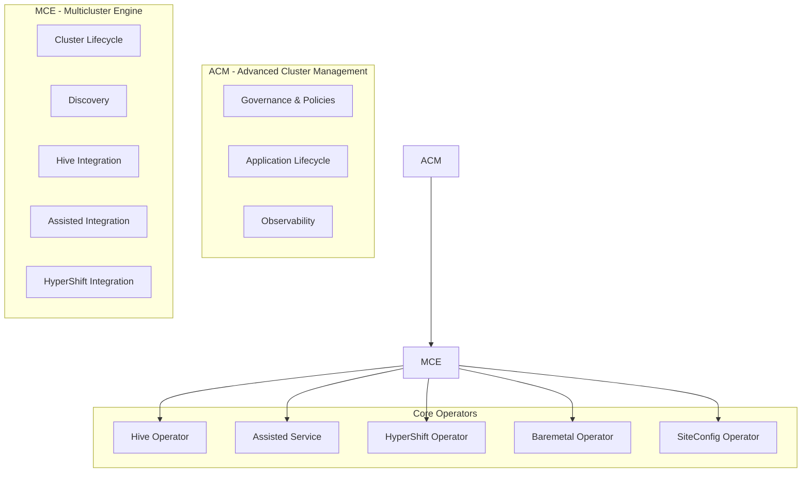
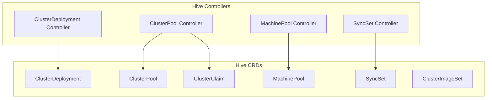
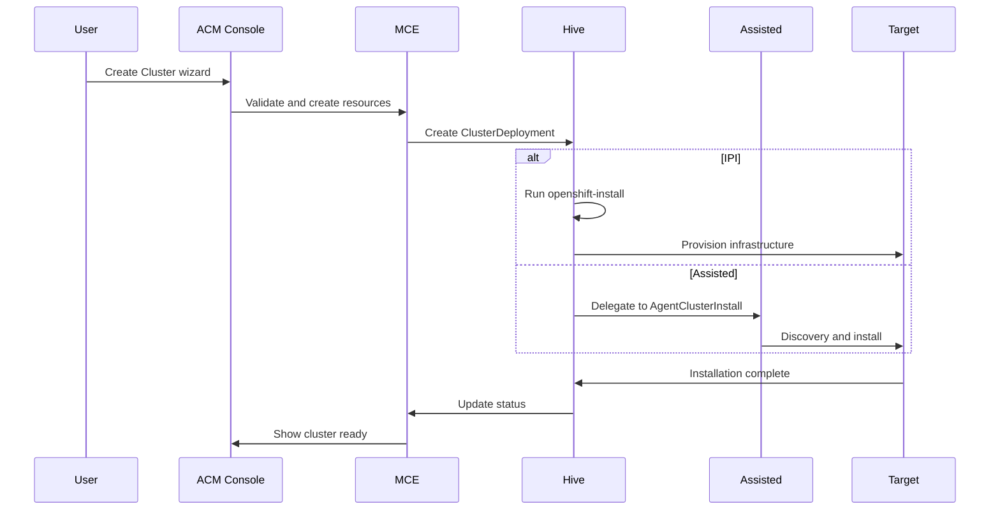

# ACM/MCE/Hive Integration

This document explains how Advanced Cluster Management (ACM), Multicluster Engine (MCE), and Hive work together to provide cluster lifecycle management for OpenShift installations.

## Component Hierarchy



## What Each Component Provides

### ACM (Advanced Cluster Management)

Full multi-cluster management platform:

| Capability | Description |
|------------|-------------|
| Governance | Policy-based configuration and compliance |
| Application Lifecycle | GitOps-based application deployment |
| Observability | Metrics, logging, alerting across clusters |
| Cluster Lifecycle | Via MCE integration |

### MCE (Multicluster Engine)

Core cluster lifecycle functionality:

| Capability | Description |
|------------|-------------|
| Cluster Creation | IPI, Assisted, HyperShift |
| Cluster Import | Bring existing clusters under management |
| Cluster Scaling | Add/remove nodes |
| Upgrades | Orchestrated cluster upgrades |
| Discovery | Discover existing OpenShift clusters |

### Hive

Kubernetes-native cluster provisioning:

| Capability | Description |
|------------|-------------|
| ClusterDeployment | Core cluster definition |
| ClusterPool | Pre-provisioned cluster pools |
| MachinePool | Worker node management |
| SyncSet | Configuration synchronization |

## Hive Architecture



## ClusterDeployment

The central CRD for cluster provisioning:

```yaml
apiVersion: hive.openshift.io/v1
kind: ClusterDeployment
metadata:
  name: my-cluster
  namespace: my-cluster
spec:
  baseDomain: example.com
  clusterName: my-cluster
  
  # Installation method selector
  platform:
    # For cloud platforms
    aws:
      region: us-east-1
      credentialsSecretRef:
        name: aws-creds
    # OR for agent-based (Assisted)
    agentBareMetal:
      agentSelector:
        matchLabels:
          cluster-name: my-cluster
  
  # Reference to cluster configuration
  clusterInstallRef:
    group: extensions.hive.openshift.io
    kind: AgentClusterInstall  # or MachinePool for IPI
    name: my-cluster
    version: v1beta1
  
  # Image specification
  provisioning:
    imageSetRef:
      name: openshift-4.14
    installConfigSecretRef:
      name: install-config
  
  # Secrets
  pullSecretRef:
    name: pull-secret
  
  # Cluster management
  installed: false  # Set true after installation
  clusterMetadata:
    adminKubeconfigSecretRef:
      name: my-cluster-admin-kubeconfig
    adminPasswordSecretRef:
      name: my-cluster-admin-password
```

## ClusterPool

Pre-provision clusters for on-demand claiming:

```yaml
apiVersion: hive.openshift.io/v1
kind: ClusterPool
metadata:
  name: aws-clusters
  namespace: cluster-pools
spec:
  # Pool sizing
  size: 3           # Maintain 3 unclaimed clusters
  runningCount: 1   # Keep 1 running, hibernate rest
  
  # Cluster template
  baseDomain: example.com
  imageSetRef:
    name: openshift-4.14
  platform:
    aws:
      region: us-east-1
      credentialsSecretRef:
        name: aws-creds
  pullSecretRef:
    name: pull-secret
  
  # Lifecycle
  maxSize: 10
  maxConcurrent: 2
  hibernateAfter: 30m
```

### ClusterClaim

Claim a cluster from the pool:

```yaml
apiVersion: hive.openshift.io/v1
kind: ClusterClaim
metadata:
  name: my-claim
  namespace: cluster-pools
spec:
  clusterPoolName: aws-clusters
  lifetime: 8h  # Auto-release after 8 hours
```

## MachinePool

Manage worker nodes:

```yaml
apiVersion: hive.openshift.io/v1
kind: MachinePool
metadata:
  name: my-cluster-workers
  namespace: my-cluster
spec:
  clusterDeploymentRef:
    name: my-cluster
  name: workers
  replicas: 3
  platform:
    aws:
      type: m5.large
      rootVolume:
        iops: 3000
        size: 120
        type: gp3
      zones:
        - us-east-1a
        - us-east-1b
  autoscaling:
    minReplicas: 2
    maxReplicas: 10
```

## SyncSet

Push configuration to managed clusters:

```yaml
apiVersion: hive.openshift.io/v1
kind: SyncSet
metadata:
  name: common-config
  namespace: my-cluster
spec:
  clusterDeploymentRefs:
    - name: my-cluster
  resources:
    - apiVersion: v1
      kind: ConfigMap
      metadata:
        name: common-config
        namespace: default
      data:
        key: value
  patches:
    - apiVersion: v1
      kind: ConfigMap
      name: existing-config
      namespace: default
      patch: |
        data:
          newKey: newValue
      patchType: merge
```

### SelectorSyncSet

Apply to multiple clusters by label:

```yaml
apiVersion: hive.openshift.io/v1
kind: SelectorSyncSet
metadata:
  name: production-config
spec:
  clusterDeploymentSelector:
    matchLabels:
      environment: production
  resources:
    - apiVersion: v1
      kind: Namespace
      metadata:
        name: monitoring
```

## ClusterImageSet

Define available OpenShift versions:

```yaml
apiVersion: hive.openshift.io/v1
kind: ClusterImageSet
metadata:
  name: openshift-4.14.0
spec:
  releaseImage: quay.io/openshift-release-dev/ocp-release:4.14.0-x86_64
```

## Integration Flow

### Cluster Creation via ACM/MCE Console



### Managed Cluster Registration

After installation, the cluster is registered as a ManagedCluster:

```yaml
apiVersion: cluster.open-cluster-management.io/v1
kind: ManagedCluster
metadata:
  name: my-cluster
  labels:
    cloud: Amazon
    region: us-east-1
    vendor: OpenShift
spec:
  hubAcceptsClient: true
  leaseDurationSeconds: 60
```

## Multi-Cluster Policies

Apply configurations across clusters:

```yaml
apiVersion: policy.open-cluster-management.io/v1
kind: Policy
metadata:
  name: require-labels
  namespace: open-cluster-management
spec:
  remediationAction: enforce
  disabled: false
  policy-templates:
    - objectDefinition:
        apiVersion: policy.open-cluster-management.io/v1
        kind: ConfigurationPolicy
        metadata:
          name: require-labels
        spec:
          severity: high
          object-templates:
            - complianceType: musthave
              objectDefinition:
                apiVersion: v1
                kind: Namespace
                metadata:
                  name: default
                  labels:
                    managed-by: acm
---
apiVersion: policy.open-cluster-management.io/v1
kind: PlacementBinding
metadata:
  name: require-labels-binding
  namespace: open-cluster-management
spec:
  placementRef:
    name: all-clusters
    kind: Placement
    apiGroup: cluster.open-cluster-management.io
  subjects:
    - name: require-labels
      kind: Policy
      apiGroup: policy.open-cluster-management.io
```

## Cluster Sets

Group clusters for management:

```yaml
apiVersion: cluster.open-cluster-management.io/v1beta2
kind: ManagedClusterSet
metadata:
  name: production-clusters
---
apiVersion: cluster.open-cluster-management.io/v1beta2
kind: ManagedClusterSetBinding
metadata:
  name: production-clusters
  namespace: default
spec:
  clusterSet: production-clusters
```

## Status Aggregation

### ClusterDeployment Status

```yaml
status:
  conditions:
    - type: ClusterInstallCompleted
      status: "True"
    - type: UnreachableCluster
      status: "False"
    - type: Hibernating
      status: "False"
  installed: true
  installedTimestamp: "2024-01-15T10:30:00Z"
  webConsoleURL: "https://console-openshift-console.apps.my-cluster.example.com"
  apiURL: "https://api.my-cluster.example.com:6443"
  clusterVersionStatus:
    version: "4.14.0"
    state: Stable
```

### ManagedCluster Status

```yaml
status:
  conditions:
    - type: ManagedClusterConditionAvailable
      status: "True"
    - type: ManagedClusterJoined
      status: "True"
    - type: HubAcceptedManagedCluster
      status: "True"
  clusterClaims:
    - name: id.k8s.io
      value: "my-cluster-uuid"
    - name: platform.open-cluster-management.io
      value: AWS
    - name: version.openshift.io
      value: "4.14.0"
```

## Hibernation

Reduce costs by hibernating idle clusters:

```bash
# Hibernate a cluster
oc patch clusterdeployment my-cluster -n my-cluster \
  --type merge -p '{"spec":{"powerState":"Hibernating"}}'

# Resume a cluster
oc patch clusterdeployment my-cluster -n my-cluster \
  --type merge -p '{"spec":{"powerState":"Running"}}'
```

## Related Documentation

- [ZTP Overview](ztp.md)
- [SiteConfig Operator](siteconfig.md)
- [Assisted Installation](../03-assisted-installation/overview.md)
- [CRD Reference](../08-crd-reference/installation-crds.md)

