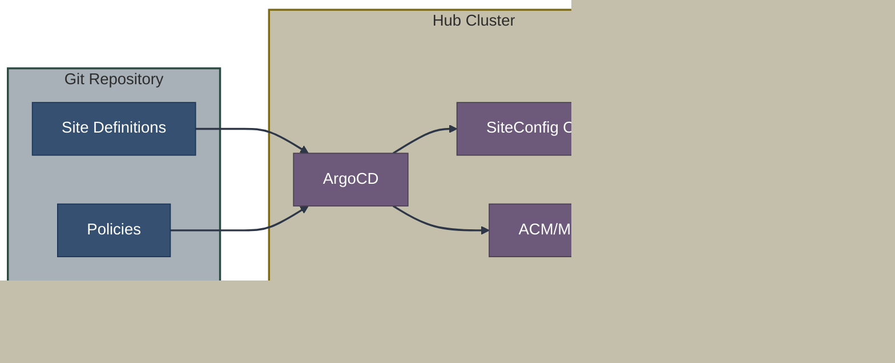

# GitOps Provisioning

This section covers GitOps-driven approaches to OpenShift cluster provisioning, enabling declarative, version-controlled, and scalable deployments.

## Overview

GitOps provisioning treats cluster definitions as code, storing them in Git repositories and using ArgoCD to synchronize desired state to the hub cluster. This enables:

- **Declarative infrastructure** - Clusters defined in YAML
- **Version control** - Full history and rollback
- **Scale** - Deploy hundreds of clusters consistently
- **Automation** - Zero-touch provisioning



## Documents in This Section

| Document | Description |
|----------|-------------|
| [**Zero Touch Provisioning (ZTP)**](ztp.md) | Complete ZTP workflow, components, and ClusterInstance |
| [**SiteConfig Operator**](siteconfig.md) | How SiteConfig renders ClusterInstance to installation resources |
| [**ACM Integration**](acm-integration.md) | Policy framework and multi-cluster management |

## Key Components

| Component | Repository | Purpose |
|-----------|------------|---------|
| ArgoCD | [argoproj/argo-cd](https://github.com/argoproj/argo-cd) | GitOps synchronization |
| SiteConfig Operator | [stolostron/siteconfig](https://github.com/stolostron/siteconfig) | ClusterInstance rendering |
| TALM | [openshift-kni/cluster-group-upgrades-operator](https://github.com/openshift-kni/cluster-group-upgrades-operator) | Policy-based upgrades |
| ACM | [stolostron/rhacm-docs](https://github.com/stolostron/rhacm-docs) | Multi-cluster management |

## When to Use GitOps Provisioning

**Choose ZTP/GitOps when:**
- Deploying clusters at scale (10+ sites)
- Standardized, repeatable deployments required
- GitOps workflows already in place
- Edge/telco deployments
- Policy-driven configuration management

**Consider alternatives when:**
- Single cluster deployment
- Interactive installation preferred
- No existing Git/ArgoCD infrastructure
- Proof-of-concept or testing

## The ClusterInstance API

The `ClusterInstance` CRD provides a unified, template-driven interface for cluster provisioning:

```yaml
apiVersion: siteconfig.open-cluster-management.io/v1alpha1
kind: ClusterInstance
metadata:
  name: edge-site-001
spec:
  clusterName: edge-site-001
  baseDomain: example.com
  # ... cluster configuration
  nodes:
    - hostName: master-0
      bmcAddress: redfish://bmc.example.com
      # ... node configuration
```

The SiteConfig Operator renders this into:
- ClusterDeployment
- AgentClusterInstall
- InfraEnv
- BareMetalHost
- NMStateConfig

## ZTP Workflow

1. **Define** - Create ClusterInstance in Git
2. **Sync** - ArgoCD applies to hub cluster
3. **Render** - SiteConfig creates installation resources
4. **Install** - Assisted Service provisions cluster
5. **Configure** - TALM applies policies
6. **Manage** - ACM provides ongoing governance

## Quick Comparison: Direct vs GitOps

| Aspect | Direct (CRDs) | GitOps (ZTP) |
|--------|---------------|--------------|
| Cluster definition | Individual CRDs | ClusterInstance template |
| Deployment method | kubectl/oc apply | ArgoCD sync |
| Version control | Optional | Required (Git) |
| Scale | Manual per-cluster | Automated fleet |
| Day-2 configuration | Manual | Policy-driven |

## Related Sections

- [Assisted Installation](../03-assisted-installation/overview.md) - Underlying installation method
- [Image-Based Install](../04-image-based-installation/ibi.md) - Alternative backend for ZTP
- [CRD Reference](../08-crd-reference/index.md) - ClusterInstance and related CRDs
- [Hub and Spoke Architecture](../03-assisted-installation/saas-vs-onprem.md#hub-and-spoke-architecture) - Architecture pattern


