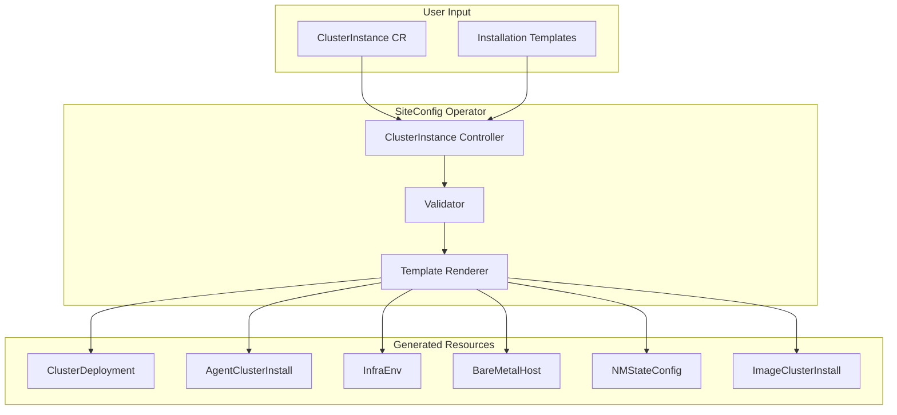

# SiteConfig Operator

The SiteConfig Operator provides template-driven cluster provisioning with a unified `ClusterInstance` API, decoupling cluster definition from installation method.

## Overview



## Key Concepts

### ClusterInstance

The unified API that captures cluster definition independently of installation method.

### Templates

ConfigMaps containing Go templates that render ClusterInstance data into installation resources.

### Separation of Concerns

| Layer | Responsibility | Who Manages |
|-------|---------------|-------------|
| ClusterInstance | What to deploy | Site operators |
| Templates | How to deploy | Platform team |
| Underlying CRDs | Actual provisioning | Operators |

## Enabling SiteConfig Operator

### Prerequisites

- OpenShift 4.14+
- MCE 2.4+ or ACM 2.9+

### Installation

```yaml
apiVersion: multicluster.openshift.io/v1
kind: MultiClusterEngine
metadata:
  name: multiclusterengine
spec:
  overrides:
    components:
      - name: siteconfig
        enabled: true
```

### Verify Installation

```bash
# Check operator deployment
oc get deployment -n siteconfig-system

# Check CRD
oc get crd clusterinstances.siteconfig.open-cluster-management.io
```

## ClusterInstance Specification

### Full Example

```yaml
apiVersion: siteconfig.open-cluster-management.io/v1alpha1
kind: ClusterInstance
metadata:
  name: edge-sno-1
  namespace: edge-sno-1
spec:
  # Cluster identity
  clusterName: edge-sno-1
  baseDomain: example.com
  clusterType: SNO  # SNO, Compact, Standard
  
  # Template selection
  templateRefs:
    - name: ai-cluster-templates-v1
      namespace: siteconfig-system
  
  # Image set
  clusterImageSetNameRef: openshift-v4.14.0
  
  # Secrets
  pullSecretRef:
    name: pull-secret
  sshPublicKey: "ssh-rsa AAAA..."
  
  # Networking
  clusterNetwork:
    - cidr: 10.128.0.0/14
      hostPrefix: 23
  serviceNetwork:
    - 172.30.0.0/16
  machineNetwork:
    - cidr: 192.168.1.0/24
  
  # API VIPs (for multi-node)
  apiVIPs:
    - 192.168.1.100
  ingressVIPs:
    - 192.168.1.101
  
  # Extra manifests
  extraManifests:
    - name: day1-config
  
  # Cluster labels
  clusterLabels:
    cluster-type: sno
    region: us-east
  
  # Node definitions
  nodes:
    - hostname: sno-node
      role: master
      
      # BMC configuration
      bmcAddress: redfish-virtualmedia://192.168.1.10/redfish/v1/Systems/1
      bmcCredentialsName:
        name: bmc-secret
      bootMACAddress: "00:11:22:33:44:55"
      
      # Installation disk
      rootDeviceHints:
        deviceName: /dev/sda
      
      # Network configuration
      nodeNetwork:
        interfaces:
          - name: eno1
            macAddress: "00:11:22:33:44:55"
        config:
          interfaces:
            - name: eno1
              type: ethernet
              state: up
              ipv4:
                address:
                  - ip: 192.168.1.50
                    prefix-length: 24
                enabled: true
                dhcp: false
          routes:
            config:
              - destination: 0.0.0.0/0
                next-hop-address: 192.168.1.1
          dns-resolver:
            config:
              server:
                - 192.168.1.1
      
      # Optional node labels
      nodeLabels:
        node-role.kubernetes.io/infra: ""
```

## Template Structure

### Template ConfigMap

```yaml
apiVersion: v1
kind: ConfigMap
metadata:
  name: ai-cluster-templates-v1
  namespace: siteconfig-system
  labels:
    siteconfig.open-cluster-management.io/template: "true"
data:
  # Each key is a resource type
  ClusterDeployment: |
    apiVersion: hive.openshift.io/v1
    kind: ClusterDeployment
    metadata:
      name: "{{ .Spec.ClusterName }}"
      namespace: "{{ .Spec.ClusterName }}"
      labels:
        {{- range $key, $value := .Spec.ClusterLabels }}
        {{ $key }}: "{{ $value }}"
        {{- end }}
    spec:
      baseDomain: "{{ .Spec.BaseDomain }}"
      clusterName: "{{ .Spec.ClusterName }}"
      platform:
        agentBareMetal:
          agentSelector:
            matchLabels:
              cluster-name: "{{ .Spec.ClusterName }}"
      pullSecretRef:
        name: "{{ .Spec.PullSecretRef.Name }}"
      clusterInstallRef:
        group: extensions.hive.openshift.io
        kind: AgentClusterInstall
        name: "{{ .Spec.ClusterName }}"
        version: v1beta1
  
  AgentClusterInstall: |
    # ... template content
  
  InfraEnv: |
    # ... template content
  
  BareMetalHost: |
    {{- range .Spec.Nodes }}
    ---
    apiVersion: metal3.io/v1alpha1
    kind: BareMetalHost
    metadata:
      name: "{{ .Hostname }}"
      namespace: "{{ $.Spec.ClusterName }}"
      labels:
        infraenvs.agent-install.openshift.io: "{{ $.Spec.ClusterName }}"
      annotations:
        bmac.agent-install.openshift.io/hostname: "{{ .Hostname }}"
        bmac.agent-install.openshift.io/role: "{{ .Role }}"
    spec:
      online: true
      bootMACAddress: "{{ .BootMACAddress }}"
      bmc:
        address: "{{ .BMCAddress }}"
        credentialsName: "{{ .BMCCredentialsName.Name }}"
      automatedCleaningMode: disabled
      rootDeviceHints:
        deviceName: "{{ .RootDeviceHints.DeviceName }}"
    {{- end }}
  
  NMStateConfig: |
    {{- range .Spec.Nodes }}
    {{- if .NodeNetwork }}
    ---
    apiVersion: agent-install.openshift.io/v1beta1
    kind: NMStateConfig
    metadata:
      name: "{{ .Hostname }}"
      namespace: "{{ $.Spec.ClusterName }}"
      labels:
        cluster-name: "{{ $.Spec.ClusterName }}"
    spec:
      config: {{ .NodeNetwork.Config | toYaml | nindent 8 }}
      interfaces:
        {{- range .NodeNetwork.Interfaces }}
        - name: "{{ .Name }}"
          macAddress: "{{ .MacAddress }}"
        {{- end }}
    {{- end }}
    {{- end }}
```

### IBI Templates

For Image-Based Installation:

```yaml
apiVersion: v1
kind: ConfigMap
metadata:
  name: ibi-cluster-templates-v1
  namespace: siteconfig-system
  labels:
    siteconfig.open-cluster-management.io/template: "true"
data:
  ClusterDeployment: |
    apiVersion: hive.openshift.io/v1
    kind: ClusterDeployment
    metadata:
      name: "{{ .Spec.ClusterName }}"
      namespace: "{{ .Spec.ClusterName }}"
    spec:
      baseDomain: "{{ .Spec.BaseDomain }}"
      clusterName: "{{ .Spec.ClusterName }}"
      platform:
        agentBareMetal:
          agentSelector: {}
      pullSecretRef:
        name: "{{ .Spec.PullSecretRef.Name }}"
      clusterInstallRef:
        group: extensions.hive.openshift.io
        kind: ImageClusterInstall
        name: "{{ .Spec.ClusterName }}"
        version: v1alpha1
  
  ImageClusterInstall: |
    apiVersion: extensions.hive.openshift.io/v1alpha1
    kind: ImageClusterInstall
    metadata:
      name: "{{ .Spec.ClusterName }}"
      namespace: "{{ .Spec.ClusterName }}"
    spec:
      clusterDeploymentRef:
        name: "{{ .Spec.ClusterName }}"
      imageSetRef:
        name: "{{ .Spec.ClusterImageSetNameRef }}"
      hostname: "{{ (index .Spec.Nodes 0).Hostname }}"
      bareMetalHostRef:
        name: "{{ (index .Spec.Nodes 0).Hostname }}"
        namespace: "{{ .Spec.ClusterName }}"
      machineNetwork: "{{ (index .Spec.MachineNetwork 0).CIDR }}"
```

## Template Functions

Available functions in templates:

| Function | Description | Example |
|----------|-------------|---------|
| `toYaml` | Convert to YAML | `{{ .Config \| toYaml }}` |
| `nindent` | Indent with newline | `{{ .Data \| nindent 4 }}` |
| `index` | Array access | `{{ index .Nodes 0 }}` |
| `range` | Iterate | `{{ range .Nodes }}...{{ end }}` |
| `if/else` | Conditionals | `{{ if .Value }}...{{ end }}` |
| `default` | Default value | `{{ .Value \| default "foo" }}` |

## Status and Conditions

### ClusterInstance Status

```yaml
status:
  conditions:
    - type: ClusterInstanceValidated
      status: "True"
      reason: ValidationSucceeded
      message: "ClusterInstance validated successfully"
    - type: RenderedTemplates
      status: "True"
      reason: RenderingSucceeded
      message: "All templates rendered successfully"
    - type: RenderedTemplatesApplied
      status: "True"
      reason: Applied
      message: "All rendered resources applied"
    - type: Provisioned
      status: "True"
      reason: Completed
      message: "Cluster provisioned successfully"
  
  # Reference to generated resources
  clusterDeploymentRef:
    name: edge-sno-1
    namespace: edge-sno-1
  
  # List of rendered manifests
  manifestsRendered:
    - apiVersion: hive.openshift.io/v1
      kind: ClusterDeployment
      name: edge-sno-1
    - apiVersion: extensions.hive.openshift.io/v1beta1
      kind: AgentClusterInstall
      name: edge-sno-1
    - apiVersion: agent-install.openshift.io/v1beta1
      kind: InfraEnv
      name: edge-sno-1
    - apiVersion: metal3.io/v1alpha1
      kind: BareMetalHost
      name: sno-node
```

### Condition Types

| Condition | Meaning |
|-----------|---------|
| `ClusterInstanceValidated` | Spec validation passed |
| `RenderedTemplates` | Templates successfully rendered |
| `RenderedTemplatesApplied` | Resources created in cluster |
| `Provisioned` | Cluster installation completed |
| `Degraded` | Error occurred |

## Dry Run Mode

Test template rendering without applying:

```yaml
apiVersion: siteconfig.open-cluster-management.io/v1alpha1
kind: ClusterInstance
metadata:
  name: test-cluster
  annotations:
    siteconfig.open-cluster-management.io/dry-run: "true"
spec:
  # ...
```

Check rendered output:

```bash
oc get clusterinstance test-cluster -o jsonpath='{.status.renderedManifests}' | jq
```

## Extra Manifests

Add day-1 configuration via ConfigMaps:

```yaml
# Extra manifests ConfigMap
apiVersion: v1
kind: ConfigMap
metadata:
  name: day1-config
  namespace: edge-sno-1
data:
  99-performance-profile.yaml: |
    apiVersion: performance.openshift.io/v2
    kind: PerformanceProfile
    metadata:
      name: sno-profile
    spec:
      cpu:
        isolated: "2-31"
        reserved: "0-1"
      hugepages:
        defaultHugepagesSize: 1G
        pages:
          - count: 16
            size: 1G
      realTimeKernel:
        enabled: true
      numa:
        topologyPolicy: restricted
```

Reference in ClusterInstance:

```yaml
spec:
  extraManifests:
    - name: day1-config
```

## Suppressing Resources

Disable specific resources:

```yaml
spec:
  suppressedManifests:
    - BareMetalHost  # Don't generate BMH (external management)
```

## Deprovisioning

### Delete ClusterInstance

```bash
oc delete clusterinstance edge-sno-1 -n edge-sno-1
```

The operator cleans up:
1. ClusterDeployment (triggers Hive deprovision)
2. AgentClusterInstall
3. InfraEnv
4. BareMetalHosts
5. Generated secrets and ConfigMaps

### Preserve Resources

To keep certain resources:

```yaml
metadata:
  annotations:
    siteconfig.open-cluster-management.io/preserve-on-delete: "BareMetalHost,Secret"
```

## Troubleshooting

### Template Errors

```bash
# Check operator logs
oc logs -n siteconfig-system deploy/siteconfig-controller-manager

# Check ClusterInstance events
oc describe clusterinstance edge-sno-1 -n edge-sno-1
```

### Common Issues

| Issue | Cause | Solution |
|-------|-------|----------|
| Template not found | Wrong templateRef | Verify ConfigMap exists and has label |
| Rendering failed | Template syntax error | Check Go template syntax |
| Resources not created | Validation failed | Check conditions for errors |
| Missing field | Required field not in spec | Add missing spec fields |

### Validation

```bash
# Validate ClusterInstance before apply
oc apply --dry-run=server -f clusterinstance.yaml
```

## Related Documentation

- [GitOps Provisioning Overview](index.md) - Section overview
- [ZTP Overview](ztp.md) - Complete ZTP workflow
- [ACM Integration](acm-integration.md) - Policy framework
- [CRD Reference](../08-crd-reference/installation-crds.md)

