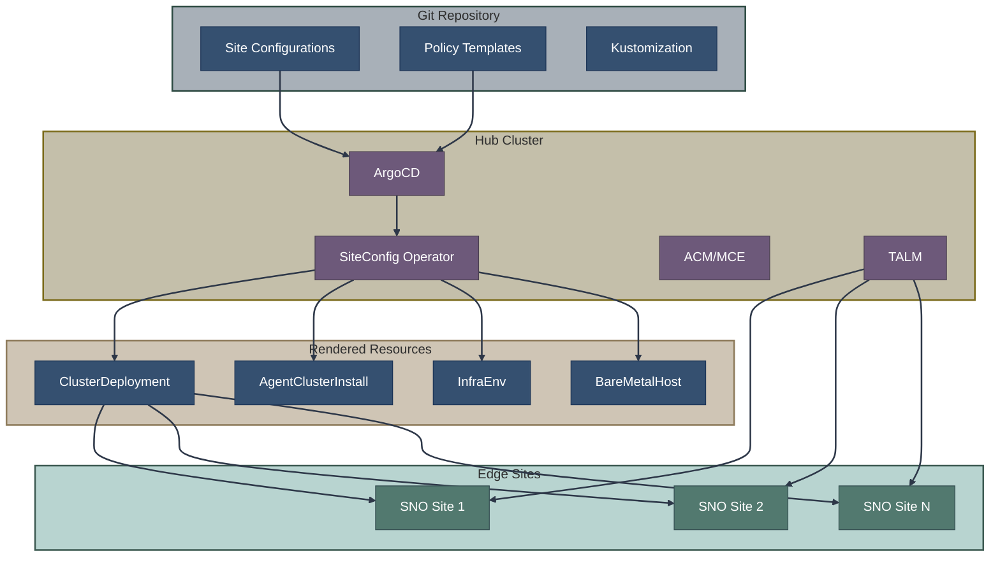
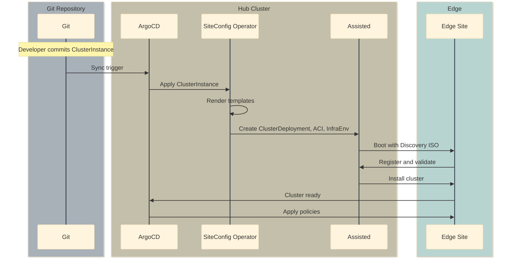

# Zero Touch Provisioning (ZTP)

Zero Touch Provisioning (ZTP) is a GitOps-driven approach to deploying OpenShift clusters at scale, particularly suited for edge and telco deployments.

ZTP uses a [hub-and-spoke architecture](../00-concepts-glossary.md#hub-and-spoke-architecture) where a central **hub cluster** manages the provisioning of many **spoke clusters** (edge sites) through GitOps workflows.

## Overview



## Key Components

### ArgoCD

**Repository:** [argoproj/argo-cd](https://github.com/argoproj/argo-cd) | [Docs](https://argo-cd.readthedocs.io/)

GitOps engine that synchronizes Git repository state to the hub cluster.

### SiteConfig Operator

**Repository:** [stolostron/siteconfig](https://github.com/stolostron/siteconfig)

Renders ClusterInstance CRs into underlying installation resources.

Key source files:
- [ClusterInstance CRD](https://github.com/stolostron/siteconfig/blob/main/api/v1alpha1/clusterinstance_types.go)
- [ClusterInstance Controller](https://github.com/stolostron/siteconfig/tree/main/internal/controller)

### TALM (Topology Aware Lifecycle Manager)

**Repository:** [openshift-kni/cluster-group-upgrades-operator](https://github.com/openshift-kni/cluster-group-upgrades-operator)

Manages policy-based configuration and upgrades across clusters.

### ACM/MCE

**Repositories:**
- MCE: [stolostron/backplane-operator](https://github.com/stolostron/backplane-operator)
- ACM docs: [stolostron/rhacm-docs](https://github.com/stolostron/rhacm-docs)

Provides cluster lifecycle management, policy framework, and observability.

## ZTP Workflow



## ClusterInstance API

The unified API for cluster definitions:

```yaml
apiVersion: siteconfig.open-cluster-management.io/v1alpha1
kind: ClusterInstance
metadata:
  name: edge-site-1
  namespace: edge-site-1
spec:
  # Cluster identification
  clusterName: edge-site-1
  baseDomain: example.com
  
  # Template reference
  templateRefs:
    - name: ai-cluster-templates-v1
      namespace: siteconfig-system
  
  # Pull secret
  pullSecretRef:
    name: pull-secret
  
  # SSH key
  sshPublicKey: "ssh-rsa AAAA..."
  
  # Cluster configuration
  clusterType: SNO
  clusterNetwork:
    - cidr: 10.128.0.0/14
      hostPrefix: 23
  serviceNetwork:
    - 172.30.0.0/16
  machineNetwork:
    - cidr: 192.168.1.0/24
  
  # Extra manifests
  extraManifests:
    - name: day1-config
  
  # Node definitions
  nodes:
    - hostname: sno-node
      role: master
      bmcAddress: idrac-virtualmedia://192.168.1.10/redfish/v1/Systems/System.Embedded.1
      bmcCredentialsName:
        name: bmc-secret
      bootMACAddress: "00:11:22:33:44:55"
      rootDeviceHints:
        deviceName: /dev/sda
      nodeNetwork:
        interfaces:
          - name: eno1
            macAddress: "00:11:22:33:44:55"
        config:
          interfaces:
            - name: eno1
              type: ethernet
              state: up
              ipv4:
                address:
                  - ip: 192.168.1.100
                    prefix-length: 24
                enabled: true
                dhcp: false
          routes:
            config:
              - destination: 0.0.0.0/0
                next-hop-address: 192.168.1.1
          dns-resolver:
            config:
              server:
                - 192.168.1.1
```

## Template System

### Installation Templates

Templates define the installation method and architecture:

```yaml
apiVersion: v1
kind: ConfigMap
metadata:
  name: ai-cluster-templates-v1
  namespace: siteconfig-system
  labels:
    siteconfig.open-cluster-management.io/template: "true"
data:
  ClusterDeployment: |
    apiVersion: hive.openshift.io/v1
    kind: ClusterDeployment
    metadata:
      name: "{{ .ClusterName }}"
      namespace: "{{ .ClusterName }}"
    spec:
      baseDomain: "{{ .BaseDomain }}"
      clusterName: "{{ .ClusterName }}"
      platform:
        agentBareMetal:
          agentSelector:
            matchLabels:
              cluster-name: "{{ .ClusterName }}"
      pullSecretRef:
        name: "{{ .PullSecretRef.Name }}"
      clusterInstallRef:
        group: extensions.hive.openshift.io
        kind: AgentClusterInstall
        name: "{{ .ClusterName }}"
        version: v1beta1
  
  AgentClusterInstall: |
    apiVersion: extensions.hive.openshift.io/v1beta1
    kind: AgentClusterInstall
    metadata:
      name: "{{ .ClusterName }}"
      namespace: "{{ .ClusterName }}"
    spec:
      clusterDeploymentRef:
        name: "{{ .ClusterName }}"
      imageSetRef:
        name: "{{ .ClusterImageSetName }}"
      networking:
        clusterNetwork: {{ .ClusterNetwork | toYaml | nindent 10 }}
        serviceNetwork: {{ .ServiceNetwork | toYaml | nindent 10 }}
      provisionRequirements:
        controlPlaneAgents: {{ .ControlPlaneAgents }}
  
  InfraEnv: |
    apiVersion: agent-install.openshift.io/v1beta1
    kind: InfraEnv
    metadata:
      name: "{{ .ClusterName }}"
      namespace: "{{ .ClusterName }}"
    spec:
      clusterRef:
        name: "{{ .ClusterName }}"
        namespace: "{{ .ClusterName }}"
      pullSecretRef:
        name: "{{ .PullSecretRef.Name }}"
      sshAuthorizedKey: "{{ .SSHPublicKey }}"
      nmStateConfigLabelSelector:
        matchLabels:
          cluster-name: "{{ .ClusterName }}"
```

### IBI Templates

For Image-Based Installation:

```yaml
apiVersion: v1
kind: ConfigMap
metadata:
  name: ibi-cluster-templates-v1
  namespace: siteconfig-system
data:
  ImageClusterInstall: |
    apiVersion: extensions.hive.openshift.io/v1alpha1
    kind: ImageClusterInstall
    metadata:
      name: "{{ .ClusterName }}"
      namespace: "{{ .ClusterName }}"
    spec:
      clusterDeploymentRef:
        name: "{{ .ClusterName }}"
      imageSetRef:
        name: "{{ .ClusterImageSetName }}"
      hostname: "{{ index .Nodes 0 "hostname" }}"
      bareMetalHostRef:
        name: "{{ .ClusterName }}"
        namespace: "{{ .ClusterName }}"
```

## Directory Structure

Typical ZTP repository layout:

```
ztp-repository/
├── siteconfig/
│   ├── kustomization.yaml
│   ├── site-1/
│   │   ├── kustomization.yaml
│   │   ├── clusterinstance.yaml
│   │   ├── bmc-secret.yaml
│   │   └── extra-manifests/
│   │       └── performance-profile.yaml
│   └── site-2/
│       └── ...
├── policies/
│   ├── kustomization.yaml
│   ├── common/
│   │   └── common-policies.yaml
│   └── group-policies/
│       ├── sno-policies.yaml
│       └── compact-policies.yaml
└── argocd/
    ├── siteconfig-app.yaml
    └── policies-app.yaml
```

## ArgoCD Applications

### SiteConfig Application

```yaml
apiVersion: argoproj.io/v1alpha1
kind: Application
metadata:
  name: siteconfig
  namespace: openshift-gitops
spec:
  project: default
  source:
    repoURL: https://github.com/myorg/ztp-repository.git
    path: siteconfig
    targetRevision: main
  destination:
    server: https://kubernetes.default.svc
  syncPolicy:
    automated:
      prune: true
      selfHeal: true
```

### Policies Application

```yaml
apiVersion: argoproj.io/v1alpha1
kind: Application
metadata:
  name: policies
  namespace: openshift-gitops
spec:
  project: default
  source:
    repoURL: https://github.com/myorg/ztp-repository.git
    path: policies
    targetRevision: main
  destination:
    server: https://kubernetes.default.svc
  syncPolicy:
    automated:
      prune: true
      selfHeal: true
```

## Policy-Based Configuration

### PolicyGenerator

```yaml
apiVersion: policy.open-cluster-management.io/v1
kind: PolicyGenerator
metadata:
  name: sno-policies
spec:
  policyDefaults:
    namespace: ztp-policies
    placement:
      clusterSelectors:
        matchLabels:
          cluster-type: sno
    remediationAction: enforce
  
  policies:
    - name: sno-performance
      manifests:
        - path: performance-profile.yaml
    - name: sno-networking
      manifests:
        - path: sriov-config.yaml
```

### Cluster Labels for Policy Binding

```yaml
# In ClusterInstance
spec:
  clusterLabels:
    cluster-type: sno
    region: us-east
    hardware-profile: dell-r750
```

## Status and Monitoring

### ClusterInstance Status

```yaml
status:
  conditions:
    - type: ClusterInstanceValidated
      status: "True"
    - type: RenderedTemplates
      status: "True"
    - type: ClusterProvisioned
      status: "True"
    - type: ClusterInstalled
      status: "True"
  clusterDeploymentRef:
    name: edge-site-1
  manifestsRendered:
    - ClusterDeployment
    - AgentClusterInstall
    - InfraEnv
    - BareMetalHost
    - NMStateConfig
```

### Monitoring Deployments

```bash
# Check ClusterInstance status
oc get clusterinstance -A

# Check underlying resources
oc get clusterdeployment,agentclusterinstall,infraenv,baremetalhost -n edge-site-1

# Check ArgoCD sync status
oc get application -n openshift-gitops
```

## Scale Considerations

### Batch Deployments

```yaml
# kustomization.yaml for batch
apiVersion: kustomize.config.k8s.io/v1beta1
kind: Kustomization
resources:
  - site-001/
  - site-002/
  - site-003/
  # ... up to hundreds of sites
```

### Rate Limiting

TALM provides controlled rollouts:

```yaml
apiVersion: ran.openshift.io/v1alpha1
kind: ClusterGroupUpgrade
metadata:
  name: wave-1-deployment
spec:
  clusters:
    - edge-site-1
    - edge-site-2
    - edge-site-3
  enable: true
  maxConcurrency: 2  # Deploy 2 at a time
  remediationStrategy:
    timeout: 240
```

## Disconnected ZTP

### Mirror Configuration

```yaml
# In ClusterInstance
spec:
  additionalTrustBundle: |
    -----BEGIN CERTIFICATE-----
    ...
    -----END CERTIFICATE-----
  imageDigestMirrors:
    - source: quay.io/openshift-release-dev/ocp-release
      mirrors:
        - registry.example.com/ocp4/openshift4
```

### Disconnected ArgoCD

```yaml
# ArgoCD source from internal Git
spec:
  source:
    repoURL: https://git.internal.example.com/ztp/site-configs.git
```

## Troubleshooting

### Common Issues

| Issue | Diagnosis | Solution |
|-------|-----------|----------|
| ClusterInstance not syncing | Check ArgoCD | Verify Git connectivity |
| Templates not rendering | Check SiteConfig logs | Validate template syntax |
| Cluster not provisioning | Check Assisted status | Review AgentClusterInstall conditions |
| Policies not applying | Check TALM status | Verify cluster labels |

### Debugging Commands

```bash
# Check SiteConfig operator
oc logs -n siteconfig-system -l control-plane=siteconfig-controller

# Check rendered resources
oc get clusterinstance edge-site-1 -o yaml

# Check ArgoCD application
argocd app get siteconfig --refresh

# Check policy compliance
oc get policy -A
```

## Related Documentation

- [GitOps Provisioning Overview](index.md) - Section overview
- [SiteConfig Operator](siteconfig.md) - ClusterInstance rendering
- [ACM Integration](acm-integration.md) - Policy and multi-cluster management
- [Assisted Installation](../03-assisted-installation/overview.md)
- [Image-Based Installation](../04-image-based-installation/index.md)

