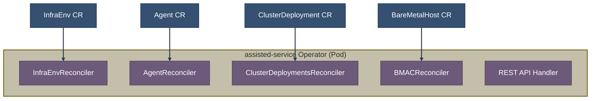
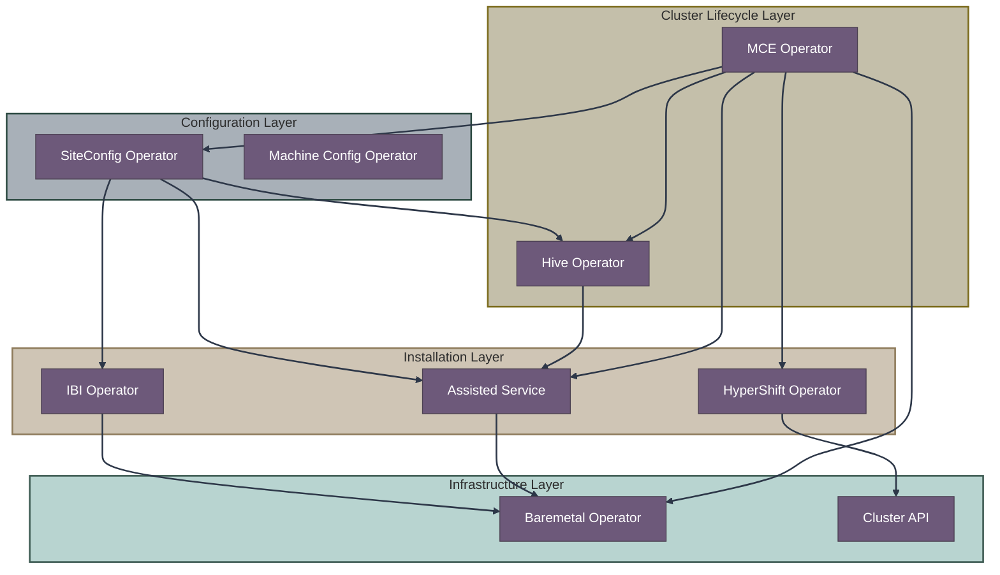
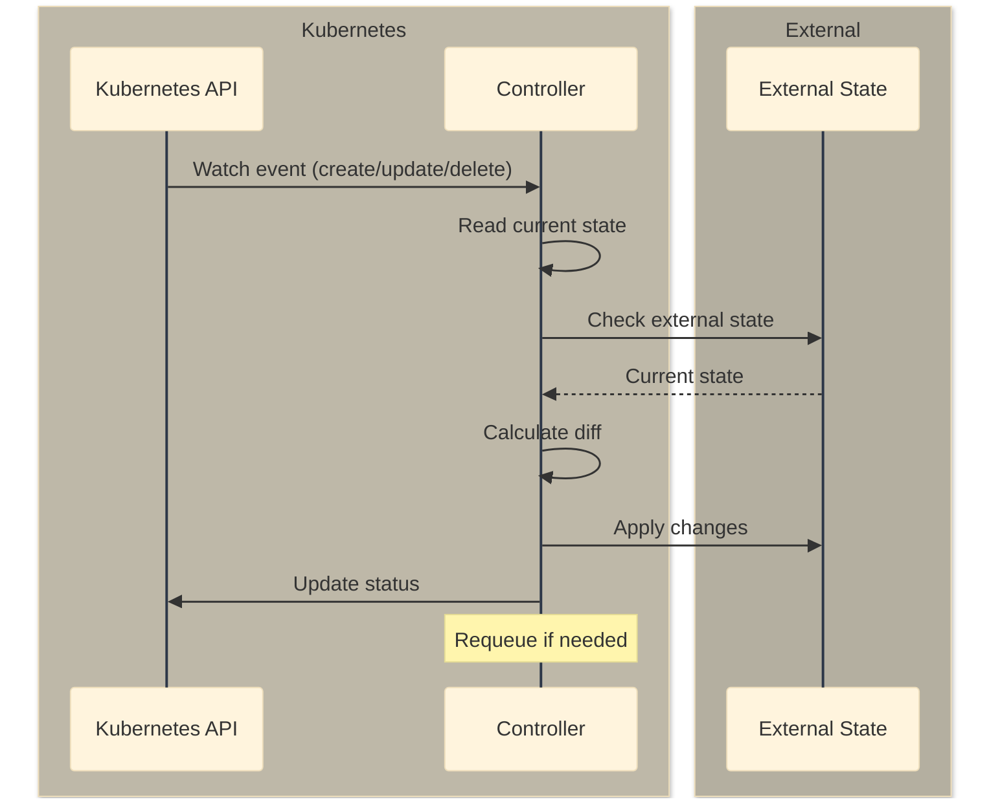
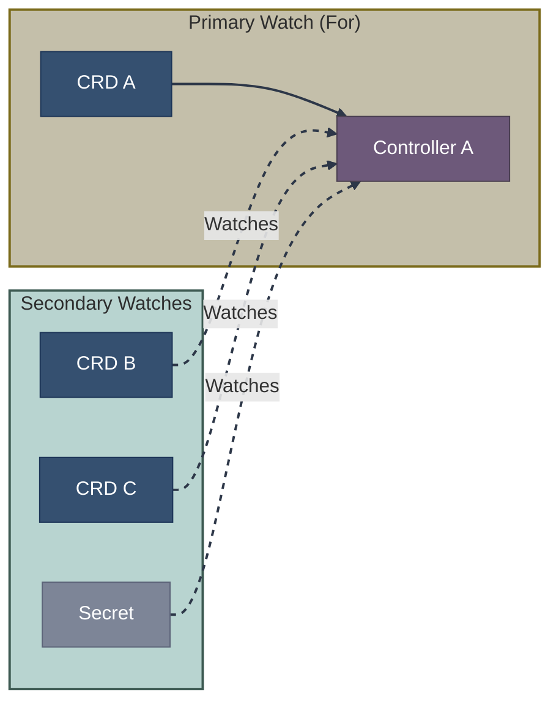
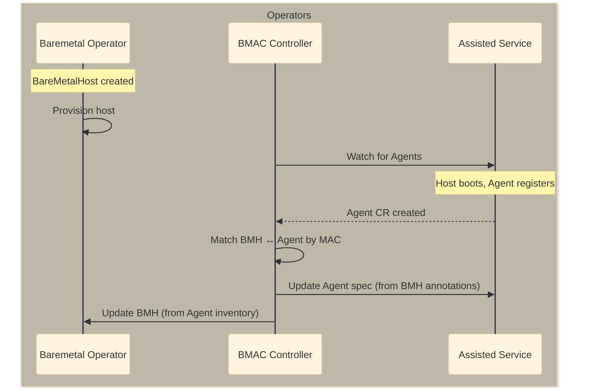
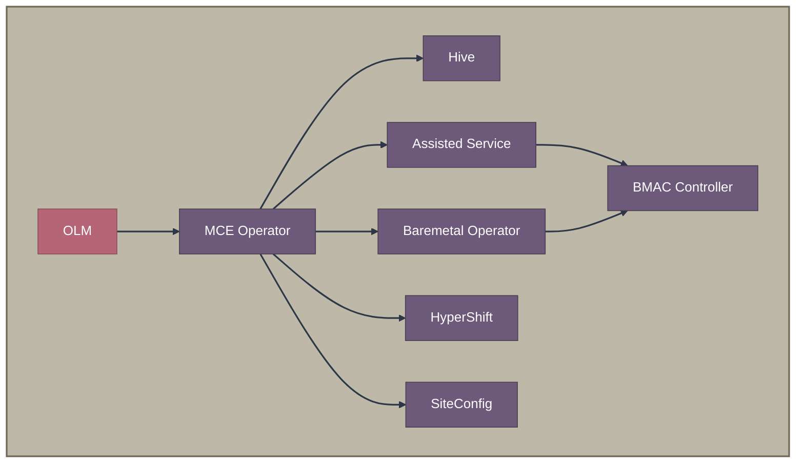
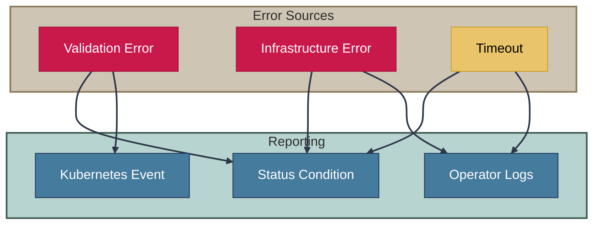

# Operators and Controllers Overview

OpenShift installation involves multiple operators working together. This document provides an architectural overview of how they interact.

## Terminology: Operators vs Controllers

Before diving in, let's clarify the relationship between operators and controllers:

| Term | Definition | Example |
|------|------------|---------|
| **Operator** | A deployment/pod that runs one or more controllers, often packaged and distributed via OLM (Operator Lifecycle Manager) | assisted-service, hive-operator, hypershift |
| **Controller** | A specific reconciliation loop that watches CRDs and drives actual state toward desired spec | InfraEnvReconciler, AgentReconciler |

An operator is the **container/deployment**, while controllers are the **logic inside it**:



A single operator typically implements multiple controllers, each responsible for reconciling a specific CRD type. See [Detailed Controller Reference](reference.md) for the complete list.

## Operator Ecosystem



## Operators by Function

### Cluster Lifecycle

| Operator | Purpose | Key CRDs |
|----------|---------|----------|
| **MCE Operator** | Central lifecycle management | MultiClusterEngine |
| **Hive Operator** | Cluster provisioning/deprovisioning | ClusterDeployment, ClusterPool |

### Installation Orchestration

| Operator | Purpose | Key CRDs |
|----------|---------|----------|
| **Assisted Service** | Guided installation | AgentClusterInstall, InfraEnv, Agent |
| **IBI Operator** | Image-based installation | ImageClusterInstall |
| **HyperShift Operator** | Hosted control planes | HostedCluster, NodePool |

### Infrastructure Management

| Operator | Purpose | Key CRDs |
|----------|---------|----------|
| **Baremetal Operator** | Bare metal host lifecycle | BareMetalHost, PreprovisioningImage |
| **Cluster API** | Machine management | Machine, MachineSet, MachineDeployment |

### Configuration Management

| Operator | Purpose | Key CRDs |
|----------|---------|----------|
| **SiteConfig Operator** | Template-based provisioning | ClusterInstance |
| **Machine Config Operator** | Node OS configuration | MachineConfig, MachineConfigPool |

## Controller Patterns

### Reconciliation Flow



### Watch Relationships

Controllers watch primary resources and related resources:



## Cross-Operator Communication

Operators communicate through:

1. **Shared CRDs** - One operator owns, others watch
2. **Status conditions** - Standard reporting mechanism
3. **Annotations** - Controller-specific metadata
4. **Finalizers** - Coordinated deletion

### Example: Assisted ↔ BMAC Flow



## Operator Dependencies

### Installation Order



### Namespace Layout

| Namespace | Components |
|-----------|------------|
| `multicluster-engine` | MCE, Assisted, Hive controllers |
| `openshift-machine-api` | Machine API, Baremetal Operator |
| `hypershift` | HyperShift Operator |
| `siteconfig-system` | SiteConfig Operator |
| `<cluster-name>` | Per-cluster resources |

## Failure Handling

### Retry Mechanisms

| Pattern | Use Case | Example |
|---------|----------|---------|
| **Requeue** | Temporary failure | Network timeout |
| **Exponential backoff** | Repeated failures | API rate limiting |
| **Finalizer blocking** | Wait for dependency | Clean up related resources |
| **Status condition** | Permanent error | Invalid configuration |

### Error Propagation



## Monitoring Operators

### Health Checks

```bash
# Check operator pods
oc get pods -n multicluster-engine
oc get pods -n openshift-machine-api
oc get pods -n hypershift

# Check operator logs
oc logs -n multicluster-engine -l control-plane=assisted-service
oc logs -n multicluster-engine -l app=hive
```

### Common Metrics

| Metric | Description |
|--------|-------------|
| `controller_runtime_reconcile_total` | Total reconciliations |
| `controller_runtime_reconcile_errors_total` | Reconcile errors |
| `controller_runtime_reconcile_time_seconds` | Reconcile duration |
| `workqueue_depth` | Pending work items |

## Related Documentation

- [Detailed Controller Reference](reference.md)
- [CRD Reference](../08-crd-reference/index.md)
- [Component Diagrams](../09-diagrams/component-diagrams.md)

