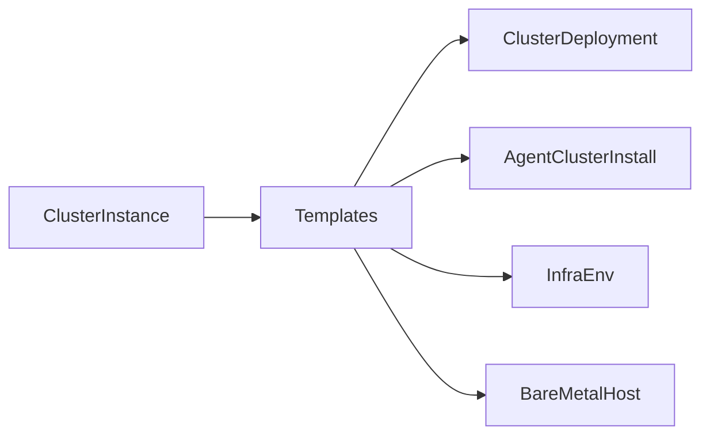

# Operators and Controllers Reference

This document provides detailed information about each controller involved in OpenShift installation, including what they reconcile, watch, and their purpose.

## Assisted-Service Controllers

### AgentServiceConfigReconciler

**Package:** `internal/controller/controllers/agentserviceconfig_controller.go`

| Aspect | Details |
|--------|---------|
| **Reconciles** | `AgentServiceConfig` |
| **Watches** | ConfigMap (mirror registry, ingress) |
| **Owns** | PVC, Service, ServiceAccount, Deployment, Route |
| **Purpose** | Deploys and configures the assisted-service infrastructure |

**Key Responsibilities:**
- Creates PostgreSQL database
- Deploys assisted-service pods
- Deploys assisted-image-service
- Configures routes and services
- Handles mirror registry configuration

---

### InfraEnvReconciler

**Package:** `internal/controller/controllers/infraenv_controller.go`

| Aspect | Details |
|--------|---------|
| **Reconciles** | `InfraEnv` |
| **Watches** | `NMStateConfig`, `ClusterDeployment`, `Secret` |
| **Purpose** | Generates discovery ISO configurations |

**Key Responsibilities:**
- Generates discovery ISO URL
- Applies static network configuration
- Links InfraEnv to ClusterDeployment
- Handles pull secret updates
- Regenerates ISO when NMStateConfig changes

**Watched Resource Mapping:**
```go
// NMStateConfig → InfraEnv (by label selector)
nmStateConfigLabelSelector.MatchLabels["cluster-name"] == infraEnv.Name

// ClusterDeployment → InfraEnv (by clusterRef)
infraEnv.Spec.ClusterRef.Name == clusterDeployment.Name
```

---

### AgentReconciler

**Package:** `internal/controller/controllers/agent_controller.go`

| Aspect | Details |
|--------|---------|
| **Reconciles** | `Agent` |
| **Watches** | `Secret` |
| **Purpose** | Manages discovered host lifecycle |

**Key Responsibilities:**
- Syncs Agent spec with internal host state
- Updates Agent status from host inventory
- Handles host approval
- Manages role and hostname changes
- Reports validation results

**Status Updates:**
```yaml
status:
  inventory:
    cpu: {...}
    memory: {...}
    disks: [...]
    interfaces: [...]
  conditions:
    - type: Connected
    - type: RequirementsMet
    - type: Validated
    - type: Installed
```

---

### ClusterDeploymentsReconciler

**Package:** `internal/controller/controllers/clusterdeployments_controller.go`

| Aspect | Details |
|--------|---------|
| **Reconciles** | `ClusterDeployment` (Hive) |
| **Watches** | `Secret`, `AgentClusterInstall`, `Agent` |
| **Purpose** | Orchestrates cluster installation via assisted-service |

**Key Responsibilities:**
- Creates/updates cluster in assisted-service backend
- Syncs ClusterDeployment spec to internal cluster
- Watches AgentClusterInstall for install configuration
- Monitors Agent state for installation progress
- Updates ClusterDeployment status

**Agent → ClusterDeployment Mapping:**
```go
// Agents trigger ClusterDeployment reconcile when:
// - Agent.Spec.ClusterDeploymentName changes
// - Agent.Status changes
```

---

### BMACReconciler (Baremetal Agent Controller)

**Package:** `internal/controller/controllers/bmh_agent_controller.go`

| Aspect | Details |
|--------|---------|
| **Reconciles** | `BareMetalHost` |
| **Watches** | `Agent`, `InfraEnv`, `ClusterDeployment` |
| **Purpose** | Bridges Baremetal Operator with Assisted Service |

**Key Responsibilities:**
- Matches BareMetalHost to Agent by MAC address
- Sets ISO URL on BMH from InfraEnv
- Copies BMH annotations to Agent spec:
  - `bmac.agent-install.openshift.io/role` → Agent.Spec.Role
  - `bmac.agent-install.openshift.io/hostname` → Agent.Spec.Hostname
- Updates BMH with hardware details from Agent inventory
- Manages converged flow with PreprovisioningImage

**MAC Address Matching:**
```go
// Agent.Status.Inventory.Interfaces[].MacAddress
// matches
// BareMetalHost.Spec.BootMACAddress
```

---

### AgentClusterInstallReconciler

**Package:** `internal/controller/controllers/agentclusterinstall_controller.go`

| Aspect | Details |
|--------|---------|
| **Reconciles** | `AgentClusterInstall` |
| **Purpose** | Validates AgentClusterInstall configuration |

**Key Responsibilities:**
- Validates cluster networking configuration
- Checks platform compatibility
- Updates status conditions
- Handles manifest references

---

### AgentClassificationReconciler

**Package:** `internal/controller/controllers/agentclassification_controller.go`

| Aspect | Details |
|--------|---------|
| **Reconciles** | `AgentClassification` |
| **Watches** | `Agent` |
| **Purpose** | Auto-labels Agents based on classification rules |

**Classification Example:**
```yaml
apiVersion: agent-install.openshift.io/v1beta1
kind: AgentClassification
metadata:
  name: by-memory
spec:
  labelKey: memory-class
  labelValue: high
  query: ".memory.physicalBytes > 68719476736"  # > 64GB
```

---

### AgentLabelReconciler

**Package:** `internal/controller/controllers/agentlabel_controller.go`

| Aspect | Details |
|--------|---------|
| **Reconciles** | `Agent` |
| **Watches** | `AgentClassification` |
| **Purpose** | Applies classification labels to Agents |

---

### PreprovisioningImageReconciler

**Package:** `internal/controller/controllers/preprovisioningimage_controller.go`

| Aspect | Details |
|--------|---------|
| **Reconciles** | `PreprovisioningImage` (Metal3) |
| **Watches** | `InfraEnv`, `BareMetalHost` |
| **Purpose** | Converged flow with Baremetal Operator |

**Key Responsibilities:**
- Copies InfraEnv ISO URL to PreprovisioningImage
- Adds Ironic agent configuration to ISO
- Enables metal3 integration for hardware inventory

---

## IBI Operator Controllers

### ImageClusterInstallReconciler

**Package:** `controllers/imageclusterinstall_controller.go`

| Aspect | Details |
|--------|---------|
| **Reconciles** | `ImageClusterInstall` |
| **Watches** | `BareMetalHost`, `ClusterDeployment` |
| **Purpose** | Orchestrates image-based SNO installation |

**Key Responsibilities:**
- Creates configuration ISO
- Attaches ISO to BareMetalHost
- Monitors installation progress
- Reports cluster readiness

---

## Hive Controllers

### ClusterDeploymentController

**Reconciles:** `ClusterDeployment`

**Purpose:** Core Hive controller for cluster lifecycle

**Key Responsibilities:**
- Provisions clusters via openshift-install (IPI)
- Delegates to install refs for other methods
- Manages cluster credentials
- Handles hibernation/resumption
- Orchestrates deprovisioning

---

### ClusterPoolController

**Reconciles:** `ClusterPool`, `ClusterClaim`

**Purpose:** Manages pre-provisioned cluster pools

**Key Responsibilities:**
- Maintains pool size
- Creates ClusterDeployments from pool
- Handles cluster claiming
- Manages hibernation
- Enforces lifetime limits

---

### MachinePoolController

**Reconciles:** `MachinePool`

**Purpose:** Manages worker node pools

**Key Responsibilities:**
- Creates MachineSets on spoke cluster
- Handles scaling
- Configures autoscaling
- Manages platform-specific settings

---

## HyperShift Controllers

### HostedClusterReconciler

**Reconciles:** `HostedCluster`

**Purpose:** Manages hosted cluster lifecycle

**Key Responsibilities:**
- Creates hosted control plane namespace
- Deploys Control Plane Operator
- Configures networking and endpoints
- Manages cluster upgrades
- Handles cluster deletion

---

### NodePoolReconciler

**Reconciles:** `NodePool`

**Purpose:** Manages worker nodes for hosted clusters

**Key Responsibilities:**
- Creates CAPI MachineDeployments
- Configures platform-specific settings
- Handles scaling and autoscaling
- Manages upgrades via replacement

---

## SiteConfig Controllers

### ClusterInstanceReconciler

**Reconciles:** `ClusterInstance`

**Purpose:** Template-driven cluster provisioning

**Key Responsibilities:**
- Validates ClusterInstance spec
- Renders templates to installation resources
- Creates/updates underlying CRDs
- Reports rendering status
- Handles updates and deletions

**Template Rendering Flow:**


---

## Controller Summary Table

| Controller | For (Reconciles) | Watches | Owner |
|------------|------------------|---------|-------|
| AgentServiceConfigReconciler | AgentServiceConfig | ConfigMap | assisted-service |
| InfraEnvReconciler | InfraEnv | NMStateConfig, ClusterDeployment, Secret | assisted-service |
| AgentReconciler | Agent | Secret | assisted-service |
| ClusterDeploymentsReconciler | ClusterDeployment | Secret, AgentClusterInstall, Agent | assisted-service |
| BMACReconciler | BareMetalHost | Agent, InfraEnv, ClusterDeployment | assisted-service |
| AgentClusterInstallReconciler | AgentClusterInstall | - | assisted-service |
| AgentClassificationReconciler | AgentClassification | Agent | assisted-service |
| PreprovisioningImageReconciler | PreprovisioningImage | InfraEnv, BareMetalHost | assisted-service |
| ImageClusterInstallReconciler | ImageClusterInstall | BareMetalHost, ClusterDeployment | IBI operator |
| ClusterDeploymentController | ClusterDeployment | - | Hive |
| ClusterPoolController | ClusterPool | ClusterClaim | Hive |
| MachinePoolController | MachinePool | - | Hive |
| HostedClusterReconciler | HostedCluster | - | HyperShift |
| NodePoolReconciler | NodePool | - | HyperShift |
| ClusterInstanceReconciler | ClusterInstance | - | SiteConfig |

## Related Documentation

- [Overview](overview.md)
- [CRD Reference](../08-crd-reference/index.md)

