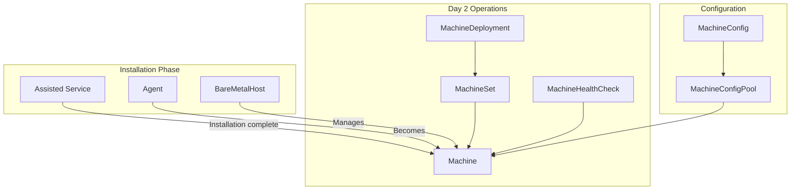

# Day 2 Machine Management CRDs

This document covers CRDs used for post-installation machine management. While not directly involved in cluster installation, understanding these resources is important for the complete cluster lifecycle.

## Overview

After installation, machine management shifts from installation operators to the Machine API:



## Machine

**API Group:** `machine.openshift.io/v1beta1`  
**Owner:** Machine API Operator

### Purpose

Represents a single node in the cluster.

```yaml
apiVersion: machine.openshift.io/v1beta1
kind: Machine
metadata:
  name: my-cluster-worker-0
  namespace: openshift-machine-api
  labels:
    machine.openshift.io/cluster-api-cluster: my-cluster
    machine.openshift.io/cluster-api-machine-role: worker
    machine.openshift.io/cluster-api-machine-type: worker
spec:
  # Provider-specific config
  providerSpec:
    value:
      apiVersion: machine.openshift.io/v1beta1
      kind: AWSMachineProviderConfig
      instanceType: m5.large
      ami:
        id: ami-12345678
      subnet:
        id: subnet-abc123
      securityGroups:
        - id: sg-xyz789
      placement:
        availabilityZone: us-east-1a
  
  # Lifecycle
  lifecycleHooks:
    preDrain: []
    preTerminate: []

status:
  # Current phase
  phase: Running
  
  # Node reference
  nodeRef:
    name: ip-10-0-1-100.ec2.internal
    uid: "..."
  
  # Provider info
  providerStatus:
    instanceId: i-1234567890abcdef0
    instanceState: running
  
  # Addresses
  addresses:
    - type: InternalIP
      address: 10.0.1.100
    - type: ExternalDNS
      address: ec2-1-2-3-4.compute.amazonaws.com
```

---

## MachineSet

**API Group:** `machine.openshift.io/v1beta1`  
**Owner:** Machine API Operator

### Purpose

Manages a group of identical Machines (similar to ReplicaSet for Pods).

```yaml
apiVersion: machine.openshift.io/v1beta1
kind: MachineSet
metadata:
  name: my-cluster-worker-us-east-1a
  namespace: openshift-machine-api
  labels:
    machine.openshift.io/cluster-api-cluster: my-cluster
spec:
  # Replicas
  replicas: 2
  
  # Selector must match template labels
  selector:
    matchLabels:
      machine.openshift.io/cluster-api-cluster: my-cluster
      machine.openshift.io/cluster-api-machineset: my-cluster-worker-us-east-1a
  
  # Machine template
  template:
    metadata:
      labels:
        machine.openshift.io/cluster-api-cluster: my-cluster
        machine.openshift.io/cluster-api-machine-role: worker
        machine.openshift.io/cluster-api-machine-type: worker
        machine.openshift.io/cluster-api-machineset: my-cluster-worker-us-east-1a
    spec:
      providerSpec:
        value:
          # Provider-specific config (same as Machine)
          apiVersion: machine.openshift.io/v1beta1
          kind: AWSMachineProviderConfig
          instanceType: m5.large
          # ...

status:
  replicas: 2
  fullyLabeledReplicas: 2
  readyReplicas: 2
  availableReplicas: 2
```

---

## MachineHealthCheck

**API Group:** `machine.openshift.io/v1beta1`  
**Owner:** Machine API Operator

### Purpose

Monitors machine health and triggers remediation for unhealthy machines.

```yaml
apiVersion: machine.openshift.io/v1beta1
kind: MachineHealthCheck
metadata:
  name: worker-health-check
  namespace: openshift-machine-api
spec:
  # Target machines
  selector:
    matchLabels:
      machine.openshift.io/cluster-api-machine-role: worker
  
  # Health criteria
  unhealthyConditions:
    - type: Ready
      status: "False"
      timeout: 300s
    - type: Ready
      status: Unknown
      timeout: 300s
  
  # Remediation limits
  maxUnhealthy: 40%
  nodeStartupTimeout: 10m
  
  # Optional: external remediation
  remediationTemplate:
    apiVersion: infrastructure.cluster.x-k8s.io/v1beta1
    kind: Metal3RemediationTemplate
    name: worker-remediation

status:
  expectedMachines: 6
  currentHealthy: 6
```

---

## MachineConfig

**API Group:** `machineconfiguration.openshift.io/v1`  
**Owner:** Machine Config Operator

### Purpose

Defines node configuration (files, systemd units, kernel arguments).

```yaml
apiVersion: machineconfiguration.openshift.io/v1
kind: MachineConfig
metadata:
  name: 99-custom-chrony
  labels:
    machineconfiguration.openshift.io/role: worker
spec:
  # OS configuration
  osImageURL: ""  # Empty uses current
  
  # Ignition config
  config:
    ignition:
      version: 3.2.0
    
    # Files to create
    storage:
      files:
        - path: /etc/chrony.conf
          mode: 0644
          contents:
            source: data:text/plain;base64,c2VydmVyIG50cC5...
    
    # Systemd units
    systemd:
      units:
        - name: custom-service.service
          enabled: true
          contents: |
            [Unit]
            Description=Custom Service
            [Service]
            ExecStart=/usr/local/bin/custom
            [Install]
            WantedBy=multi-user.target
  
  # Kernel arguments
  kernelArguments:
    - "console=ttyS0"
    - "loglevel=7"
  
  # Kernel type
  kernelType: realtime  # default, realtime
  
  # FIPS mode
  fips: false
```

---

## MachineConfigPool

**API Group:** `machineconfiguration.openshift.io/v1`  
**Owner:** Machine Config Operator

### Purpose

Groups nodes that share the same configuration.

```yaml
apiVersion: machineconfiguration.openshift.io/v1
kind: MachineConfigPool
metadata:
  name: worker
spec:
  # Node selector
  nodeSelector:
    matchLabels:
      node-role.kubernetes.io/worker: ""
  
  # Machine config selector
  machineConfigSelector:
    matchLabels:
      machineconfiguration.openshift.io/role: worker
  
  # Update configuration
  paused: false
  maxUnavailable: 1

status:
  # Pool status
  machineCount: 3
  updatedMachineCount: 3
  readyMachineCount: 3
  unavailableMachineCount: 0
  degradedMachineCount: 0
  
  # Current configuration
  configuration:
    name: rendered-worker-abc123
    source:
      - name: 00-worker
      - name: 99-custom-chrony
  
  conditions:
    - type: Updated
      status: "True"
    - type: Updating
      status: "False"
    - type: Degraded
      status: "False"
```

---

## Cluster API Resources (for HCP)

For Hosted Control Planes, Cluster API manages machines:

### Cluster (CAPI)

```yaml
apiVersion: cluster.x-k8s.io/v1beta1
kind: Cluster
metadata:
  name: my-hosted-cluster
  namespace: clusters-my-hosted
spec:
  clusterNetwork:
    pods:
      cidrBlocks:
        - 10.132.0.0/14
    services:
      cidrBlocks:
        - 172.31.0.0/16
  
  controlPlaneRef:
    apiVersion: hypershift.openshift.io/v1beta1
    kind: HostedControlPlane
    name: my-hosted
  
  infrastructureRef:
    apiVersion: hypershift.openshift.io/v1beta1
    kind: HostedCluster
    name: my-hosted
```

### Machine (CAPI)

```yaml
apiVersion: cluster.x-k8s.io/v1beta1
kind: Machine
metadata:
  name: my-hosted-worker-abc123
  namespace: clusters-my-hosted
spec:
  clusterName: my-hosted-cluster
  
  bootstrap:
    dataSecretName: workers-bootstrap
  
  infrastructureRef:
    apiVersion: infrastructure.cluster.x-k8s.io/v1beta2
    kind: AWSMachine
    name: my-hosted-worker-abc123

status:
  phase: Running
  bootstrapReady: true
  infrastructureReady: true
  nodeRef:
    name: ip-10-0-1-100
```

### MachineDeployment (CAPI)

```yaml
apiVersion: cluster.x-k8s.io/v1beta1
kind: MachineDeployment
metadata:
  name: my-hosted-workers
  namespace: clusters-my-hosted
spec:
  clusterName: my-hosted-cluster
  replicas: 3
  
  selector:
    matchLabels:
      cluster.x-k8s.io/cluster-name: my-hosted-cluster
  
  template:
    spec:
      clusterName: my-hosted-cluster
      bootstrap:
        dataSecretName: workers-bootstrap
      infrastructureRef:
        apiVersion: infrastructure.cluster.x-k8s.io/v1beta2
        kind: AWSMachineTemplate
        name: workers-template
```

## Relationship Between APIs

| Scope | OpenShift Machine API | Cluster API (CAPI) |
|-------|----------------------|-------------------|
| Use case | Traditional clusters | Hosted Control Planes |
| Namespace | openshift-machine-api | clusters-<name> |
| API Group | machine.openshift.io | cluster.x-k8s.io |
| Controller | machine-api-operator | CAPI + providers |

## Common Operations

### Scale workers

```bash
# Via MachineSet
oc scale machineset my-cluster-worker-us-east-1a -n openshift-machine-api --replicas=5

# Via MachinePool (Hive)
oc patch machinepool workers -n my-cluster --type merge -p '{"spec":{"replicas":5}}'

# Via NodePool (HCP)
oc patch nodepool workers -n clusters --type merge -p '{"spec":{"replicas":5}}'
```

### Apply configuration

```bash
# Create MachineConfig
oc apply -f machineconfig.yaml

# Watch rollout
oc get mcp worker -w
```

## Related Documentation

- [Installation CRDs](installation-crds.md)
- [Supporting CRDs](supporting-crds.md)
- [Hosted Control Planes](../05-hosted-control-planes/hcp-overview.md)

