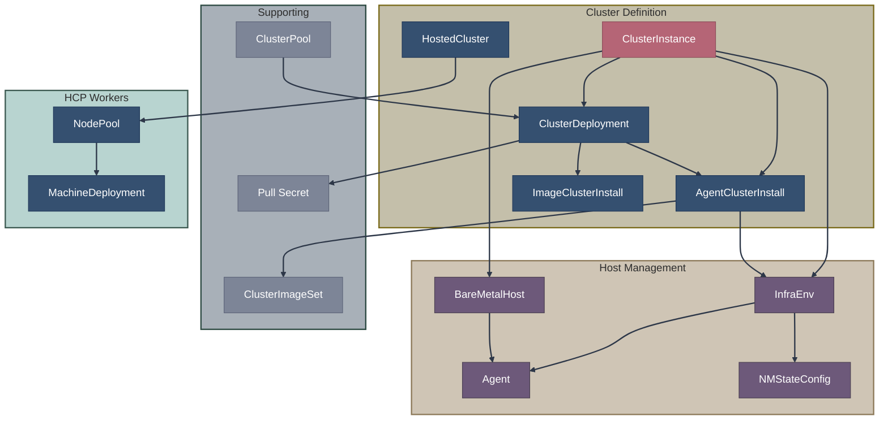

# CRD Reference Index

This section documents the Custom Resource Definitions (CRDs) used in OpenShift installation.

## CRDs by Installation Method

| Installation Method | Primary CRDs |
|--------------------|--------------|
| **IPI/UPI** | (Uses install-config.yaml, not CRDs) |
| **Assisted (MCE)** | ClusterDeployment, AgentClusterInstall, InfraEnv, Agent |
| **Agent-Based Installer** | (Uses YAML files, embedded as ZTP manifests) |
| **Image-Based Install** | ClusterDeployment, ImageClusterInstall, BareMetalHost |
| **Hosted Control Planes** | HostedCluster, NodePool, HostedControlPlane |
| **ZTP** | ClusterInstance + above CRDs |

## CRD Categories

### [Installation CRDs](installation-crds.md)

Primary CRDs used to define and install clusters:

| CRD | API Group | Source |
|-----|-----------|--------|
| ClusterDeployment | hive.openshift.io | [clusterdeployment_types.go](https://github.com/openshift/hive/blob/master/apis/hive/v1/clusterdeployment_types.go) |
| AgentClusterInstall | extensions.hive.openshift.io | [agentclusterinstall_types.go](https://github.com/openshift/assisted-service/blob/master/api/hiveextension/v1beta1/agentclusterinstall_types.go) |
| InfraEnv | agent-install.openshift.io | [infraenv_types.go](https://github.com/openshift/assisted-service/blob/master/api/v1beta1/infraenv_types.go) |
| Agent | agent-install.openshift.io | [agent_types.go](https://github.com/openshift/assisted-service/blob/master/api/v1beta1/agent_types.go) |
| ImageClusterInstall | extensions.hive.openshift.io | [imageclusterinstall_types.go](https://github.com/openshift/image-based-install-operator/blob/main/api/v1alpha1/imageclusterinstall_types.go) |
| HostedCluster | hypershift.openshift.io | [hostedcluster_types.go](https://github.com/openshift/hypershift/blob/main/api/hypershift/v1beta1/hostedcluster_types.go) |
| NodePool | hypershift.openshift.io | [nodepool_types.go](https://github.com/openshift/hypershift/blob/main/api/hypershift/v1beta1/nodepool_types.go) |
| ClusterInstance | siteconfig.open-cluster-management.io | [clusterinstance_types.go](https://github.com/stolostron/siteconfig/blob/main/api/v1alpha1/clusterinstance_types.go) |

### [Supporting CRDs](supporting-crds.md)

CRDs that support the installation process:

| CRD | API Group | Source |
|-----|-----------|--------|
| AgentServiceConfig | agent-install.openshift.io | [agentserviceconfig_types.go](https://github.com/openshift/assisted-service/blob/master/api/v1beta1/agentserviceconfig_types.go) |
| NMStateConfig | agent-install.openshift.io | [nmstate_config_types.go](https://github.com/openshift/assisted-service/blob/master/api/v1beta1/nmstate_config_types.go) |
| ClusterImageSet | hive.openshift.io | [clusterimageset_types.go](https://github.com/openshift/hive/blob/master/apis/hive/v1/clusterimageset_types.go) |
| AgentClassification | agent-install.openshift.io | [agentclassification_types.go](https://github.com/openshift/assisted-service/blob/master/api/v1beta1/agentclassification_types.go) |
| BareMetalHost | metal3.io | [baremetalhost_types.go](https://github.com/metal3-io/baremetal-operator/blob/main/apis/metal3.io/v1alpha1/baremetalhost_types.go) |
| PreprovisioningImage | metal3.io | [preprovisioningimage_types.go](https://github.com/metal3-io/baremetal-operator/blob/main/apis/metal3.io/v1alpha1/preprovisioningimage_types.go) |
| ClusterPool | hive.openshift.io | [clusterpool_types.go](https://github.com/openshift/hive/blob/master/apis/hive/v1/clusterpool_types.go) |
| ClusterClaim | hive.openshift.io | [clusterclaim_types.go](https://github.com/openshift/hive/blob/master/apis/hive/v1/clusterclaim_types.go) |
| MachinePool | hive.openshift.io | [machinepool_types.go](https://github.com/openshift/hive/blob/master/apis/hive/v1/machinepool_types.go) |

### [Day 2 Machine Management](day2-machine-management.md)

CRDs for post-install machine management:

| CRD | API Group | Source |
|-----|-----------|--------|
| Machine | machine.openshift.io | [machine-api-operator/api](https://github.com/openshift/machine-api-operator/tree/master/pkg/apis/machine/v1beta1) |
| MachineSet | machine.openshift.io | [machine-api-operator/api](https://github.com/openshift/machine-api-operator/tree/master/pkg/apis/machine/v1beta1) |
| MachineDeployment | machine.openshift.io | [machine-api-operator/api](https://github.com/openshift/machine-api-operator/tree/master/pkg/apis/machine/v1beta1) |
| MachineHealthCheck | machine.openshift.io | [machine-api-operator/api](https://github.com/openshift/machine-api-operator/tree/master/pkg/apis/machine/v1beta1) |
| MachineConfig | machineconfiguration.openshift.io | [machineconfig_types.go](https://github.com/openshift/machine-config-operator/blob/master/pkg/apis/machineconfiguration.openshift.io/v1/types.go) |
| MachineConfigPool | machineconfiguration.openshift.io | [machineconfigpool_types.go](https://github.com/openshift/machine-config-operator/blob/master/pkg/apis/machineconfiguration.openshift.io/v1/types.go) |

## CRD Relationship Diagram



## API Groups

| API Group | Owner | Description |
|-----------|-------|-------------|
| `hive.openshift.io` | Hive | Cluster lifecycle |
| `extensions.hive.openshift.io` | Assisted/IBI | Extension APIs |
| `agent-install.openshift.io` | Assisted | Discovery and agents |
| `hypershift.openshift.io` | HyperShift | Hosted control planes |
| `metal3.io` | Baremetal Operator | Bare metal hosts |
| `siteconfig.open-cluster-management.io` | SiteConfig | Template provisioning |
| `machine.openshift.io` | Machine API | Machine management |

## Common Patterns

### Reference Pattern

CRDs reference each other via typed references:

```yaml
spec:
  clusterDeploymentRef:
    name: my-cluster
  imageSetRef:
    name: openshift-4.14
  pullSecretRef:
    name: pull-secret
```

### Status Conditions

Standard condition reporting:

```yaml
status:
  conditions:
    - type: Ready
      status: "True"
      reason: AllChecksPassed
      message: "Resource is ready"
      lastTransitionTime: "2024-01-15T10:30:00Z"
```

### Labels for Selection

Resources use labels for matching:

```yaml
metadata:
  labels:
    cluster-name: my-cluster
    infraenvs.agent-install.openshift.io: my-infraenv
spec:
  agentSelector:
    matchLabels:
      cluster-name: my-cluster
```

## YAML Examples

See the [examples/](examples/) directory for complete YAML examples:

- [ClusterDeployment](examples/clusterdeployment.yaml)
- [AgentClusterInstall](examples/agentclusterinstall.yaml)
- [InfraEnv](examples/infraenv.yaml)
- [NMStateConfig](examples/nmstateconfig.yaml)
- [BareMetalHost](examples/baremetalhost.yaml)

> **Note:** For HostedCluster, NodePool, and ClusterInstance examples, see inline examples in:
> - [HCP Overview](../05-hosted-control-planes/hcp-overview.md)
> - [ZTP Documentation](../06-gitops-provisioning/ztp.md)

## Related Documentation

- [Operators & Controllers Reference](../07-operators-controllers/reference.md)
- [Installation Methods Overview](../01-installation-methods-overview.md)

