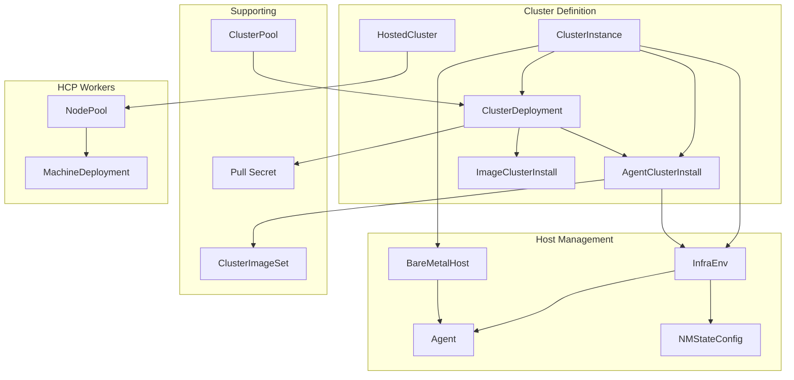

# CRD Reference Index

This section documents the Custom Resource Definitions (CRDs) used in OpenShift installation.

## CRDs by Installation Method

| Installation Method | Primary CRDs |
|--------------------|--------------|
| **IPI/UPI** | (Uses install-config.yaml, not CRDs) |
| **Assisted (MCE)** | ClusterDeployment, AgentClusterInstall, InfraEnv, Agent |
| **Agent-Based Installer** | (Uses YAML files, embedded as ZTP manifests) |
| **Image-Based Install** | ClusterDeployment, ImageClusterInstall, BareMetalHost |
| **Hosted Control Planes** | HostedCluster, NodePool, HostedControlPlane |
| **ZTP** | ClusterInstance + above CRDs |

## CRD Categories

### [Installation CRDs](installation-crds.md)

Primary CRDs used to define and install clusters:

| CRD | API Group | Purpose |
|-----|-----------|---------|
| ClusterDeployment | hive.openshift.io | Cluster definition |
| AgentClusterInstall | extensions.hive.openshift.io | Assisted install config |
| InfraEnv | agent-install.openshift.io | Discovery environment |
| Agent | agent-install.openshift.io | Discovered host |
| ImageClusterInstall | extensions.hive.openshift.io | IBI cluster config |
| HostedCluster | hypershift.openshift.io | HCP cluster |
| NodePool | hypershift.openshift.io | HCP workers |
| ClusterInstance | siteconfig.open-cluster-management.io | Unified ZTP |

### [Supporting CRDs](supporting-crds.md)

CRDs that support the installation process:

| CRD | API Group | Purpose |
|-----|-----------|---------|
| AgentServiceConfig | agent-install.openshift.io | Assisted service deployment |
| NMStateConfig | agent-install.openshift.io | Static network config |
| ClusterImageSet | hive.openshift.io | OCP version reference |
| AgentClassification | agent-install.openshift.io | Host auto-labeling |
| BareMetalHost | metal3.io | Physical host management |
| PreprovisioningImage | metal3.io | BMO boot image |
| ClusterPool | hive.openshift.io | Cluster pooling |
| ClusterClaim | hive.openshift.io | Pool claiming |
| MachinePool | hive.openshift.io | Worker scaling |

### [Day 2 Machine Management](day2-machine-management.md)

CRDs for post-install machine management:

| CRD | API Group | Purpose |
|-----|-----------|---------|
| Machine | machine.openshift.io | Individual machine |
| MachineSet | machine.openshift.io | Machine group |
| MachineDeployment | machine.openshift.io | Rolling updates |
| MachineHealthCheck | machine.openshift.io | Auto-repair |
| MachineConfig | machineconfiguration.openshift.io | Node configuration |
| MachineConfigPool | machineconfiguration.openshift.io | Config grouping |

## CRD Relationship Diagram



## API Groups

| API Group | Owner | Description |
|-----------|-------|-------------|
| `hive.openshift.io` | Hive | Cluster lifecycle |
| `extensions.hive.openshift.io` | Assisted/IBI | Extension APIs |
| `agent-install.openshift.io` | Assisted | Discovery and agents |
| `hypershift.openshift.io` | HyperShift | Hosted control planes |
| `metal3.io` | Baremetal Operator | Bare metal hosts |
| `siteconfig.open-cluster-management.io` | SiteConfig | Template provisioning |
| `machine.openshift.io` | Machine API | Machine management |

## Common Patterns

### Reference Pattern

CRDs reference each other via typed references:

```yaml
spec:
  clusterDeploymentRef:
    name: my-cluster
  imageSetRef:
    name: openshift-4.14
  pullSecretRef:
    name: pull-secret
```

### Status Conditions

Standard condition reporting:

```yaml
status:
  conditions:
    - type: Ready
      status: "True"
      reason: AllChecksPassed
      message: "Resource is ready"
      lastTransitionTime: "2024-01-15T10:30:00Z"
```

### Labels for Selection

Resources use labels for matching:

```yaml
metadata:
  labels:
    cluster-name: my-cluster
    infraenvs.agent-install.openshift.io: my-infraenv
spec:
  agentSelector:
    matchLabels:
      cluster-name: my-cluster
```

## YAML Examples

See the [examples/](examples/) directory for complete YAML examples:

- [ClusterDeployment](examples/clusterdeployment.yaml)
- [AgentClusterInstall](examples/agentclusterinstall.yaml)
- [InfraEnv](examples/infraenv.yaml)
- [Agent](examples/agent.yaml)
- [NMStateConfig](examples/nmstateconfig.yaml)
- [BareMetalHost](examples/baremetalhost.yaml)
- [HostedCluster](examples/hostedcluster.yaml)
- [NodePool](examples/nodepool.yaml)
- [ClusterInstance](examples/clusterinstance.yaml)

## Related Documentation

- [Operators & Controllers Reference](../07-operators-controllers/reference.md)
- [Installation Methods Overview](../01-installation-methods-overview.md)

