# Component Diagrams

This document contains comprehensive Mermaid diagrams for each OpenShift installation scenario.

## IPI Installation Flow

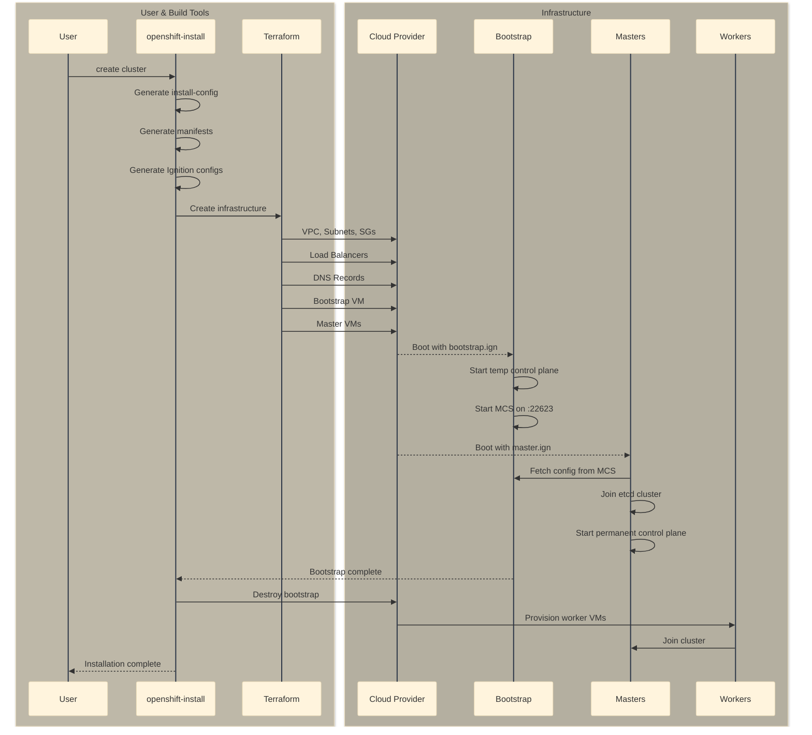

## Assisted Installation Flow (On-Premise)

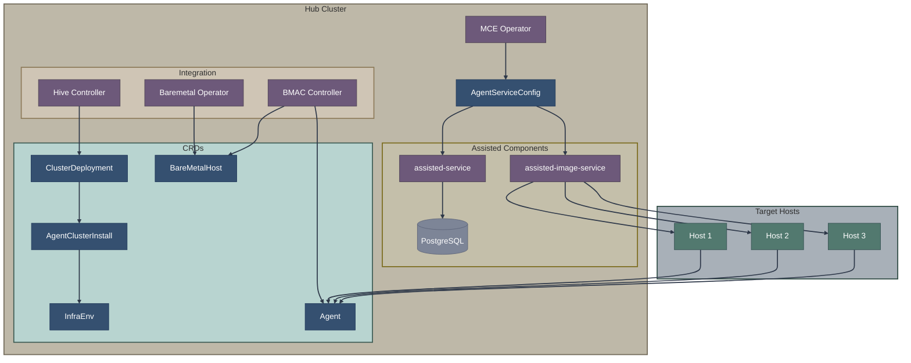

## Agent-Based Installer Flow

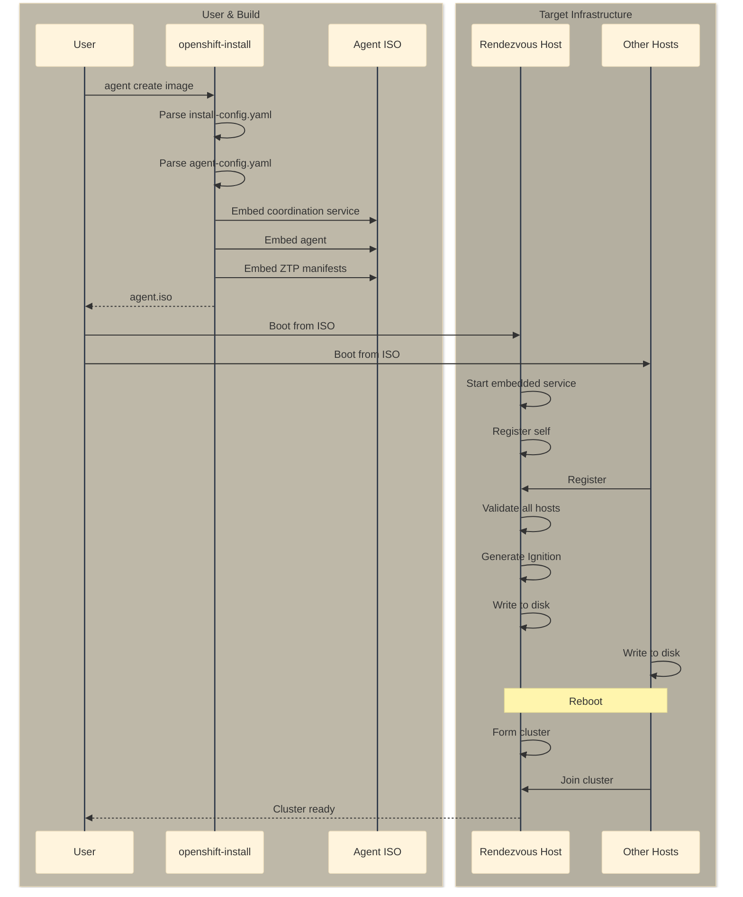

## Image-Based Installation Flow

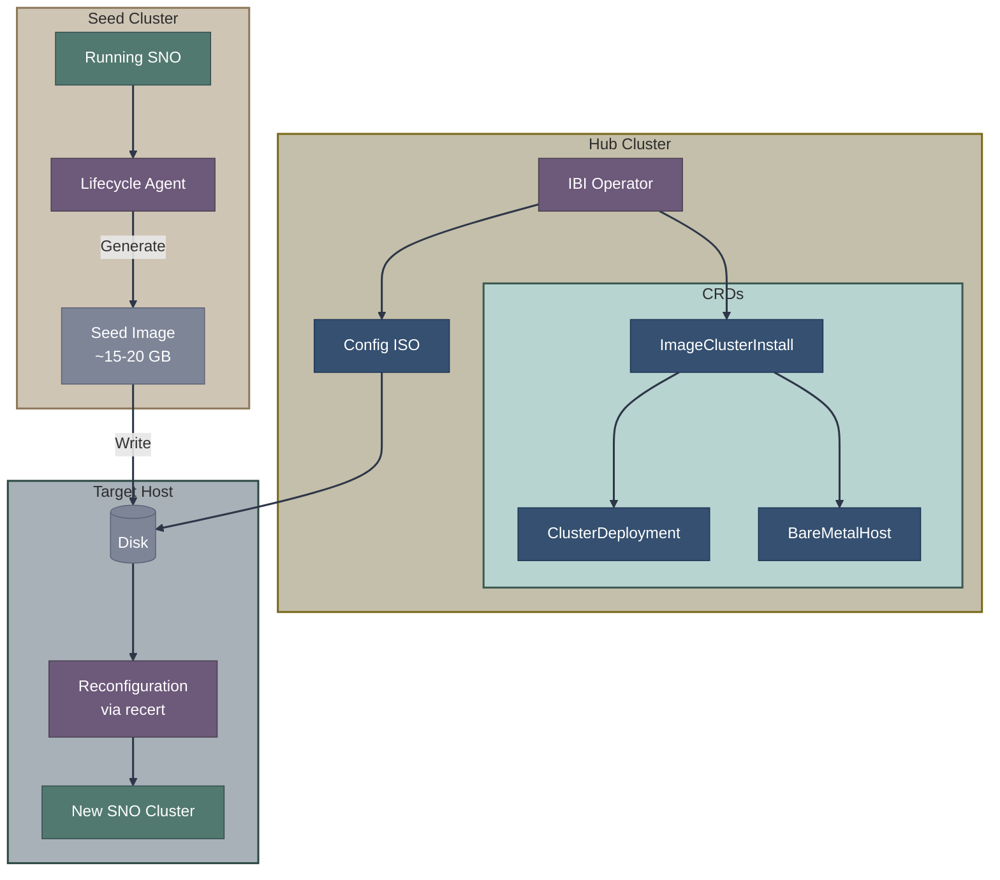

## Hosted Control Planes Architecture

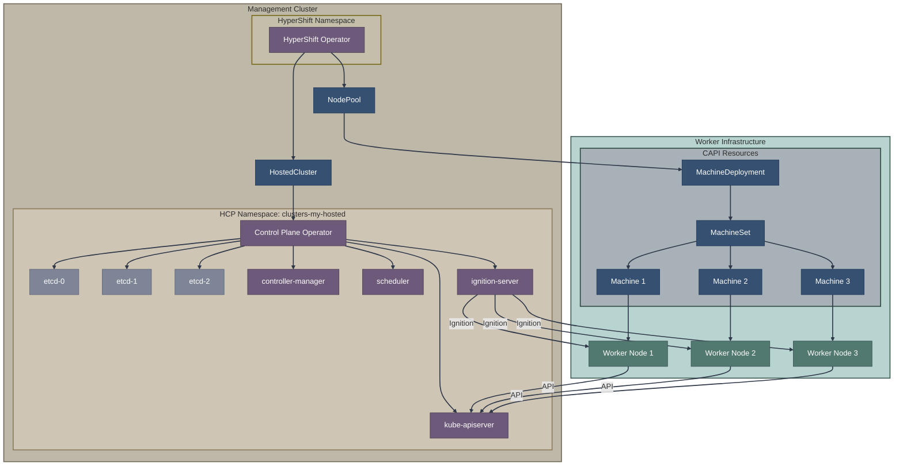

## ZTP with SiteConfig Flow

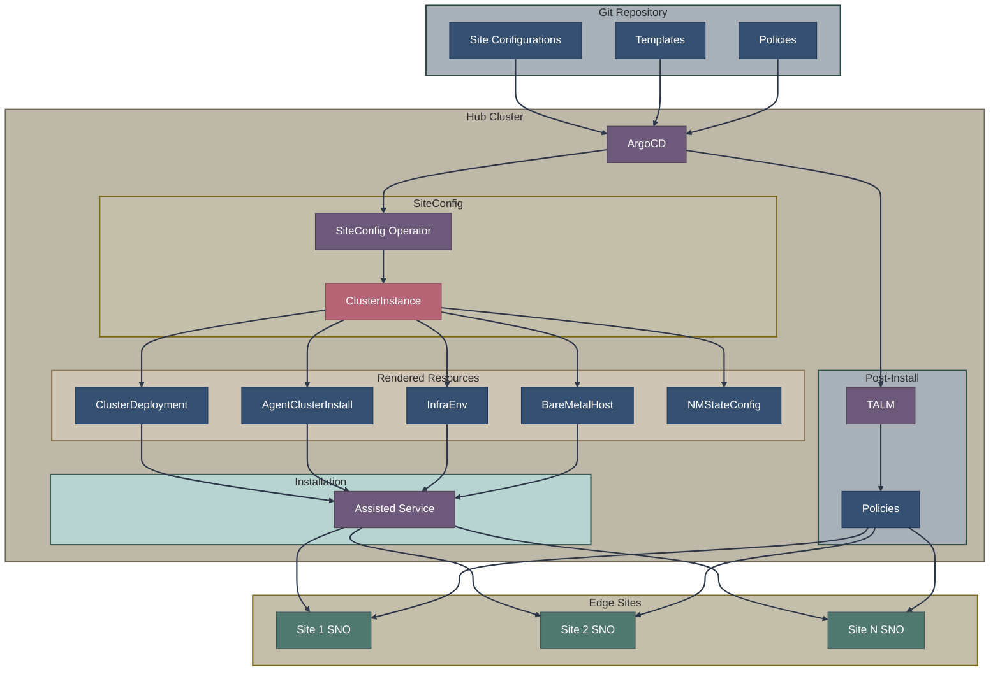

## Controller Watch Relationships

```mermaid
graph TB
    subgraph crds["CRDs"]
        ASC[AgentServiceConfig]
        CD[ClusterDeployment]
        ACI[AgentClusterInstall]
        IE[InfraEnv]
        AGENT[Agent]
        BMH[BareMetalHost]
        NMS[NMStateConfig]
        PPI[PreprovisioningImage]
        AC[AgentClassification]
    end
    
    subgraph controllers["Controllers"]
        ASCC[AgentServiceConfig<br/>Controller]
        CDC[ClusterDeployments<br/>Controller]
        IEC[InfraEnv<br/>Controller]
        AGENTC[Agent<br/>Controller]
        BMAC[BMAC<br/>Controller]
        PPIC[PPI<br/>Controller]
        ACC[AgentClassification<br/>Controller]
    end
    
    ASC --> ASCC
    
    CD --> CDC
    ACI -.->|watches| CDC
    AGENT -.->|watches| CDC
    
    IE --> IEC
    NMS -.->|watches| IEC
    CD -.->|watches| IEC
    
    AGENT --> AGENTC
    
    BMH --> BMAC
    AGENT -.->|watches| BMAC
    IE -.->|watches| BMAC
    CD -.->|watches| BMAC
    
    PPI --> PPIC
    IE -.->|watches| PPIC
    BMH -.->|watches| PPIC
    
    AC --> ACC
    AGENT -.->|watches| ACC
    
    style ASC fill:#355070,stroke:#1d3557,color:#fff
    style CD fill:#355070,stroke:#1d3557,color:#fff
    style ACI fill:#355070,stroke:#1d3557,color:#fff
    style IE fill:#355070,stroke:#1d3557,color:#fff
    style AGENT fill:#355070,stroke:#1d3557,color:#fff
    style BMH fill:#355070,stroke:#1d3557,color:#fff
    style NMS fill:#355070,stroke:#1d3557,color:#fff
    style PPI fill:#355070,stroke:#1d3557,color:#fff
    style AC fill:#355070,stroke:#1d3557,color:#fff
    style ASCC fill:#6d597a,stroke:#4a3f50,color:#fff
    style CDC fill:#6d597a,stroke:#4a3f50,color:#fff
    style IEC fill:#6d597a,stroke:#4a3f50,color:#fff
    style AGENTC fill:#6d597a,stroke:#4a3f50,color:#fff
    style BMAC fill:#6d597a,stroke:#4a3f50,color:#fff
    style PPIC fill:#6d597a,stroke:#4a3f50,color:#fff
    style ACC fill:#6d597a,stroke:#4a3f50,color:#fff
    
    style crds fill:#b8d4d0,stroke:#3d5a52,stroke-width:2px,color:#2d2d2d
    style controllers fill:#c4bfaa,stroke:#7a6a1a,stroke-width:2px,color:#2d2d2d
    
    linkStyle default stroke:#2d3748,stroke-width:2px
```

## CRD Ownership and References

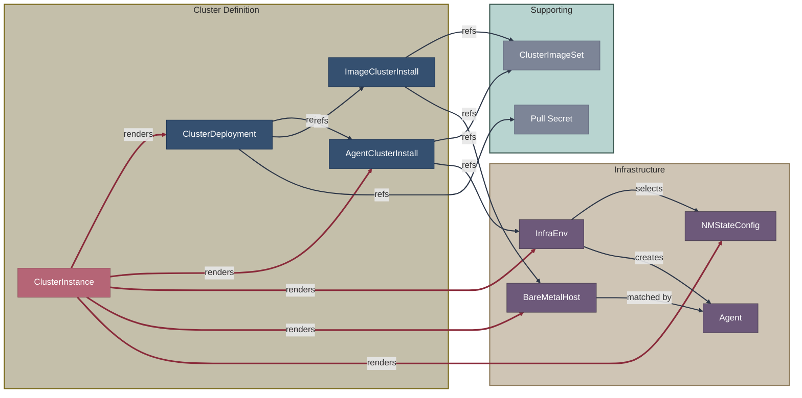

## State Machine: Cluster Installation

```mermaid
flowchart LR
    subgraph background[" "]
        direction LR
        
        START(( )) -->|Cluster Created| PendingForInput
        
        PendingForInput -->|Partial Config| Insufficient
        PendingForInput -->|Full Config| Ready
        Insufficient -->|Validations Pass| Ready
        Ready -->|Validation Fails| Insufficient
        
        Ready -->|User Triggers| Preparing[PreparingFor<br/>Installation]
        Preparing -->|Ignition Ready| Installing
        Installing -->|Hosts Installed| Finalizing
        Finalizing -->|Operators Ready| Installed
        
        Installing -->|Fatal Error| Error
        Finalizing -->|Timeout| Error
        
        Ready -->|User Cancels| Cancelled
        Installing -->|User Cancels| Cancelled
    end
    
    style START fill:#2d3748,stroke:#2d3748
    style PendingForInput fill:#adb5bd,stroke:#6c757d,color:#000
    style Insufficient fill:#adb5bd,stroke:#6c757d,color:#000
    style Ready fill:#adb5bd,stroke:#6c757d,color:#000
    style Preparing fill:#457b9d,stroke:#1d3557,color:#fff
    style Installing fill:#457b9d,stroke:#1d3557,color:#fff
    style Finalizing fill:#457b9d,stroke:#1d3557,color:#fff
    style Installed fill:#52796f,stroke:#354f52,color:#fff
    style Error fill:#c9184a,stroke:#a4133c,color:#fff
    style Cancelled fill:#e9c46a,stroke:#c9a227,color:#000
    
    style background fill:#beb8a8,stroke:#706858,stroke-width:2px,color:#2d2d2d
    
    linkStyle default stroke:#2d3748,stroke-width:2px
    linkStyle 9,10 stroke:#9b2c2c,stroke-width:2px
```

## State Machine: Host Discovery

```mermaid
flowchart LR
    subgraph background[" "]
        direction LR
        
        START(( )) -->|Host Boots| Discovering
        
        Discovering -->|Validations Pass| Known
        Discovering -->|Validations Fail| Insufficient
        Discovering -->|Needs Config| PendingForInput
        
        PendingForInput -->|Config Provided| Known
        Insufficient -->|Issues Fixed| Known
        Known -->|New Issues| Insufficient
        
        Known -->|Heartbeat Timeout| Disconnected
        Disconnected -->|Reconnects| Known
        
        Known -->|Install Triggered| Preparing[PreparingFor<br/>Installation]
        Preparing -->|Disk Ready| Installing
        Installing -->|Writing| InProgress[Installing<br/>InProgress]
        InProgress -->|Success| Installed
        InProgress -->|Failure| Error
        InProgress -->|Boot Order| PendingAction[Pending<br/>UserAction]
        
        Known -->|User Disables| Disabled
        Disabled -->|Re-enabled| Known
    end
    
    style START fill:#2d3748,stroke:#2d3748
    style Discovering fill:#adb5bd,stroke:#6c757d,color:#000
    style Known fill:#adb5bd,stroke:#6c757d,color:#000
    style Insufficient fill:#adb5bd,stroke:#6c757d,color:#000
    style PendingForInput fill:#adb5bd,stroke:#6c757d,color:#000
    style Disconnected fill:#e9c46a,stroke:#c9a227,color:#000
    style Preparing fill:#457b9d,stroke:#1d3557,color:#fff
    style Installing fill:#457b9d,stroke:#1d3557,color:#fff
    style InProgress fill:#457b9d,stroke:#1d3557,color:#fff
    style PendingAction fill:#e9c46a,stroke:#c9a227,color:#000
    style Installed fill:#52796f,stroke:#354f52,color:#fff
    style Error fill:#c9184a,stroke:#a4133c,color:#fff
    style Disabled fill:#adb5bd,stroke:#6c757d,color:#000
    
    style background fill:#beb8a8,stroke:#706858,stroke-width:2px,color:#2d2d2d
    
    linkStyle default stroke:#2d3748,stroke-width:2px
```

## Comparison: Installation Methods

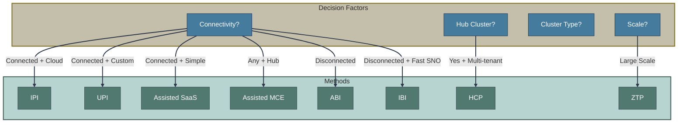

## Related Documentation

- [Installation Methods Overview](../01-installation-methods-overview.md)
- [Operators & Controllers Reference](../07-operators-controllers/reference.md)
- [CRD Reference](../08-crd-reference/index.md)

