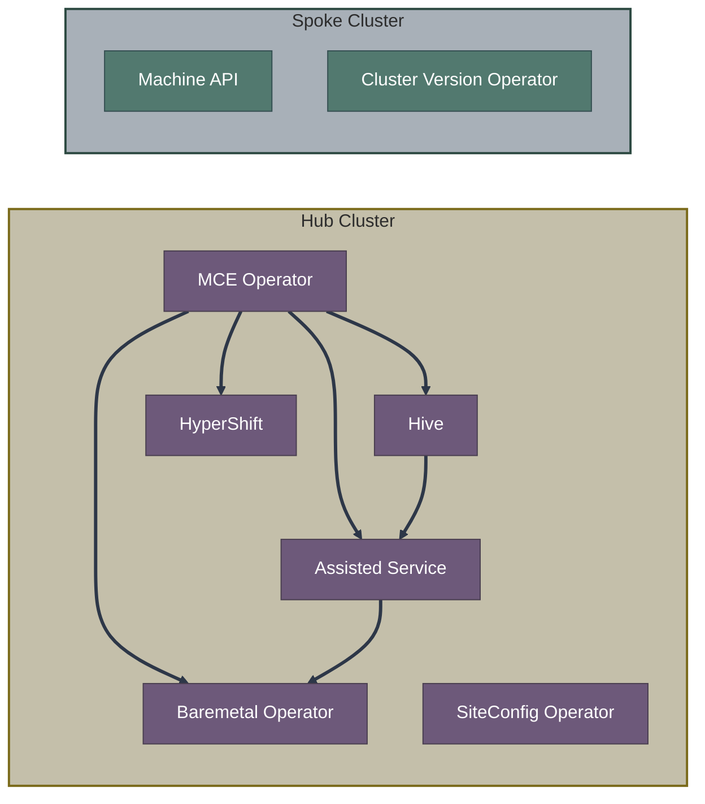

# OpenShift Installation Guide

A comprehensive guide for developers navigating OpenShift cluster installation methods, operators, controllers, and Custom Resources.

## Quick Navigation

| Section | Description |
|---------|-------------|
| [**Key Concepts & Glossary**](00-concepts-glossary.md) | Essential terminology: hub/spoke, early/late binding, images, hyperscalers |
| [Installation Methods Overview](01-installation-methods-overview.md) | Comparison matrix and decision tree for choosing the right installation method |
| [Traditional Installers](02-traditional-installers/ipi.md) | IPI, UPI, and the bootstrap process |
| [Assisted Installation](03-assisted-installation/overview.md) | SaaS, on-premise, Agent-Based Installer |
| [Image-Based Installation](04-image-based-installation/ibi.md) | IBI and Appliance approaches |
| [Hosted Control Planes](05-hosted-control-planes/hcp-overview.md) | HyperShift and CAPI integration |
| [GitOps Provisioning](06-gitops-provisioning/ztp.md) | ZTP, SiteConfig, ACM/MCE integration |
| [Operators & Controllers](07-operators-controllers/overview.md) | Reference for all installation-related operators |
| [CRD Reference](08-crd-reference/index.md) | Complete CRD documentation with examples |
| [Diagrams](09-diagrams/component-diagrams.md) | Mermaid architecture diagrams |
| [Resources](10-resources.md) | Links for further study |

## Key Concepts

### What is OpenShift Installation?

OpenShift installation involves:
1. **Provisioning infrastructure** (VMs, bare metal, cloud resources)
2. **Bootstrapping** a temporary control plane
3. **Installing** the permanent control plane and workers
4. **Configuring** the cluster with operators and day-2 settings

### Glossary: The "Alphabet Soup"

OpenShift has multiple installation paths, each with its own acronyms. Here are the most common:

| Acronym | Full Name | Description |
|---------|-----------|-------------|
| **IPI** | Installer-Provisioned Infrastructure | Cloud deployments with full automation |
| **UPI** | User-Provisioned Infrastructure | Custom/restricted environments |
| **ABI** | Agent-Based Installer | Disconnected on-premise deployments |
| **IBI** | Image-Based Install | Fast SNO deployments from seed images |
| **HCP** | Hosted Control Planes | Control plane as a service |
| **ZTP** | Zero Touch Provisioning | GitOps-driven edge deployments |
| **ACM** | Advanced Cluster Management | Multi-cluster management platform |
| **MCE** | Multicluster Engine | Core cluster lifecycle operator |
| **SNO** | Single Node OpenShift | All-in-one cluster on a single node |

> 📖 **See [Key Concepts & Glossary](00-concepts-glossary.md)** for detailed explanations of:
> - Hub and Spoke architecture
> - Early vs Late binding
> - Declarative vs Imperative APIs
> - Hyperscalers
> - Release images, OS images, and digests
> - Complete glossary of all acronyms

### Operators vs Controllers

In Kubernetes terminology:
- **Operator**: A deployment/pod that runs one or more controllers, often packaged via OLM
- **Controller**: A reconciliation loop that watches CRDs and drives state toward desired spec

For example, **assisted-service** is an operator that contains multiple controllers:
- `InfraEnvReconciler` - watches InfraEnv CRs
- `AgentReconciler` - watches Agent CRs
- `ClusterDeploymentsReconciler` - watches ClusterDeployment CRs
- And several more...

See [Operators & Controllers Reference](07-operators-controllers/overview.md) for details.

### Operator Ecosystem

Installation involves multiple cooperating operators:

## Getting Started

1. **New to OpenShift?** Start with [Installation Methods Overview](01-installation-methods-overview.md)
2. **Know your method?** Jump to the specific section
3. **Developing operators?** See [Operators & Controllers Reference](07-operators-controllers/overview.md)
4. **Working with CRDs?** Check the [CRD Reference](08-crd-reference/index.md)

## Prerequisites for Understanding This Guide

- Basic Kubernetes concepts (Pods, Deployments, CRDs, Operators)
- Familiarity with YAML and Kubernetes manifests
- Understanding of control plane vs worker node architecture

## Contributing

This documentation is maintained alongside the OpenShift installation components. See the source repositories linked in [Resources](10-resources.md) for contribution guidelines.

