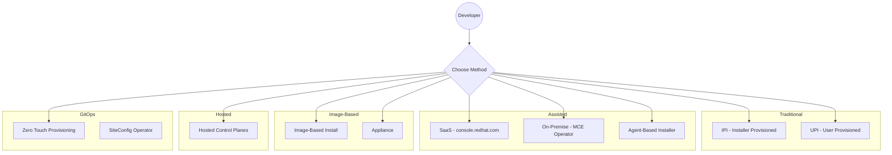
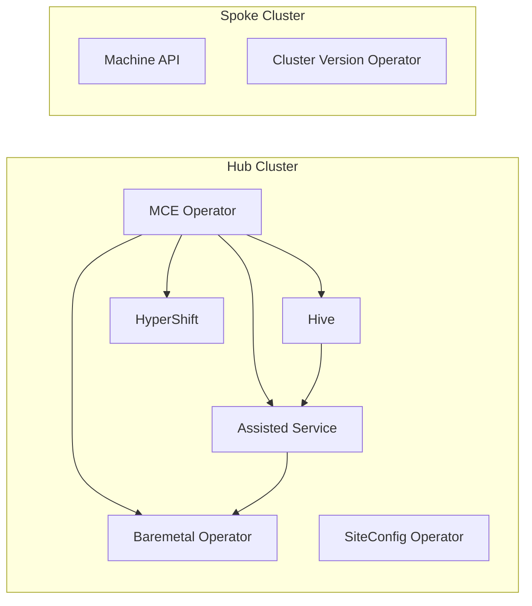

# OpenShift Installation Guide

A comprehensive guide for developers navigating OpenShift cluster installation methods, operators, controllers, and Custom Resources.

## Quick Navigation

| Section | Description |
|---------|-------------|
| [Installation Methods Overview](01-installation-methods-overview.md) | Comparison matrix and decision tree for choosing the right installation method |
| [Traditional Installers](02-traditional-installers/) | IPI, UPI, and the bootstrap process |
| [Assisted Installation](03-assisted-installation/) | SaaS, on-premise, Agent-Based Installer |
| [Image-Based Installation](04-image-based-installation/) | IBI and Appliance approaches |
| [Hosted Control Planes](05-hosted-control-planes/) | HyperShift and CAPI integration |
| [GitOps Provisioning](06-gitops-provisioning/) | ZTP, SiteConfig, ACM/MCE integration |
| [Operators & Controllers](07-operators-controllers/) | Reference for all installation-related operators |
| [CRD Reference](08-crd-reference/) | Complete CRD documentation with examples |
| [Diagrams](09-diagrams/component-diagrams.md) | Mermaid architecture diagrams |
| [Resources](10-resources.md) | Links for further study |

## Installation Methods at a Glance

## Key Concepts

### What is OpenShift Installation?

OpenShift installation involves:
1. **Provisioning infrastructure** (VMs, bare metal, cloud resources)
2. **Bootstrapping** a temporary control plane
3. **Installing** the permanent control plane and workers
4. **Configuring** the cluster with operators and day-2 settings

### The "Alphabet Soup" Problem

OpenShift has multiple installation paths, each with its own acronyms:

| Acronym | Full Name | Primary Use Case |
|---------|-----------|------------------|
| **IPI** | Installer-Provisioned Infrastructure | Cloud deployments with full automation |
| **UPI** | User-Provisioned Infrastructure | Custom/restricted environments |
| **ABI** | Agent-Based Installer | Disconnected on-premise deployments |
| **IBI** | Image-Based Install | Fast SNO deployments from seed images |
| **HCP** | Hosted Control Planes | Control plane as a service |
| **ZTP** | Zero Touch Provisioning | GitOps-driven edge deployments |
| **ACM** | Advanced Cluster Management | Multi-cluster management platform |
| **MCE** | Multicluster Engine | Core cluster lifecycle operator |
| **CIM** | Central Infrastructure Management | Host inventory management |

### Operator Ecosystem

Installation involves multiple cooperating operators:

## Getting Started

1. **New to OpenShift?** Start with [Installation Methods Overview](01-installation-methods-overview.md)
2. **Know your method?** Jump to the specific section
3. **Developing operators?** See [Operators & Controllers Reference](07-operators-controllers/)
4. **Working with CRDs?** Check the [CRD Reference](08-crd-reference/)

## Prerequisites for Understanding This Guide

- Basic Kubernetes concepts (Pods, Deployments, CRDs, Operators)
- Familiarity with YAML and Kubernetes manifests
- Understanding of control plane vs worker node architecture

## Contributing

This documentation is maintained alongside the OpenShift installation components. See the source repositories linked in [Resources](10-resources.md) for contribution guidelines.

